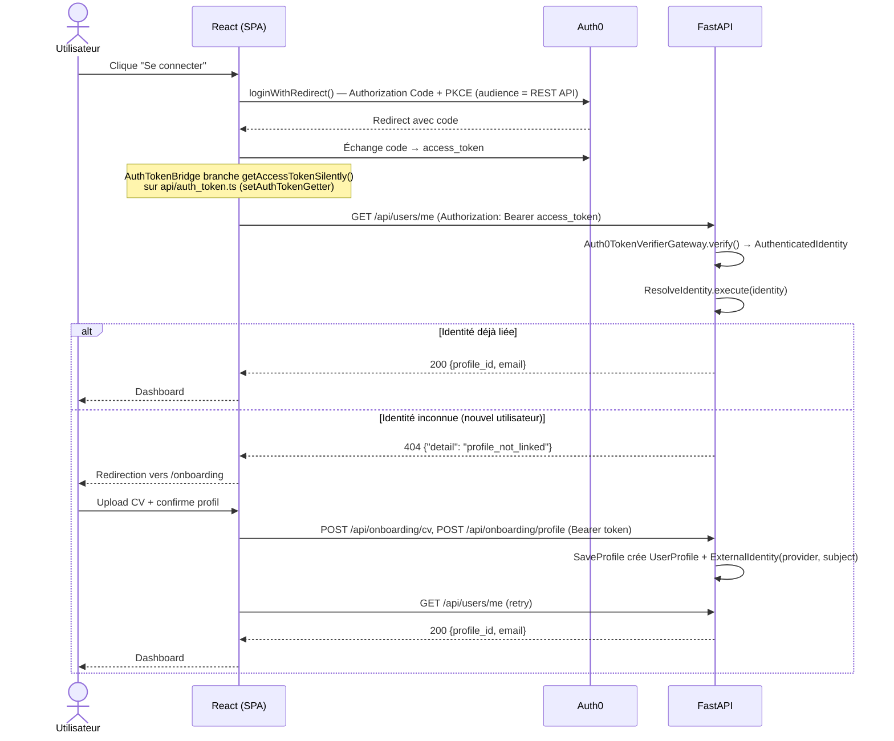
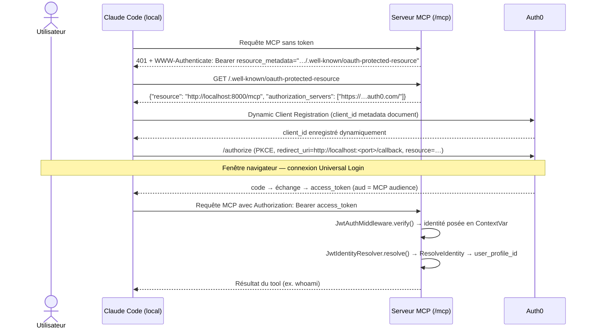

# Intégration Auth0 — Mission Radar AI

Ce document explique en détail comment Auth0 a été intégré comme source d'identité unique
pour les trois pilotes de l'application : React (SPA), l'API FastAPI, et le serveur MCP. Il
complète la section "Phase 10.4" du `README.md` racine avec le code réellement écrit, les
diagrammes de séquence des deux workflows de connexion, et le journal des problèmes
rencontrés (et résolus) pendant la configuration réelle du tenant.

## Sommaire

1. [Objectif et principes](#objectif-et-principes)
2. [Architecture Clean Architecture](#architecture-clean-architecture)
3. [Modèle de données — `ExternalIdentity`](#modèle-de-données--externalidentity)
4. [Configuration du tenant Auth0](#configuration-du-tenant-auth0)
5. [Variables d'environnement](#variables-denvironnement)
6. [Workflow de connexion — Web (React SPA)](#workflow-de-connexion--web-react-spa)
7. [Workflow de connexion — MCP](#workflow-de-connexion--mcp)
8. [Journal des problèmes rencontrés](#journal-des-problèmes-rencontrés)
9. [Fichiers clés](#fichiers-clés)

---

## Objectif et principes

Avant cette intégration : l'API REST ne vérifiait rien (`user_profile_id` fourni tel quel par
le client), et le serveur MCP utilisait soit un UUID codé en dur (`EnvironmentIdentityResolver`,
pilote stdio), soit un simple secret partagé côté HTTP (`SharedSecretMiddleware`) — aucun des
deux ne vérifiait *qui* appelait.

Objectif : une seule source d'identité (Auth0) pour React, l'API REST et le serveur MCP, avec
trois règles strictes tenues du début à la fin :

- **Auth0 ne sort jamais de `Infrastructure/`** — le Domain et l'Application ne connaissent
  qu'un DTO générique (`AuthenticatedIdentity`) et une ABC (`TokenVerifierGateway`), jamais
  "Auth0", jamais un JWT.
- **Deux audiences séparées** (API REST vs serveur MCP) — le spec MCP Authorization
  (RFC 8707, anti *confused deputy*) exige qu'un token soit rejeté s'il n'a pas été émis
  spécifiquement pour la ressource qui le reçoit. Partager une audience aurait permis à un
  token REST volé d'être rejoué contre `/mcp`.
- **`provider`/`subject` ne sont jamais codés en dur** dans l'Application — ils viennent
  toujours du DTO produit par l'Infrastructure, pour que remplacer Auth0 par un autre
  fournisseur OIDC (Keycloak, Okta...) ne touche qu'une seule classe.

---

## Architecture Clean Architecture

```
Domain/            ExternalIdentity (entity) + ExternalIdentityRepository (ABC)
Application/        AuthenticatedIdentity (DTO) + TokenVerifierGateway (ABC)
                     ResolveIdentity (Use Case)
Infrastructure/      Auth0TokenVerifierGateway (implémente TokenVerifierGateway)
                     SqlAlchemyExternalIdentityRepository (implémente ExternalIdentityRepository)
                     JwtAuthMiddleware + JwtIdentityResolver (MCP)
                     get_authenticated_identity + get_current_user_profile_id (FastAPI Depends)
```

### `AuthenticatedIdentity` — DTO générique, indépendant du mécanisme

```python
# backend/src/Application/DTO/authenticated_identity.py
@dataclass(frozen=True)
class AuthenticatedIdentity:
    provider: str                              # ex. "auth0" — posé par l'Infrastructure
    subject: str                               # claim `sub`
    email: Optional[str] = None
    claims: Mapping[str, Any] = field(default_factory=dict)  # scope, roles, org... si besoin un jour
```

`provider`/`subject`/`email` sont des champs de premier niveau parce qu'ils sont déjà utilisés
par du code métier réel (résolution d'identité, onboarding, `UserProfile.email`, digest email).
Tout le reste (scopes, rôles...) reste dans `claims` tant qu'aucun cas d'usage n'en dépend.

### `TokenVerifierGateway` (ABC) → `Auth0TokenVerifierGateway`

```python
# backend/src/Application/Gateway/token_verifier_gateway.py
class TokenVerifierGateway(ABC):
    @abstractmethod
    async def verify(self, token: str, expected_audience: str) -> AuthenticatedIdentity: ...
```

```python
# backend/src/Infrastructure/External/Auth0/auth0_token_verifier_gateway.py
_EMAIL_CLAIM = "https://mission-radar.dev/email"  # posé par l'Action Auth0, voir plus bas

class Auth0TokenVerifierGateway(TokenVerifierGateway):
    def __init__(self, domain: str) -> None:
        self._issuer = f"https://{domain}/"
        self._jwks_client = PyJWKClient(f"https://{domain}/.well-known/jwks.json", cache_keys=True)

    async def verify(self, token: str, expected_audience: str) -> AuthenticatedIdentity:
        signing_key = await asyncio.to_thread(self._jwks_client.get_signing_key_from_jwt, token)
        claims = jwt.decode(
            token, signing_key.key, algorithms=["RS256"],
            audience=expected_audience, issuer=self._issuer,
        )
        return AuthenticatedIdentity(
            provider="auth0",
            subject=claims["sub"],
            email=claims.get(_EMAIL_CLAIM),
            claims=claims,
        )
```

C'est le **seul** endroit du code qui connaît le nom "auth0" et le nom du claim email
namespacé — tout le reste manipule `AuthenticatedIdentity` sans savoir d'où elle vient.

### `ResolveIdentity` — jamais de littéral fournisseur

```python
# backend/src/Application/UseCase/resolve_identity.py
class ResolveIdentity:
    def __init__(self, external_identity_repository: ExternalIdentityRepository) -> None:
        self._external_identity_repository = external_identity_repository

    async def execute(self, identity: AuthenticatedIdentity) -> UUID:
        link = await self._external_identity_repository.get_by_provider_and_subject(
            identity.provider, identity.subject
        )
        if link is None:
            raise UserProfileNotLinkedError(...)
        return link.user_profile_id
```

### Dépendances FastAPI

```python
# backend/src/Infrastructure/Api/Dependency/dependencies.py
async def get_authenticated_identity(
    credentials: HTTPAuthorizationCredentials = Depends(HTTPBearer()),
) -> AuthenticatedIdentity:
    try:
        return await _get_token_verifier_gateway().verify(
            credentials.credentials, expected_audience=settings.AUTH0_API_AUDIENCE
        )
    except TokenVerificationError as exc:
        raise HTTPException(status_code=401, detail=str(exc)) from exc


async def get_current_user_profile_id(
    identity: AuthenticatedIdentity = Depends(get_authenticated_identity),
    db: AsyncSession = Depends(get_db_session),
) -> UUID:
    resolve_identity = ResolveIdentity(
        external_identity_repository=SqlAlchemyExternalIdentityRepository(db)
    )
    try:
        return await resolve_identity.execute(identity)
    except UserProfileNotLinkedError as exc:
        raise HTTPException(status_code=404, detail="profile_not_linked") from exc
```

Tous les endpoints REST qui supposent un profil existant (`dashboard_controller.py`,
`pipeline_controller.py`, `GET /api/users/me`) utilisent `Depends(get_current_user_profile_id)`
à la place de l'ancien `user_profile_id: UUID` fourni tel quel par le client. L'onboarding
(`POST /api/onboarding/cv`, `POST /api/onboarding/profile`) utilise la dépendance plus légère
`get_authenticated_identity` (token vérifié, identité pas encore résolue — c'est justement le
cas d'un nouvel utilisateur).

---

## Modèle de données — `ExternalIdentity`

Relie une identité de fournisseur externe à un `UserProfile` métier — relation many-to-one,
supporte nativement plusieurs fournisseurs et plusieurs identités par utilisateur (et, plus
tard, des comptes de service via `provider="auth0-m2m"`, sans changement de schéma).

```python
# backend/src/Domain/Entity/external_identity.py
@dataclass
class ExternalIdentity:
    user_profile_id: UUID
    provider: str          # générique — aucune mention "Auth0" dans le Domain
    subject: str
    id: UUID = field(default_factory=uuid4)
    created_at: datetime = field(default_factory=lambda: datetime.now(timezone.utc))
```

Table `external_identities` (migration `056eb3cd5bd7`) : contrainte unique `(provider, subject)`,
clé étrangère `user_profile_id → user_profiles.id` (`ON DELETE CASCADE`).

`SaveProfile` (onboarding) crée ce lien dans la même opération que la création/mise à jour du
`UserProfile`, à partir de l'`AuthenticatedIdentity` reçue par le contrôleur — c'est le seul
moment où un `(provider, subject)` devient résolvable.

---

## Configuration du tenant Auth0

Ressources créées dans le tenant `mission-radar-ai-dev.eu.auth0.com` :

| Ressource | Type | Identifier / usage |
|---|---|---|
| `Mission Radar AI - REST API` | API | `https://api.mission-radar.dev` — audience du REST, `AUTH0_API_AUDIENCE` |
| `Mission Radar AI - MCP Server` | API | `https://api.mission-radar.dev/mcp` — audience "prod" (réservée, pas utilisée en dev) |
| `Mission Radar AI - MCP Server (Local Dev)` | API | `http://localhost:8000/mcp` — audience réellement utilisée en dev, `AUTH0_MCP_AUDIENCE` |
| `Mission Radar AI - Web` | Application (SPA) | Callback/Logout/Web Origins : `http://localhost:5173`, Refresh Token Rotation activée |
| `Mission Radar AI - MCP Client` | Application (Regular Web App) | Callback : `https://claude.ai/api/mcp/auth_callback` — utilisée par **Claude Desktop** uniquement |
| Action `Add email to access token` | Action (Login/Post-Login) | Ajoute le claim namespacé `https://mission-radar.dev/email` |

Réglages tenant nécessaires en plus de la création de ces ressources (voir le
[journal des problèmes](#journal-des-problèmes-rencontrés) pour le pourquoi de chacun) :

- **Application Access Policy** de chaque API → autoriser les clients concernés (SPA pour le
  REST, client DCR de Claude Code pour le MCP local)
- **Dynamic Client Registration** activé (Settings → Advanced) — nécessaire pour Claude Code,
  qui s'enregistre lui-même sans app pré-créée
- **Username-Password-Authentication** promue "domain level" (Advanced Settings de la
  connexion) — requis pour que les apps tierces (dont les clients DCR) puissent s'y connecter

---

## Variables d'environnement

| Variable | Où | Valeur (dev) |
|---|---|---|
| `AUTH0_DOMAIN` | `.env` | `mission-radar-ai-dev.eu.auth0.com` |
| `AUTH0_API_AUDIENCE` | `.env` | `https://api.mission-radar.dev` |
| `AUTH0_MCP_AUDIENCE` | `.env` | `http://localhost:8000/mcp` — **doit toujours correspondre à l'origine réellement joignable du serveur MCP**, pas à un identifiant "aspirationnel" |
| `MCP_PROTECTED_RESOURCE_METADATA_URL` | `.env` | `http://localhost:8000/.well-known/oauth-protected-resource` |
| `VITE_AUTH0_DOMAIN` | `frontend/.env` | même valeur que `AUTH0_DOMAIN` |
| `VITE_AUTH0_CLIENT_ID` | `frontend/.env` | Client ID de `Mission Radar AI - Web` |
| `VITE_AUTH0_AUDIENCE` | `frontend/.env` | même valeur que `AUTH0_API_AUDIENCE` |

---

## Workflow de connexion — Web (React SPA)



### Code côté React

`Auth0ProviderWithNavigate` — placé **à l'intérieur** de `BrowserRouter` (nécessaire pour
`onRedirectCallback` → `useNavigate`) :

```tsx
// frontend/src/app/providers/auth0_provider.tsx
export function Auth0ProviderWithNavigate({ children }: { children: ReactNode }) {
  const navigate = useNavigate();
  const onRedirectCallback = (appState?: AppState) => {
    navigate(appState?.returnTo ?? window.location.pathname);
  };
  return (
    <Auth0Provider
      domain={domain}
      clientId={clientId}
      authorizationParams={{ redirect_uri: window.location.origin, audience }}
      onRedirectCallback={onRedirectCallback}
      useRefreshTokens={true}
      cacheLocation="localstorage"
    >
      <AuthTokenBridge />
      {children}
    </Auth0Provider>
  );
}
```

`useRefreshTokens`/`cacheLocation` sont nécessaires ensemble : sans eux, le cache de tokens
vit en mémoire (perdu à chaque reload) et le SDK retombe sur une authentification silencieuse
via iframe caché, qui dépend du cookie de session Auth0 — un cookie **tiers** du point de vue
de l'origine SPA, bloqué par défaut par Safari (et de plus en plus par Chrome/Firefox). Voir
le [journal des problèmes](#journal-des-problèmes-rencontrés), point 4.

Le pont token — `get`/`post` dans `api/client.ts` sont de simples fonctions async, pas des
hooks, donc elles ne peuvent pas appeler `useAuth0()` directement :

```ts
// frontend/src/api/auth_token.ts
let tokenGetter: () => Promise<string | null> = async () => null;
export function setAuthTokenGetter(getter: typeof tokenGetter) { tokenGetter = getter; }
export async function getAuthToken() { return tokenGetter(); }
```

```ts
// frontend/src/api/client.ts
export async function authHeaders(): Promise<Record<string, string>> {
  const token = await getAuthToken();
  return token ? { Authorization: `Bearer ${token}` } : {};
}
// get()/post() attachent authHeaders() à chaque requête
```

`UserProfileContext` est **conservé** comme abstraction publique (pas remplacé) — seule sa
source de données change : `localStorage` → `useAuth0()` + `GET /api/users/me`, avec en plus
`needsOnboarding`/`isLoading`/`refetch` exposés pour le routeur.

⚠️ **Piège rencontré en test réel** : `onboarding_api.ts` fait ses propres appels `fetch()`
bruts (upload multipart de CV = `FormData`, incompatible avec le `post()` JSON-only de
`client.ts`) — ces appels ne passaient donc pas par `authHeaders()` et échouaient en
`401 Not authenticated`. Fix : `authHeaders()` exporté depuis `client.ts` et injecté
manuellement dans les 3 fetchs de `onboarding_api.ts`.

---

## Workflow de connexion — MCP

Deux clients MCP différents, deux mécanismes OAuth **complètement différents** — découvert en
testant réellement (voir journal ci-dessous) :

| | Claude Desktop | Claude Code (CLI) |
|---|---|---|
| Où tourne le flow OAuth | Infrastructure cloud d'Anthropic | Localement, sur la machine du développeur |
| Redirect URI | Fixe : `https://claude.ai/api/mcp/auth_callback` | Loopback RFC 8252 : `http://localhost:<port>/callback` |
| Identité du client | Pré-enregistrée manuellement (Client ID/Secret saisis dans l'UI Claude) | Client ID Metadata Document (`https://claude.ai/oauth/claude-code-client-metadata`) → Dynamic Client Registration côté Auth0 |
| Application Auth0 | `Mission Radar AI - MCP Client` (Regular Web App) | Aucune pré-créée — Auth0 en crée une automatiquement via DCR (`Claude Code (mission-radar)`) |
| Accessibilité serveur | Doit être joignable depuis Internet (tunnel/déploiement) | `http://localhost:8000/mcp` suffit |



### Code côté serveur MCP

`JwtAuthMiddleware` — vérifie le token **une seule fois**, avant tout dispatch JSON-RPC ; pose
l'identité dans un `contextvars.ContextVar` (pas `Request.state`, pour ne pas dépendre de la
façon dont FastMCP threade son scope ASGI en interne) :

```python
# backend/src/Infrastructure/Mcp/Transport/jwt_auth_middleware.py
_authenticated_identity_ctx: ContextVar[Optional[AuthenticatedIdentity]] = ContextVar(
    "mcp_authenticated_identity", default=None
)

class JwtAuthMiddleware:
    async def __call__(self, scope, receive, send) -> None:
        if scope["type"] != "http":
            await self._app(scope, receive, send); return

        token = self._extract_bearer(scope)
        if not token:
            await self._reject(scope, receive, send); return
        try:
            identity = await self._token_verifier.verify(token, expected_audience=self._expected_audience)
        except TokenVerificationError:
            await self._reject(scope, receive, send); return

        reset_token = _authenticated_identity_ctx.set(identity)
        try:
            await self._app(scope, receive, send)
        finally:
            _authenticated_identity_ctx.reset(reset_token)

    async def _reject(self, scope, receive, send) -> None:
        challenge = f'Bearer resource_metadata="{self._resource_metadata_url}"'
        await PlainTextResponse("Unauthorized", 401, headers={"WWW-Authenticate": challenge})(scope, receive, send)
```

`JwtIdentityResolver` — relit l'identité déjà vérifiée, ouvre sa propre session courte (comme
chaque Tool/Resource MCP) :

```python
# backend/src/Infrastructure/Mcp/Identity/jwt_identity_resolver.py
class JwtIdentityResolver(IdentityResolver):
    async def resolve(self) -> UUID:
        identity = get_authenticated_identity_from_context()
        if identity is None:
            raise MissingIdentityConfigurationError(...)
        async with self._resolve_identity_context_factory() as resolve_identity:
            try:
                return await resolve_identity.execute(identity)
            except UserProfileNotLinkedError as exc:
                raise InvalidIdentityConfigurationError(str(exc)) from exc
```

Montage HTTP :

```python
# backend/src/Infrastructure/Mcp/Transport/http_app_factory.py
def build_mcp_http_app() -> Starlette:
    token_verifier = Auth0TokenVerifierGateway(domain=settings.AUTH0_DOMAIN)
    mcp = build_mcp_server(identity_resolver_factory=JwtIdentityResolver)
    return mcp.http_app(
        path="/",
        middleware=[Middleware(
            JwtAuthMiddleware,
            token_verifier=token_verifier,
            expected_audience=settings.AUTH0_MCP_AUDIENCE,
            resource_metadata_url=settings.MCP_PROTECTED_RESOURCE_METADATA_URL,
        )],
    )
```

Le pilote stdio local (`server.py`, utilisé par Claude Desktop en mode process local historique)
n'est **pas** concerné — `build_mcp_server()` garde `EnvironmentIdentityResolver` par défaut,
seul `build_mcp_http_app()` passe explicitement `JwtIdentityResolver`.

Métadonnées RFC 9728, exposées en dehors du mount `/mcp` (route FastAPI classique) :

```python
# backend/main.py
@app.get("/.well-known/oauth-protected-resource")
async def oauth_protected_resource_metadata() -> dict:
    return {
        "resource": settings.AUTH0_MCP_AUDIENCE,
        "authorization_servers": [f"https://{settings.AUTH0_DOMAIN}/"],
        "bearer_methods_supported": ["header"],
    }
```

Ajout du serveur côté Claude Code :

```bash
claude mcp add --transport http mission-radar http://localhost:8000/mcp
```

Puis dans une session Claude Code : `/mcp` → sélectionner `mission-radar` → **Authenticate**.

---

## Journal des problèmes rencontrés

Tout ce qui suit a été rencontré (et corrigé) en testant réellement contre le tenant Auth0 —
gardé ici pour ne pas le re-découvrir dans six mois.

### 1. `Client "..." is not authorized to access resource server "..."`

**Cause** : chaque API Auth0 a une "Application Access Policy" — par défaut, aucun client
(SPA ou autre) n'est autorisé à demander un token pour elle. La légende du dashboard mentionne
encore parfois l'onglet historique "Machine to Machine Applications", mais ce mécanisme couvre
aussi les flows Authorization Code (SPA).

**Fix** : `Applications → APIs → [API] →` section d'accès applications → autoriser
explicitement le client concerné (ou "All applications allowed" pour une API de dev sans
enjeu). Rencontré deux fois : une fois pour la SPA sur l'API REST, une fois pour le client DCR
de Claude Code sur l'API MCP.

### 2. `Protected resource "…" does not match expected "…" (or origin)`

**Cause** : le champ `resource` renvoyé par `/.well-known/oauth-protected-resource` doit
correspondre à l'**origine réellement joignable** du serveur MCP, pas à un identifiant
"aspirationnel" de prod. `AUTH0_MCP_AUDIENCE` était initialement réglé sur
`https://api.mission-radar.dev/mcp` (valeur pensée pour la prod) alors que le serveur tournait
sur `http://localhost:8000` — Claude Code refuse cette incohérence comme protection
anti-usurpation.

**Fix** : créé une seconde API Auth0 dédiée au dev local
(`Mission Radar AI - MCP Server (Local Dev)`, identifier `http://localhost:8000/mcp`),
`AUTH0_MCP_AUDIENCE` pointe dessus en dev. L'API "prod" (`https://api.mission-radar.dev/mcp`)
reste réservée pour un futur déploiement réel, où `AUTH0_MCP_AUDIENCE` sera reswitché dessus.

### 3. `no connections enabled for the client`

**Cause** : le client créé automatiquement par Dynamic Client Registration (celui de Claude
Code) n'a aucune connexion d'authentification (base de données, social...) associée — Auth0
n'a donc rien à proposer sur l'écran de connexion.

**Fix** : `Authentication → Database → Username-Password-Authentication → Advanced Settings`
→ promouvoir la connexion au niveau du domaine ("domain level connection"). Une fois promue,
elle devient automatiquement disponible pour toutes les apps tierces du tenant (dont les futurs
clients créés par DCR), sans avoir à les autoriser individuellement.

### 4. Authentification redemandée à chaque reload de la page (SPA)

**Cause** : `<Auth0Provider>` sans `cacheLocation` ni `useRefreshTokens` explicites utilise un
cache en mémoire — détruit à chaque F5. Le SDK retente alors une authentification silencieuse
via iframe caché (`prompt=none`), qui dépend du cookie de session posé sur le domaine Auth0 ;
ce cookie est tiers du point de vue de `localhost:5173` et les navigateurs modernes le
bloquent (Safari par défaut, Chrome/Firefox de plus en plus). Résultat : l'utilisateur est vu
comme non-authentifié à chaque reload.

**Fix** : `useRefreshTokens={true}` (demande automatiquement le scope `offline_access` — la
rotation de refresh token est déjà activée côté tenant, donc chaque token est à usage unique)
+ `cacheLocation="localstorage"` (persiste le refresh token à travers les reloads, sans
dépendre du cookie tiers ni de l'iframe). Compromis assumé : le token devient accessible à un
script XSS, ce que limite la rotation à usage unique déjà en place.

### Pré-requis identifiés pour que Claude Code puisse se connecter à une API Auth0 via DCR

1. **Dynamic Client Registration** activé au niveau tenant (`Settings → Advanced`)
2. L'**Application Access Policy** de l'API cible autorise le client DCR (ou "All applications
   allowed")
3. La connexion d'authentification (`Username-Password-Authentication`) est **promue au niveau
   du domaine**
4. `AUTH0_MCP_AUDIENCE` correspond à l'**origine réellement joignable** du serveur, pas à un
   identifiant arbitraire

---

## Fichiers clés

| Fichier | Rôle |
|---|---|
| `backend/src/Application/DTO/authenticated_identity.py` | DTO générique, indépendant du mécanisme |
| `backend/src/Application/Gateway/token_verifier_gateway.py` | ABC |
| `backend/src/Application/UseCase/resolve_identity.py` | Résolution identité → `user_profile_id` |
| `backend/src/Domain/Entity/external_identity.py` | Entité de liaison |
| `backend/src/Infrastructure/External/Auth0/auth0_token_verifier_gateway.py` | Implémentation Auth0 (JWKS, RS256) |
| `backend/src/Infrastructure/Api/Dependency/dependencies.py` | `get_authenticated_identity`, `get_current_user_profile_id` |
| `backend/src/Infrastructure/Mcp/Transport/jwt_auth_middleware.py` | Garde-fou HTTP du mount `/mcp` |
| `backend/src/Infrastructure/Mcp/Identity/jwt_identity_resolver.py` | `IdentityResolver` HTTP |
| `backend/main.py` | Route `.well-known/oauth-protected-resource` |
| `frontend/src/app/providers/auth0_provider.tsx` | `Auth0Provider` + pont token |
| `frontend/src/api/auth_token.ts`, `frontend/src/api/client.ts` | Attache du Bearer token |
| `frontend/src/context/user_profile_context.tsx` | Source d'identité côté React |

Voir aussi le `README.md` racine, section **"Phase 10.4 — Auth0 comme source d'identité
unique"**, pour le détail phase par phase (10.4.1 à 10.4.7) et les décisions d'architecture
validées (audiences séparées, `AuthenticatedIdentity` générique, etc.).
