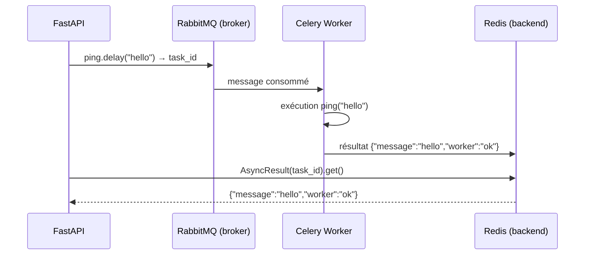
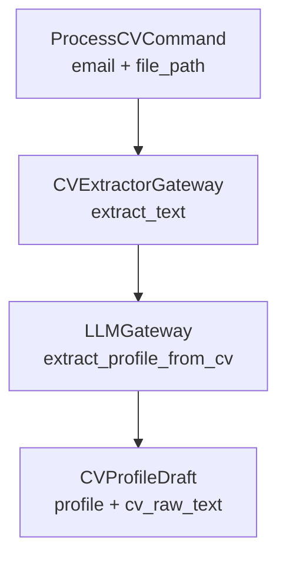
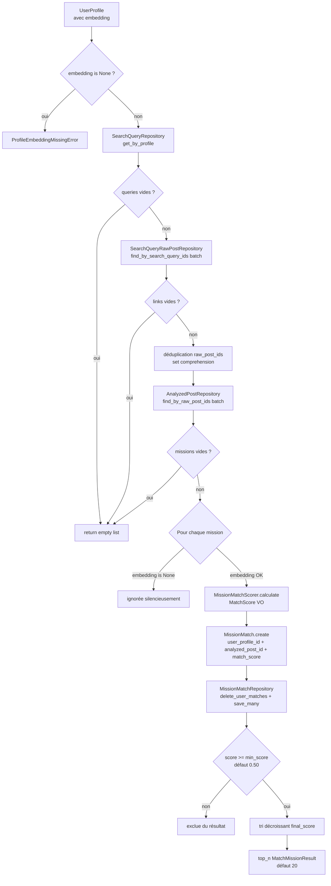
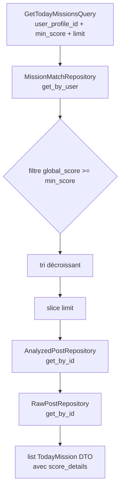

# Mission Radar AI — Historique de développement

> Documentation de développement détaillée, phase par phase (Phase 1 à Phase 10.4.7). Pour une présentation du projet, voir le [README](../README.md) à la racine.

Agent de veille de missions freelance : scraping LinkedIn via Apify, analyse hybride rules + LLM, matching profil, digest email quotidien.

---

## Stack technique

| Couche | Technologie |
|---|---|
| API | FastAPI + Python 3.12 |
| Serveur ASGI | Uvicorn |
| Scraping | Apify API (`harvestapi/linkedin-post-search`) + tenacity |
| Broker | RabbitMQ (Celery) |
| Cache | Redis (cache sémantique) |
| Scheduler | Celery Beat |
| Base de données | PostgreSQL + SQLAlchemy async + Alembic |
| LLM dev | Groq |
| LLM prod | Claude API (Anthropic) |
| Embeddings | sentence-transformers (`all-MiniLM-L6-v2`) |
| PDF | pdfminer.six |
| Observabilité | Langfuse |
| Évaluation AI | DeepEval + GitHub Actions |
| MCP | FastMCP |
| Frontend | React 18 + Vite + TypeScript + react-query + recharts |
| Email | Jinja2 + Resend |
| Conteneurisation | Docker + Docker Compose |

---

## Architecture

> ⚠️ **Arbre historique — structure simplifiée initiale.** L'arborescence ci-dessous date des premières phases. Le frontend est depuis passé à une structure feature-based (voir Phase 6.1), et `Infrastructure/` a gagné plusieurs dossiers non représentés ici (`Mcp/`, `Messaging/`, `Commands/`, `Config/`) ; un dossier `evaluation/` existe aussi à la racine du projet. Voir le README pour l'arborescence actuelle.

```
Domain/ ← Application/ ← Infrastructure/
```

```
mission-radar-ai/
├── backend/
│   ├── main.py                          # Entry point FastAPI
│   ├── src/
│   │   ├── Domain/                      # Entités, Value Objects, interfaces ABC
│   │   │   ├── Entity/                  # UserProfile, RawPost, AnalyzedPost, Mission
│   │   │   ├── ValueObject/             # TJM, Stack, ContractType, MatchScore
│   │   │   ├── Repository/              # interfaces ABC
│   │   │   ├── Service/                 # logique métier pure, sans I/O
│   │   │   └── Exception/
│   │   ├── Application/                 # Use cases (≈ handlers Symfony Messenger)
│   │   │   ├── UseCase/
│   │   │   ├── Command/
│   │   │   ├── Query/
│   │   │   ├── DTO/
│   │   │   └── Gateway/                 # ABC : LLMProvider, ScraperGateway, MailerGateway…
│   │   └── Infrastructure/
│   │       ├── Api/Controller/          # Routers FastAPI
│   │       ├── Persistence/             # SQLAlchemy + repositories
│   │       ├── External/                # Apify, LLM, Mailer, Langfuse
│   │       └── Worker/                  # Celery tasks
│   ├── tests/
│   │   ├── Unit/
│   │   ├── Integration/
│   │   ├── Fixtures/                    # JSON Apify mockés
│   ├── requirements/
│   │   ├── base.txt
│   │   └── dev.txt
│   ├── alembic/
│   ├── pytest.ini
│   └── Dockerfile
├── frontend/
│   ├── src/
│   │   ├── components/
│   │   ├── pages/                       # Dashboard, Onboarding, Missions, Profile
│   │   ├── services/                    # Appels API backend
│   │   └── types/
│   ├── package.json
│   ├── vite.config.ts
│   └── Dockerfile
├── docker-compose.yml
├── .env.example
└── README.md
```

---

## Python Naming Conventions

Le projet suit strictement PEP8.

| Élément | Convention | Exemple |
|---|---|---|
| Fichiers | `snake_case` | `process_cv.py`, `cv_profile.py` |
| Classes | `PascalCase` | `ProcessCV`, `CVProfile` |
| Méthodes | `snake_case` | `execute()`, `extract_text()` |
| Variables | `snake_case` | `profile_dto`, `cv_text` |
| Constantes | `UPPER_CASE` | `_EXCERPT_LENGTH`, `_WEIGHTS` |

Les noms de classes restent en PascalCase même si le fichier qui les contient est en snake_case. Exemple : la classe `CVExtractorGateway` vit dans `cv_extractor_gateway.py`.

---

## Infrastructure Celery (Phase 1.5)

### Rôle du broker et du backend

| Composant | Technologie | Rôle |
|---|---|---|
| **Broker** | RabbitMQ | File d'attente des tâches — reçoit les messages envoyés par FastAPI et les distribue aux workers |
| **Backend** | Redis | Stockage des résultats — le worker y écrit le résultat, l'API vient le lire |

### Cycle complet d'une tâche



### Parallèles Symfony ↔ Celery

| Symfony | Celery / projet |
|---|---|
| `Message` + `MessageHandler` | `@celery_app.task` |
| `messenger:consume` | `celery worker` |
| Transport RabbitMQ (Messenger) | Broker RabbitMQ (Celery) |
| Retry Strategy (Messenger) | `max_retries` + `countdown` |
| `SchedulerBundle` + cron | `celery beat` |
| Dead Letter Queue (DLQ) | DLQ RabbitMQ (Phase 3) |

### Commandes worker

```bash
# Démarrer le worker (géré par Docker Compose)
docker compose up celery_worker

# Logs du worker en live
docker compose logs -f celery_worker

# Logs du beat scheduler
docker compose logs -f celery_beat

# Inspecter les workers actifs
docker compose exec celery_worker celery -A src.Infrastructure.Worker.celery_app inspect active

# Purger la queue (dev uniquement)
docker compose exec celery_worker celery -A src.Infrastructure.Worker.celery_app purge
```

### Endpoints tasks

```bash
# Envoyer une tâche ping
curl -X POST http://localhost:8000/api/tasks/ping \
  -H "Content-Type: application/json" \
  -d '{"message": "hello"}'
# → {"task_id": "abc-123-..."}

# Consulter le résultat
curl http://localhost:8000/api/tasks/abc-123-...
# → {"task_id": "...", "status": "success", "result": {"message": "hello", "worker": "ok"}}
```

### Tests d'intégration Celery

```bash
# Nécessite le worker actif (docker compose up celery_worker)
docker compose exec backend pytest tests/Integration/test_celery_ping.py -v
```

---

## Domain Layer (Phase 1.6)

Le Domain est le cœur du projet. Il contient les règles métier pures, sans aucune dépendance vers l'infrastructure (pas de SQLAlchemy, FastAPI, Celery, Redis, Groq…). Il est testable avec `pytest` pur, sans Docker.

### Concepts clés

| Concept | Python | Symfony/DDD |
|---|---|---|
| **Entity** | `@dataclass` avec identité UUID | Entité DDD — identité stable, mutable |
| **Value Object** | `@dataclass(frozen=True)` | Objet valeur PHP immutable — égalité par valeur |
| **Repository Interface** | `class ABC` | Interface PHP dans le Domain — le domaine exprime ses besoins |
| **Domain Exception** | sous-classe de `DomainException` | Exception métier indépendante du framework |

### Pourquoi les Repository Interfaces vivent dans Domain/

En DDD, c'est le domaine qui exprime ce dont il a besoin (ex. "donne-moi le profil actif"). L'infrastructure fournit une réponse à ce besoin via une implémentation concrète. Si l'interface était dans Infrastructure/, le Domain dépendrait de l'infra — ce qui violerait la règle `Domain ← Application ← Infrastructure`.

### Pourquoi Value Objects sont frozen

Un `TJM(600, "EUR")` représente une valeur, pas une entité. Il n'a pas de cycle de vie. `frozen=True` garantit l'immutabilité et permet l'égalité par valeur (`TJM(600) == TJM(600)`).

### Modèle multi-utilisateur (Phase 1.6 bis)

```
UserProfile ──────────┐
  (email, skills…)    │ user_profile_id
                      ▼
                 SearchQuery    ← requêtes dérivées du profil (Phase 3.4)
                      │ search_query_id
                      ▼
            SearchQueryRawPost  ← table de liaison SearchQuery ↔ RawPost (refactoring pré-5.3)
                      ▲
                      │ raw_post_id
                   RawPost      ← post LinkedIn brut (Apify) — UNIQUE par (source, external_id)
                      │ raw_post_id
                      ▼
                 AnalyzedPost   ← vérité métier du post (stack, TJM, remote détectés) — UNIQUE
                      │ analyzed_post_id
                      ▼
                 MissionMatch   ← scores de matching User ↔ Mission
```

Séparation claire des responsabilités :
- `SearchQueryRawPost` trace quels posts ont été remontés par quelle query, **sans dupliquer** `RawPost` ni `AnalyzedPost`
- Un même post collecté par 10 queries → 1 RawPost + 1 AnalyzedPost + 10 lignes de liaison
- `AnalyzedPost` décrit **le post** (indépendant de l'utilisateur)
- `MissionMatch` décrit **la relation** Utilisateur ↔ Mission — contient un `MatchScore` (Value Object) produit par `MissionMatchScorer`
- `final_score` est délégué au `MatchScore` VO ; la persistance (phase suivante) stockera les composants en colonnes plates pour les requêtes SQL

### Structure Domain/

```
Domain/
├── Entity/
│   ├── user_profile.py          # Profil freelance — email obligatoire (validation format)
│   ├── raw_post.py              # Post LinkedIn brut — content non vide
│   ├── analyzed_post.py         # Résultat de l'analyse — stack/TJM/remote détectés + embedding JSONB (Phase 5.0.2)
│   ├── mission_match.py         # Relation User ↔ Mission — snapshot match_score: MatchScore + factory create() (Phase 5.3.0)
│   └── search_query_raw_post.py # Liaison SearchQuery ↔ RawPost — traçabilité de la collecte (pré-5.3)
├── ValueObject/
│   ├── tjm.py              # Taux journalier — valeur positive, EUR/day par défaut
│   ├── stack.py            # Liste normalisée (lowercase, dédupliquée) de technos
│   ├── contract_type.py    # Enum : freelance | cdi | cdd | internship | unknown
│   ├── remote_mode.py      # Enum : full_remote | hybrid | onsite | unknown
│   ├── confidence_score.py # Score [0.0, 1.0] — seuil 0.7 pour bypasser le LLM
│   └── match_score.py      # Score de matching V1 — final_score (4 composants, recalibrable Phase 6)
├── Service/
│   ├── mission_normalizer.py            # PostAnalysis → AnalyzedPost (normalisation pure)
│   ├── mission_embedding_builder.py     # AnalyzedPost → texte structuré pour embedding
│   ├── heuristic_search_query_generator.py  # UserProfile → list[SearchQuery]
│   └── mission_match_scorer.py          # UserProfile + AnalyzedPost → MatchScore (Phase 5.1.1)
├── Repository/
│   ├── user_profile_repository.py         # ABC : save / get_by_id / get_by_email
│   ├── raw_post_repository.py             # ABC : save / exists_by_external_id / get_by_id / get_by_source_and_external_id
│   ├── analyzed_post_repository.py        # ABC : save / get_by_raw_post_id / list_today_missions
│   ├── mission_match_repository.py        # ABC : save / save_many / get_by_user / get_best_matches / delete_user_matches (Phase 5.3.1)
│   └── search_query_raw_post_repository.py  # ABC : save / exists / find_by_search_query_id / find_by_raw_post_id
└── Exception/
    └── domain_exceptions.py  # InvalidTJMError, InvalidScoreError, InvalidEmailError…
```

### ContractType — vocabulaire international

Les missions LinkedIn peuvent provenir de plusieurs pays. Utiliser des termes français (CDI, CDD)
rendrait l'extraction LLM fragile sur des posts en anglais ou en d'autres langues.

| Terme français | Valeur `ContractType` | Raison |
|---|---|---|
| Freelance | `freelance` | Universel |
| CDI | `permanent` | Équivalent anglophone (permanent contract) |
| CDD | `fixed_term` | Équivalent anglophone (fixed-term contract) |
| Stage | `internship` | Universel |
| Alternance | `apprenticeship` | Terme anglophone standard |
| Non détecté | `unknown` | Valeur par défaut sûre |

### `location` vs `preferred_remote_mode`

Ces deux champs ont des rôles distincts dans `UserProfile` :

| Champ | Type | Rôle |
|---|---|---|
| `location` | `Optional[str]` | Localisation géographique (ville, pays) — optionnelle |
| `preferred_remote_mode` | `RemoteMode` | Modalité de travail souhaitée — obligatoire |

Exemples :

```python
# Utilisateur full remote — pas de localisation significative
UserProfile(location=None, preferred_remote_mode=RemoteMode.FULL_REMOTE, ...)

# Utilisateur hybride à Paris
UserProfile(location="Paris", preferred_remote_mode=RemoteMode.HYBRID, ...)

# Utilisateur sur site à Lyon
UserProfile(location="Lyon", preferred_remote_mode=RemoteMode.ONSITE, ...)
```

`location` est optionnel car un utilisateur full remote n'a pas de contrainte géographique.
La logique de matching remote est portée par `RemoteMode`, pas par `location`.

### Tests unitaires Domain

```bash
# Rapide — aucun conteneur nécessaire
docker compose exec backend pytest tests/Unit/ -v
# → 78 tests en 0.05s
```

---

## Architecture des données (Phase 1.8)

### Flux UseCase → PostgreSQL

```
UseCase (Application/)
    │
    │  dépend de l'interface ABC
    ▼
UserProfileRepository (Domain/Repository/)        ← interface — zéro import SQLAlchemy
    │
    │  implémente
    ▼
SqlAlchemyUserProfileRepository (Infrastructure/Persistence/Repository/)
    │
    │  convertit via
    ▼
UserProfileMapper (Infrastructure/Persistence/Mapper/)
    │
    │  opère sur
    ▼
UserProfileModel (Infrastructure/Persistence/SQLAlchemy/Models/)
    │
    │  persiste dans
    ▼
PostgreSQL
```

### Pourquoi des Mappers ?

Sans mapper, le repository retournerait un `UserProfileModel` — un objet SQLAlchemy — au Use Case. Le Domain deviendrait implicitement dépendant de SQLAlchemy (colonnes, lazy loading, sessions attachées...). Le mapper isole complètement les deux mondes :

- `to_domain()` : `UserProfileModel` → `UserProfile` (dataclass Domain pure)
- `to_model()` : `UserProfile` → `UserProfileModel` (objet SQLAlchemy à persister)

### Parallèles Symfony ↔ SQLAlchemy Repositories

| Symfony / Doctrine | Python / SQLAlchemy async |
|---|---|
| `EntityManager` | `AsyncSession` |
| `persist()` + `flush()` | `session.merge()` + `await session.flush()` |
| Repository Doctrine concret | `SqlAlchemyXxxRepository` |
| Interface Domain (PHP) | `XxxRepository(ABC)` |
| Hydrateur / Assembler | `XxxMapper.to_domain()` / `to_model()` |
| `find()` | `await session.get(Model, id)` |
| `findOneBy(['email' => ...])` | `select(Model).where(Model.email == ...)` |

### Testabilité

L'`AsyncSession` est injectée au constructeur — jamais instanciée dans le repository. Cela permet :
- **Tests d'intégration** : vrai PostgreSQL, fixture transactionnelle avec rollback automatique
- **Tests unitaires** (futurs) : mock de `AsyncSession` si besoin de tester des Use Cases en isolation

### Tests d'intégration Repository

```bash
# PostgreSQL doit être up
docker compose exec backend pytest tests/Integration/Repository/ -v

# Tous les tests d'intégration
docker compose exec backend pytest tests/Integration/ -v
```

---

## Couche Application (Phase 1.9)

### Concepts clés

| Concept | Rôle | Parallèle Symfony |
|---|---|---|
| **UseCase** | Orchestration — coordonne les gateways et repositories pour accomplir une action métier | Application Service (Handler Messenger) |
| **Repository** | Abstraction de la persistance — le Domain exprime ses besoins, l'Infrastructure répond | Repository Doctrine (interface en Domain) |
| **Gateway** | Abstraction d'un système externe (LLM, PDF, embeddings) — jamais instanciée dans Application | Client HTTP abstrait (interface + implémentation découplée) |
| **DTO** | Contrat d'entrée/sortie entre couches — `frozen=True`, sans dépendance framework | DTO d'application, Value Object de transfert |
| **Fake Gateway** | Implémentation de test en mémoire — zéro I/O réelle | Mock Symfony en test unitaire |

### Règle d'or

```
Domain/      → pas d'I/O. Pydantic et dataclasses autorisés.
Application/ → dépend uniquement de Domain/ et de ses propres ABCs.
              Jamais d'import SQLAlchemy, FastAPI, Groq, Apify.
Infrastructure/ → implémente les ABCs.
```

### UseCases implémentés

#### ProcessCV



Flux : extraction texte PDF → structuration LLM → draft retourné au frontend.
Pas de persistance — l'utilisateur valide le draft avant confirmation (Phase 2.4).

#### MatchMissions (Phase 5.2 / 5.2.1 / 5.3.1 — user-scoped + persistance)



Délègue tout le calcul à `MissionMatchScorer`. Depuis la Phase 5.3.1, **chaque résultat est persisté** via `MissionMatchRepository.save_many()` avant filtrage — le pipeline complet est :

```
UserProfile → SearchQuery → SearchQueryRawPost → RawPost → AnalyzedPost
  → MissionMatchScorer → MissionMatch → MissionMatchRepository
  → MatchMissionResult (filtré + trié)
  → GetTodayMissions (lecture directe depuis DB)
```

Le matching est **user-scoped** : seules les missions collectées via les `SearchQuery` du profil sont évaluées. Un même `RawPost` découvert par plusieurs `SearchQuery` n'est scoré qu'une fois (déduplication par `raw_post_id`). Un re-run remplace proprement les anciens scores (delete + insert).

#### GetTodayMissions



### Structure Application/

```
Application/
├── UseCase/
│   ├── process_cv.py          # Extraction CV → CVProfileDraft (sans persistance)
│   ├── save_profile.py        # Embedding + upsert UserProfile → PostgreSQL
│   ├── match_missions.py      # Ranking + persistance MissionMatch (Phase 5.2 / 5.3.1)
│   └── get_today_missions.py  # Top missions filtrées + enrichies depuis MissionMatch (Phase 5.3.1)
├── DTO/
│   ├── cv_profile.py          # Sortie LLMGateway — profil structuré extrait
│   ├── cv_profile_draft.py    # Sortie ProcessCV — CVProfile + cv_raw_text
│   ├── save_profile_command.py  # Entrée SaveProfile — CVProfile édité + cv_raw_text
│   ├── save_profile_result.py   # Sortie SaveProfile — profile_id + email + status
│   ├── match_mission_result.py  # Sortie MatchMissions — mission + match_score (Phase 5.2)
│   ├── mission_match.py       # Sortie legacy (Phase 5.3)
│   ├── today_mission.py       # Sortie GetTodayMissions (enrichie avec RawPost)
│   ├── process_cv_command.py  # Entrée ProcessCV
│   ├── match_missions_command.py
│   └── get_today_missions_query.py
├── Gateway/
│   ├── cv_extractor_gateway.py # ABC : extract_text(file_path) → str
│   ├── llm_gateway.py          # ABC : extract_profile_from_cv + summarize_mission
│   └── embedding_gateway.py    # ABC : embed_text + compute_similarity
└── Exception/
    └── application_error.py    # UserProfileNotFoundError, ProfileEmbeddingMissingError
```

### Tests unitaires Application

```bash
# Aucun Docker requis — fakes en mémoire uniquement
docker compose exec backend pytest tests/Unit/Application/ -v
# → 43 tests en 0.04s (Phase 5.3.1 : +14 tests match_missions + 7 get_today_missions)
```

---

## Extraction CV — Infrastructure/External/CV (Phase 2.0)

### Flux d'extraction

```
CV PDF
   ↓
CVExtractorGateway (ABC — Application/Gateway/)
   ↓
PdfMinerCVExtractorGateway (Infrastructure/External/CV/)
   ↓
Texte brut nettoyé
```

### Pourquoi pdfminer est isolé derrière un Gateway

| Raison | Explication |
|---|---|
| **Swap-ability** | Remplacer pdfminer.six par PyMuPDF (ou tout autre extracteur) sans toucher Application ni Domain — seule l'implémentation concrète change |
| **Testabilité** | `ProcessCV` est testé avec `FakeCVExtractor` (implémentation en mémoire) — zéro dépendance pdfminer dans les tests unitaires Application |
| **Séparation des couches** | Application exprime *ce dont elle a besoin* (`extract_text`) — Infrastructure répond *comment* (pdfminer, OCR, API tierce…) |

### Parallèle Symfony

| Symfony | Python / projet |
|---|---|
| Interface PHP (contrat) | `CVExtractorGateway(ABC)` dans Application/Gateway/ |
| Service concret taggé dans services.yaml | `PdfMinerCVExtractorGateway` dans Infrastructure/External/CV/ |
| Injection via le container | Injection via constructeur (FastAPI `Depends()`) |

### Nettoyage minimal du texte extrait

`_clean()` (méthode statique du gateway) applique dans l'ordre :
1. Collapse les espaces et tabulations multiples → espace unique
2. Supprime les espaces en fin de ligne
3. Collapse les sauts de ligne triples ou plus → double saut de ligne
4. Strip le résultat global (supprime le form feed `\x0c` de séparation de page pdfminer)

### Tests unitaires Infrastructure

```bash
docker compose exec backend pytest tests/Unit/Infrastructure/ -v
# → 6 tests — aucun Docker service requis hormis le conteneur backend
```

---

## Extraction LLM — Infrastructure/External/LLM (Phase 2.1)

### Pipeline CV → CVProfile

```
CV PDF
   ↓
PdfMinerCVExtractorGateway   (pdfminer.six — Infrastructure/External/CV/)
   ↓
Texte brut nettoyé
   ↓
GroqLLMGateway               (llama-3.3-70b-versatile — Infrastructure/External/LLM/)
   ↓
CVProfile DTO                (Application/DTO/)
```

### Pourquoi un LLM pour parser un CV

Les CV sont des documents semi-structurés : chaque candidat utilise un format différent, et les informations clés (TJM, stack, disponibilité) peuvent apparaître n'importe où dans le texte. Un LLM extrait ces données de façon robuste là où les regex échoueraient sur des formulations variées.

### Gestion des données manquantes

Le prompt impose `null` pour toute information absente — le LLM n'invente jamais. Le gateway convertit les `null` en valeurs sentinelles sûres :

| Champ | Si absent | Valeur retournée |
|---|---|---|
| `years_experience` | null | `0` |
| `target_tjm` | null | `0.0` |
| `preferred_contract_type` | null | `"unknown"` |
| `preferred_remote_mode` | null | `"unknown"` |
| `location` | null | `None` |
| `email` | null | `LLMResponseFormatError` (champ obligatoire) |
| `full_name` | null | `LLMResponseFormatError` (champ obligatoire) |

### Limites de l'extraction

- Le LLM peut mal interpréter des abréviations rares ou des formats non conventionnels
- La détection du TJM dépend de la présence explicite dans le texte (`700€/j`, `TJM 700`)
- La stack détectée est normalisée en minuscules mais peut manquer des technos peu courantes
- Pour `email`, l'email fourni dans `ProcessCVCommand` est la clé métier réelle — l'email extrait du CV est informatif

### Parallèles Symfony

| Symfony | Python / projet |
|---|---|
| `Interface PHP` (contrat) | `LLMGateway(ABC)` dans Application/Gateway/ |
| Implémentation concrète | `GroqLLMGateway` dans Infrastructure/External/LLM/ |
| `SerializerInterface::deserialize()` | `_CVProfileRaw` Pydantic + `.model_validate()` |
| Service HTTP Symfony (`HttpClientInterface`) | `groq.AsyncGroq` client |
| Injection via le container | Paramètre `_client` + `FastAPI Depends()` |

### Test manuel

```bash
# Nécessite GROQ_API_KEY dans l'environnement
docker compose exec -e GROQ_API_KEY=$GROQ_API_KEY backend \
  python scripts/test_cv_extraction.py tests/Fixtures/CV/cv_simple.pdf
```

### Tests unitaires LLM

```bash
# Aucun appel réseau — FakeGroqClient injecté
docker compose exec backend pytest tests/Unit/Infrastructure/LLM/ -v
```

---

## ProcessCV — Phase 2.2 → 2.3 bis

### Pipeline CV → CVProfileDraft

```
CV PDF
   ↓
PdfMinerCVExtractorGateway     (pdfminer.six)
   ↓
Texte brut
   ↓
GroqLLMGateway                 (llama-3.3-70b-versatile)
   ↓
CVProfileDraft (structuré + texte brut conservé)
   ↓
Frontend → Review utilisateur
   ↓
POST /api/onboarding/profile   (Phase 2.4)
   ↓
SentenceTransformerEmbeddingGateway  (all-MiniLM-L6-v2)
   ↓
UserProfile (embedding 384 dims)
   ↓
SqlAlchemyUserProfileRepository → PostgreSQL + pgvector
```

### Pourquoi embed le profil structuré et non le texte brut

`all-MiniLM-L6-v2` est limité à 256 tokens. Un CV PDF dépasse facilement cette limite et serait tronqué silencieusement. Le use case de confirmation (Phase 2.4) construira une représentation textuelle compacte — titre, années d'expérience, stack, contrat, remote, localisation — sémantiquement dense et toujours sous la limite.

### Parallèles Symfony

| Symfony | Python / projet |
|---|---|
| Application Service (Handler Messenger) | `ProcessCV` use case |
| DTO de sortie de service | `CVProfileDraft(profile, cv_raw_text)` |
| Client HTTP abstrait (HttpClientInterface) | `EmbeddingGateway` ABC (utilisé en Phase 2.4) |
| Implémentation concrète du client | `SentenceTransformerEmbeddingGateway` |

### Tests

```bash
# Tests unitaires (aucun Docker service requis)
docker compose exec backend pytest tests/Unit/ -v
```

---

## API Onboarding — Phase 2.3 bis

### Patron Draft → Review → Confirm

De nombreux SaaS IA utilisent ce modèle car le LLM n'est pas une source de vérité :
l'utilisateur reste responsable de valider les données extraites avant persistance.

```
CV PDF
 ↓
POST /api/onboarding/cv
 ↓
LLM extraction → CVProfileDraft
 ↓
Review utilisateur (tous les champs éditables)
 ↓
POST /api/onboarding/profile
 ↓
SaveProfile UseCase
  ├── embed_text()  → embedding 384 dims
  └── repo.save()   → UserProfile → PostgreSQL
```

### Endpoint extraction

```
POST /api/onboarding/cv
Content-Type: multipart/form-data
```

| Champ | Type | Description |
|---|---|---|
| `email` | `string` (Form) | Email de l'utilisateur — clé métier |
| `file` | `File` (PDF) | CV au format PDF — max 10 MB |

### Exemple curl

```bash
curl -X POST http://localhost:8000/api/onboarding/cv \
  -F "email=user@example.com" \
  -F "file=@cv.pdf"
```

### Réponse — Draft (pas de DB write)

```json
{
  "cv_profile": {
    "email": "user@example.com",
    "full_name": "Jean Dupont",
    "title": "Senior Python Engineer",
    "years_experience": 15,
    "preferred_contract_type": "freelance",
    "target_tjm": 700.0,
    "preferred_remote_mode": "full_remote",
    "location": "Paris",
    "skills": ["python", "symfony", "fastapi"],
    "availability": "2026-09-01T00:00:00+00:00"
  },
  "cv_raw_text": "Jean Dupont\nSenior Python Engineer\n..."
}
```

Le `cv_raw_text` est conservé pour générer l'embedding lors de la confirmation.

### Flux complet

```
POST /api/onboarding/cv  (email + PDF)
        ↓
Validation (extension .pdf, non vide, taille)
        ↓
Sauvegarde temporaire  (tempfile + cleanup garanti)
        ↓
ProcessCV.execute()
  ├── PdfMinerCVExtractorGateway   → texte brut
  └── GroqLLMGateway               → CVProfile structuré
        ↓
OnboardingDraftResponse JSON  (aucune écriture en base)
```

### Erreurs possibles (POST /cv)

| Code | Cause |
|---|---|
| `400` | Fichier non PDF ou PDF illisible par pdfminer |
| `413` | Fichier > 10 MB |
| `422` | Email absent ou fichier vide |
| `502` | Service LLM indisponible ou réponse malformée |

### Endpoint confirmation — SaveProfile

```
POST /api/onboarding/profile
Content-Type: application/json
```

```bash
curl -X POST http://localhost:8000/api/onboarding/profile \
  -H "Content-Type: application/json" \
  -d '{
    "cv_profile": {
      "email": "user@example.com",
      "full_name": "Jean Dupont",
      "title": "Senior Python Engineer",
      "years_experience": 15,
      "preferred_contract_type": "freelance",
      "target_tjm": 700.0,
      "preferred_remote_mode": "full_remote",
      "location": "Paris",
      "skills": ["python", "symfony", "fastapi"],
      "availability": "2026-09-01T00:00:00+00:00"
    },
    "cv_raw_text": "Jean Dupont\nSenior Python Engineer\n..."
  }'
```

Réponse — création :
```json
{ "profile_id": "...", "email": "user@example.com", "status": "created" }
```

Réponse — mise à jour (même email) :
```json
{ "profile_id": "...", "email": "user@example.com", "status": "updated" }
```

| Code | Cause |
|---|---|
| `400` | `preferred_contract_type` ou `preferred_remote_mode` invalide |
| `422` | Body manquant ou champs obligatoires absents |
| `500` | Erreur base de données |

### Parallèles Symfony

| Symfony | FastAPI |
|---|---|
| Controller + `#[Route]` | `APIRouter` + `@router.post("/cv")` |
| `UploadedFile` | `UploadFile` |
| `Request::request->get('email')` | `email: str = Form(...)` |
| Service Container (autowiring) | `Depends(get_process_cv)` |
| Application Service / CommandHandler | `ProcessCV.execute(command)` |
| Application Service / CommandHandler | `SaveProfile.execute(command)` |
| `throw new BadRequestHttpException()` | `raise HTTPException(status_code=400)` |
| `KernelTestCase` + `overrideService()` | `app.dependency_overrides[dep] = fake` |

### Injection de dépendances

```
get_process_cv
  ├── _cv_extractor_gateway         ← singleton module-level (stateless)
  └── _llm_gateway                  ← singleton module-level (stateless)
```

Les gateways sans état (LLM, CV extractor) sont instanciés une fois au démarrage.
Pas de session DB — aucune écriture en base à ce stade.

### Tests API

```bash
# Tests d'intégration API (fake gateways — pas de DB write, pas de rollback nécessaire)
docker compose exec backend pytest tests/Integration/Api/ -v
```

---

## Frontend Onboarding — Phase 2.4

### Flux utilisateur

```
Upload CV (email + PDF)
        ↓
Analyze CV  →  Analyzing your CV... (spinner)
        ↓
Review & Edit  (tous les champs pré-remplis par l'IA)
        ↓
Save Profile  →  POST /api/onboarding/profile → Profil enregistré ✓
```

L'IA propose, l'humain décide : le profil n'est persisté qu'après validation explicite.

### Architecture frontend

```
src/
├── types/
│   ├── cv_profile_draft.ts       # Interface CVProfileDraft (miroir du backend CVProfileResponse)
│   └── onboarding_response.ts    # { cv_profile, cv_raw_text }
├── services/
│   └── onboarding_service.ts     # uploadCv() → POST /api/onboarding/cv
├── components/onboarding/
│   ├── cv_upload_form.tsx         # Étape 1 : email + PDF (react-hook-form + zod + useMutation)
│   ├── loading_step.tsx           # Étape 2 : spinner
│   ├── skills_input.tsx           # Composant tags : ajout/suppression compétences
│   ├── profile_review_form.tsx    # Étape 3 : formulaire éditable (tous les champs)
│   └── review_step.tsx            # Wrapper Étape 3
└── pages/
    └── onboarding_page.tsx        # Machine d'état : 'upload' | 'loading' | 'review' | 'success'
```

### Validation (Zod)

| Champ | Règle |
|---|---|
| `email` | `z.string().email()` |
| `years_experience` | `z.coerce.number().int().min(0)` |
| `target_tjm` | `z.coerce.number().positive()` |
| `skills` | `z.array(z.string()).min(1)` |
| `availability` | `z.string().min(1)` |

### État conservé

Le `cv_raw_text` retourné par l'API est conservé dans le state React de `OnboardingPage` pour la Phase 2.5 (génération d'embedding lors de la confirmation).

### Tests frontend

```bash
cd frontend
npm test          # 21 tests — vitest + @testing-library/react
```

Cas couverts : upload valide, email invalide, erreur API, affichage draft, modification champs, ajout/suppression skills.

---

## Phase 3.0.1 — ScraperGateway : architecture sans Apify

### Pourquoi une abstraction avant Apify ?

En Clean Architecture, les Use Cases ne doivent jamais connaître les détails d'implémentation (Apify, HTTP, LinkedIn). On introduit d'abord le contrat (`ScraperGateway`) et le Use Case, puis on branchera le vrai scraper en Phase 3.1. Cela permet de :

- Développer et tester sans clé API Apify
- Swapper facilement le scraper (Apify → autre source) sans toucher Application ni Domain
- Tester les phases suivantes (analyse, matching) indépendamment du scraping

### ScraperGateway (`Application/Gateway/`)

Contrat ABC : `async def collect_posts(query: str, limit: int) -> list[RawPost]`

Implémenté par :
- `FakeScraperGateway` (dev, Phase 3.0.1) — retourne des posts fictifs sans appel réseau
- `ApifyScraperGateway` (prod, Phase 3.1) — appel Apify avec retry/backoff tenacity

### CollectRawPosts (`Application/UseCase/`)

Use Case pur : reçoit `CollectPostsCommand(query, limit)`, délègue au `ScraperGateway`, retourne `list[RawPost]`. Pas de persistance dans cette phase.

```
CollectPostsCommand(query, limit)
        ↓
CollectRawPosts.execute()
        ↓
ScraperGateway.collect_posts(query, limit)
        ↓
list[RawPost]
```

### Diagramme de séquence

```
Client
  │
  │  CollectPostsCommand(query="python freelance", limit=10)
  ▼
CollectRawPosts.execute(command)
  │
  │  collect_posts(query, limit)
  ▼
ScraperGateway (ABC)
  │
  │  résolution runtime
  ▼
FakeScraperGateway.collect_posts(query, limit)
  │
  │  retourne _FAKE_POSTS[:limit]
  ▼
list[RawPost] ──────────────────────────────► CollectRawPosts
                                                      │
                                                      │  return list[RawPost]
                                                      ▼
                                                   Client
```

### Parallèles Symfony

| Mission Radar AI | Symfony |
|---|---|
| `ScraperGateway` (ABC) | `interface ScraperInterface` (PHP Interface) |
| `CollectRawPosts` (Use Case) | `CollectPostsHandler` / Application Service |
| `FakeScraperGateway` (Infrastructure) | `InMemoryScraperService` (Infrastructure Service) |
| `CollectPostsCommand` (DTO) | `CollectPostsCommand` (Messenger Message) |
| Injection via `__init__` | Service Container `bind` / `autowire` |

### Préparation Phase 3.1

La Phase 3.1 ajoutera `ApifyScraperGateway` + la persistance via `RawPostRepository` dans un Use Case `ScrapeAndSavePosts`. La `FakeScraperGateway` reste disponible pour le dev sans quota Apify.

### Tests

```bash
docker compose exec backend pytest tests/Unit/Application/test_collect_raw_posts.py -v
```

---

## Phase 3.0.2 — Mock Apify Provider : fixtures JSON

### Pourquoi une couche PostsProvider ?

`ScraperGateway` retourne des `RawPost` (objets domaine).
`PostsProvider` retourne des `list[dict]` (données brutes Apify, non mappées).

Cette séparation isole deux responsabilités distinctes :
- **PostsProvider** : "que retourne Apify ?" — agnostique du domaine
- **ApifyScraperGateway** : "comment mapper ces données vers `RawPost` ?"

```
fixtures/linkedin_posts_*.json
        ↓
MockApifyProvider.search_posts(query, limit) → list[dict]
        ↓  (Phase 3.1)
ApifyScraperGateway.collect_posts(query, limit) → list[RawPost]
        ↓
ScraperGateway (ABC)
```

### Pourquoi des fixtures JSON ?

- Zéro quota API Apify consommé pendant le développement
- Tests déterministes et rapides
- Tu peuples les fixtures avec de vraies réponses Apify, puis `MockApifyProvider` les sert directement

### Pourquoi ne pas faire le mapping vers RawPost dans cette phase ?

Le mapping appartient à `ApifyScraperGateway` (Phase 3.1). Le découpler ici permet de tester la transformation domaine de façon indépendante, sans mélanger "chargement de données" et "conversion métier".

### MockApifyProvider (`Infrastructure/External/Apify/`)

Routing query → fixture (insensible à la casse) :

| Mot-clé dans query | Fixture chargée |
|---|---|
| `symfony` | `linkedin_posts_symfony_freelance_paris.json` |
| `python` | `linkedin_posts_python_freelance_paris.json` |
| *(autre)* | `linkedin_posts_empty.json` |

### Parallèle Symfony

| Mission Radar AI | Symfony |
|---|---|
| `PostsProvider` (ABC) | `interface ApifyClientInterface` |
| `MockApifyProvider` | `InMemoryApifyClient` (test double) |
| Fixtures JSON | Fixtures Symfony (`yaml`/`json` dans `tests/fixtures/`) |

### Tests

```bash
docker compose exec backend pytest tests/Unit/Infrastructure/Apify/ -v
```

---

## Phase 3.0.3 — ApifyScraperGateway : mapping JSON → RawPost

### Pourquoi séparer Provider et Gateway ?

| Couche | Classe | Retourne | Responsabilité |
|---|---|---|---|
| Infrastructure | `PostsProvider` (ABC) | `list[dict]` | Abstraction interne — accès brut à la source de posts |
| Infrastructure | `MockApifyProvider` | `list[dict]` | Charge les fixtures JSON sans appel réseau |
| Application | `ScraperGateway` (ABC) | `list[RawPost]` | Port Application — contrat de collecte pour les Use Cases |
| Infrastructure | `ApifyScraperGateway` | `list[RawPost]` | Mapping dict → objet domaine |

Le Provider ne connaît pas le domaine. Le Gateway ne connaît pas Apify. Chaque couche a une seule raison de changer.

**Parallèle Symfony :**

| Mission Radar AI | Symfony |
|---|---|
| `PostsProvider` | `HttpClientInterface` / client externe |
| `ApifyScraperGateway` | Infrastructure Service (transforme la réponse HTTP en Entity) |
| `RawPost` | Entity métier |

### Flux complet

```
fixtures/linkedin_posts_*.json
        ↓
MockApifyProvider.search_posts(query, limit)
        ↓
list[dict]  (données brutes Apify, agnostiques du domaine)
        ↓
ApifyScraperGateway._map_post(data, scraped_at)
        ↓
RawPost  (objet domaine — validé par __post_init__)
```

### Mapping Apify → RawPost

| Champ `RawPost` | Source JSON Apify | Fallback |
|---|---|---|
| `external_id` | `data["id"]` | **SKIP** le post |
| `content` | `data["content"]` | **SKIP** le post |
| `post_url` | `data["linkedinUrl"]` | `""` |
| `source` | hardcodé | `"linkedin"` |
| `author_name` | `data["author"]["name"]` | `""` |
| `author_url` | `data["author"]["linkedinUrl"]` | `""` |
| `published_at` | `data["postedAt"]["date"]` (ISO 8601) | `datetime.now(UTC)` |
| `scraped_at` | calculé à l'appel | `datetime.now(UTC)` |

### Stratégie données invalides

**Post ignoré (silencieusement logué)** si :
- `id` absent → impossible de dédupliquer en base
- `content` absent ou vide/whitespace → la validation domaine `EmptyPostContentError` échouerait de toute façon, et un post sans texte n'a aucune valeur métier

**Valeur par défaut** pour les champs métadonnées :
- `author_name`, `author_url`, `post_url` → `""` — informatif seulement, pas critique pour l'analyse
- `published_at` → `datetime.now(UTC)` — approximation acceptable quand la date est absente ou malformée

Rationale : mieux vaut un `RawPost` avec des métadonnées partielles qu'un scraping bloqué sur un post mal formé. Un seul post invalide ne doit pas interrompre le batch.

### `ApifyScraperGateway` (`Infrastructure/External/Apify/`)

```python
class ApifyScraperGateway(ScraperGateway):
    def __init__(self, provider: PostsProvider) -> None: ...
    async def collect_posts(self, query: str, limit: int) -> list[RawPost]: ...
    def _map_post(self, data: dict, scraped_at: datetime, *, index: int) -> RawPost | None: ...
```

Dépend uniquement de `PostsProvider` (ABC) — injecté dans le constructeur. Aucun import SQLAlchemy, FastAPI, ou SDK Apify.

### Tests

```bash
docker compose exec backend pytest tests/Unit/Infrastructure/Apify/test_apify_scraper_gateway.py -v
```

14 cas couverts : mapping complet, champs absents (author, postedAt, linkedinUrl), posts invalides (id absent, content vide/null), fixture vide, mix valides/invalides.

---

## Phase 3.0.4 — End-to-End Scraping Flow (Mock)

### Objectif

Valider que les couches assemblées en 3.0.1–3.0.3 fonctionnent de bout en bout, sans persistance, sans API, sans Apify réel.

### Flux complet validé

```
CollectPostsCommand(query, limit)
        ↓
CollectRawPosts.execute()          ← Application (connaît ScraperGateway uniquement)
        ↓
ScraperGateway.collect_posts()     ← ABC Application
        ↓
ApifyScraperGateway.collect_posts()  ← Infrastructure (connaît PostsProvider)
        ↓
MockApifyProvider.search_posts()   ← Infrastructure (résout query → fixture)
        ↓
fixtures/linkedin_posts_*.json     ← données déterministes
        ↓
list[dict]  (données brutes)
        ↓
ApifyScraperGateway._map_post()    ← mapping dict → domaine
        ↓
RawPost                            ← Domain Entity
```

### Pourquoi pas encore Apify réel ?

L'SDK Apify consomme du quota et dépend d'un réseau externe — deux conditions incompatibles avec un pipeline CI/CD reproductible. La `MockApifyProvider` produit des données déterministes à partir de 20 posts réels anonymisés, ce qui suffit pour valider le mapping et les règles métier.

### Pourquoi pas encore de persistance ?

Coupler la validation du flux de scraping à la disponibilité d'une base PostgreSQL rendrait ces tests fragiles et lents. En Phase 3.0.4, on prouve que les objets `RawPost` remontent correctement jusqu'au Use Case. La persistance sera ajoutée en Phase 3.1 (tests d'intégration Repository séparés).

### Architecture — séparation des connaissances

| Couche | Ce qu'elle connaît |
|---|---|
| `Application` | `ScraperGateway` (ABC), `CollectPostsCommand`, `RawPost` |
| `Infrastructure` | `ApifyScraperGateway`, `PostsProvider`, `MockApifyProvider`, fixtures JSON |

Application ne sait jamais d'où viennent les données (Apify, fichier, base). Infrastructure ne décide jamais quand déclencher la collecte — c'est le Use Case. Chaque couche a une seule raison de changer.

**Parallèle Symfony :** `ScraperGateway` joue le rôle d'une `Interface` PHP injectée dans le Handler Symfony Messenger. `ApifyScraperGateway` est le service concret enregistré dans le container, invisible au Use Case.

### Tests d'intégration

```bash
docker compose exec backend pytest tests/Integration/Application/ -v
```

4 cas couverts :

| Cas | Query | limit | Résultat |
|---|---|---|---|
| Symfony | `"symfony freelance paris"` | 10 | 10 `RawPost`, external_id + author_name + published_at validés |
| Python | `"python freelance paris"` | 10 | 10 `RawPost`, champs métier validés |
| Inconnu | `"cobol freelance paris"` | 10 | `[]` (fixture vide) |
| Limit | `"symfony freelance paris"` | 3 | exactement 3 posts |

---

## Phase 3.0.5 — CLI Collect Posts

### Objectif

Exposer le flux de scraping mock via une commande CLI invocable depuis le terminal, sans FastAPI, sans Celery, sans container de dépendances.

Cette commande sert à :

- valider manuellement le flux de bout en bout
- déboguer les fixtures JSON
- servir de blueprint réutilisable pour la future Celery task (Phase 3.1)

### Pourquoi une CLI avant Celery ?

Introduire Celery directement imposerait de démarrer RabbitMQ, un worker, et une infrastructure complète juste pour déclencher un scraping. La CLI permet d'exécuter `CollectRawPosts` en une commande, sans aucune dépendance externe. La Celery task en Phase 3.1 reproduira exactement le même assemblage de dépendances — seul le contexte d'appel change.

### Flux

```
Terminal
      ↓
collect_posts.py          ← Infrastructure/Commands (couche la plus externe)
      ↓
CollectRawPosts.execute() ← Application/UseCase (agnostique du contexte d'appel)
      ↓
ScraperGateway (ABC)      ← Application/Gateway
      ↓
ApifyScraperGateway       ← Infrastructure/External/Apify
      ↓
MockApifyProvider         ← Infrastructure/External/Apify
      ↓
fixtures/linkedin_posts_*.json
      ↓
list[dict]
      ↓
RawPost                   ← Domain/Entity
```

### Usage

```bash
# Valeurs par défaut (query="symfony freelance paris", limit=10)
docker compose exec backend python -m src.Infrastructure.Commands.collect_posts

# Paramètres personnalisés
docker compose exec backend python -m src.Infrastructure.Commands.collect_posts \
  --query "python freelance paris" --limit 5
```

### Paramètres

| Paramètre | Type | Défaut | Description |
|---|---|---|---|
| `--query` | `str` | `"symfony freelance paris"` | Requête de recherche |
| `--limit` | `int` | `10` | Nombre maximum de posts à collecter |

### Exemple de sortie

```
==================================================
MISSION RADAR AI
Collect Posts
==================================================

Query : symfony freelance paris
Posts found : 5

--------------------------------------------------

[1]

Author :
Delphine Girard

Published :
2026-06-06

Source :
linkedin

URL :
https://www.linkedin.com/feed/update/urn:li:activity:...

Content preview :
Nouvelle opportunité Développeur Backend Senior PHP Symfony — Paris / Full Remote…

--------------------------------------------------
```

### Gestion des erreurs

Si une erreur survient, la commande affiche un message clair sur `stderr` et retourne le code de sortie `1` :

```
Error while collecting posts:
<message d'erreur>
```

### Parallèle Symfony

| Mission Radar AI | Symfony |
|---|---|
| `collect_posts.py` | `CollectPostsCommand` (Console Command) |
| `CollectRawPosts` (Use Case) | Application Service / Handler Messenger |
| `main(argv)` | `execute(InputInterface, OutputInterface)` |
| `parse_args()` | `configure()` + `InputArgument` |

`CollectRawPosts` ne sait pas qu'il est appelé depuis un terminal. En Phase 3.1, la Celery task l'appellera exactement de la même façon — seul le pilote change, jamais le Use Case.

### Tests

```bash
docker compose exec backend pytest tests/Unit/Infrastructure/Commands/ -v
```

10 cas couverts : parsing par défaut, paramètres personnalisés, `--provider mock|real`, appel Use Case avec bons arguments, code de sortie 0 si succès, code de sortie 1 si exception, message d'erreur sur stderr.

---

## Phase 3.0.6 — Real Apify Provider

### Objectif

Remplacer progressivement `MockApifyProvider` (fixtures JSON) par `RealApifyProvider` qui appelle
l'API Apify réelle, sans modifier l'architecture métier.

### Architecture retenue

Le SDK officiel `apify-client` est utilisé côté Infrastructure. Il est **synchrone** — wrappé dans
`asyncio.to_thread()` pour conserver l'interface async de `PostsProvider`. Aucun import `apify-client`
dans Application ni Domain.

```
CLI --provider mock|real
 ↓
CollectRawPosts (Application.UseCase)        ← inchangé
 ↓
ScraperGateway ABC (Application.Gateway)     ← inchangé
 ↓
ApifyScraperGateway (Infrastructure)         ← inchangé
 ↓
PostsProvider ABC (Infrastructure)           ← inchangé
       ↓                    ↓
MockApifyProvider      RealApifyProvider
(fixtures JSON)        (apify-client → asyncio.to_thread)
                             ↓
                       Apify API réelle
                       harvestapi/linkedin-post-search
```

### Configuration

Ajouter dans `.env` :

```bash
APIFY_API_TOKEN=apify_api_...
```

La variable est déclarée dans `Settings` (`Infrastructure/Config/settings.py`) et lue automatiquement.

### Mode mock (défaut)

```bash
# Aucun token requis — utilise les fixtures JSON
docker compose exec backend python -m src.Infrastructure.Commands.collect_posts --provider mock
```

### Mode réel

```bash
docker compose exec -e APIFY_API_TOKEN=$APIFY_API_TOKEN backend \
  python -m src.Infrastructure.Commands.collect_posts \
  --provider real --query "python freelance paris" --limit 5
```

### Paramètres CLI mis à jour

| Paramètre | Type | Défaut | Description |
|---|---|---|---|
| `--query` | `str` | `"symfony freelance paris"` | Requête de recherche |
| `--limit` | `int` | `10` | Nombre maximum de posts |
| `--provider` | `mock\|real` | `mock` | Source des données |

### Gestion des erreurs

| Erreur | Exception | Cause |
|---|---|---|
| Token absent | `ApifyTokenMissingError` | `APIFY_API_TOKEN` vide |
| Erreur Apify | `ApifyRequestError` | Réseau, acteur, dataset |
| Réponse vide | `[]` retourné | Run sans items — pas une erreur |

Les exceptions sont définies dans `Infrastructure/External/Apify/exceptions.py`.

### Validation manuelle

```bash
# 1. Tester avec mock (déterministe, sans réseau)
docker compose exec backend python -m src.Infrastructure.Commands.collect_posts \
  --provider mock --query "symfony freelance paris" --limit 3

# 2. Tester avec Apify réel (nécessite APIFY_API_TOKEN)
docker compose exec -e APIFY_API_TOKEN=$APIFY_API_TOKEN backend \
  python -m src.Infrastructure.Commands.collect_posts \
  --provider real --query "python freelance paris" --limit 5

# 3. Comparer : les deux commandes doivent retourner des RawPost valides
#    avec author_name, published_at et content non vides.
```

### Pourquoi OCP est respecté

`RealApifyProvider` **étend** l'infrastructure sans modifier aucune classe existante :
- `PostsProvider` ABC → inchangé
- `MockApifyProvider` → inchangé
- `ApifyScraperGateway` → inchangé (dépend de `PostsProvider` ABC)
- `CollectRawPosts` → inchangé (dépend de `ScraperGateway` ABC)

Seul le point d'assemblage (CLI `collect_posts.py`) choisit l'implémentation à l'exécution.
C'est le pattern Strategy : comportement swappable sans modification du code existant.

### Tests

```bash
docker compose exec backend pytest tests/Unit/Infrastructure/Apify/test_real_apify_provider.py -v
docker compose exec backend pytest tests/Unit/Infrastructure/Commands/ -v
```

6 cas `RealApifyProvider` : token absent, run None, dataset vide, réponse valide, erreur SDK,
vérification `maxItems`. Aucun test ne dépend du réseau — `ApifyClient` entièrement mocké.

---

## Phase 3.1 — RawPost Persistence

### Pourquoi persister avant Celery ?

La Phase 3.1 introduit la persistance des posts bruts **avant** d'orchestrer avec Celery (Phase 3.2). Cela permet de :

- Valider que le flux Apify → PostgreSQL fonctionne de bout en bout sans dépendance RabbitMQ
- Disposer d'un stockage de référence pour les analyses et le matching des phases suivantes
- Déboguer le contenu scraping directement en SQL plutôt que dans des logs

### Architecture

```
CLI --save --search-query-id <uuid>
    ↓
CollectRawPosts.execute()        ← Application (inchangé — collecte uniquement)
    ↓
list[RawPost]
    ↓
SaveRawPosts.execute(posts, search_query_id)  ← Application
    ↓ get_by_source_and_external_id()
RawPostRepository (ABC)          ← Domain
    ↓ save_many(new_posts)
SqlAlchemyRawPostRepository      ← Infrastructure
    ↓ add_all() + flush()
PostgreSQL — table raw_posts
    ↓
SearchQueryRawPostRepository (ABC)  ← Domain
    ↓ save(link) pour chaque post (nouveaux + doublons si lien inexistant)
SqlAlchemySearchQueryRawPostRepository  ← Infrastructure
    ↓ flush() + commit()
PostgreSQL — table search_query_raw_posts
```

Un post dupliqué (déjà dans `raw_posts`) génère quand même une liaison si elle n'existe pas encore pour cette `SearchQuery` : plusieurs queries peuvent remonter le même post.

### Stratégie anti-doublons

Clé composite `(source, external_id)` à deux niveaux :

| Niveau | Mécanisme | Rôle |
|---|---|---|
| **Application** | `exists_by_external_id(source, external_id)` | Filtre avant insertion — évite les conflits |
| **Base de données** | `UniqueConstraint("source", "external_id")` | Filet de sécurité — garantie DB-level |

Un même post LinkedIn (identifié par `external_id` Apify) peut être scrapé plusieurs fois sans créer de doublon.

### Commandes CLI

```bash
# Collecte et affichage seul (sans persistance)
docker compose exec backend python -m src.Infrastructure.Commands.collect_posts \
  --provider mock --query "symfony freelance paris" --limit 10

# Collecte + persistance PostgreSQL + liaisons SearchQuery
docker compose exec backend python -m src.Infrastructure.Commands.collect_posts \
  --provider mock --query "symfony freelance paris" --limit 10 \
  --save --search-query-id <uuid>

# Avec Apify réel
docker compose exec -e APIFY_API_TOKEN=$APIFY_API_TOKEN backend \
  python -m src.Infrastructure.Commands.collect_posts \
  --provider real --query "python freelance paris" --limit 5 \
  --save --search-query-id <uuid>
```

`--search-query-id` est obligatoire avec `--save` — récupérer un UUID via :
```bash
docker compose exec backend python -c "
import asyncio
from src.Infrastructure.Config.database import AsyncSessionLocal
from src.Infrastructure.Persistence.Repository.search_query_repository import SqlAlchemySearchQueryRepository
async def main():
    async with AsyncSessionLocal() as s:
        qs = await SqlAlchemySearchQueryRepository(s).get_by_source('linkedin')
        print([str(q.id) for q in qs])
asyncio.run(main())
"
```

### Paramètres CLI

| Paramètre | Type | Défaut | Description |
|---|---|---|---|
| `--query` | `str` | `"symfony freelance paris"` | Requête de recherche |
| `--limit` | `int` | `10` | Nombre maximum de posts à collecter |
| `--provider` | `mock\|real` | `mock` | Source des données |
| `--save` | flag | `False` | Persiste les posts en base PostgreSQL |
| `--search-query-id` | `UUID` | — | UUID de la SearchQuery à lier — **obligatoire avec `--save`** |

### Exemple de sortie avec `--save`

```
==================================================
MISSION RADAR AI
Collect Posts
==================================================

Query : symfony freelance paris
Posts found : 10
...

==================================================
Posts collected    : 10
New posts saved    : 8
Duplicates skipped : 2
Links created      : 10
==================================================
```

### Parallèles Symfony

| Mission Radar AI | Symfony |
|---|---|
| `RawPostRepository` (ABC Domain) | `interface RawPostRepositoryInterface` (PHP Interface) |
| `SqlAlchemyRawPostRepository` | Repository Doctrine concret |
| `save_many` + `session.add_all()` | `persist()` en boucle + `$em->flush()` |
| `SaveRawPosts` use case | Application Service / Handler Messenger |
| `AsyncSessionLocal()` dans CLI | `EntityManagerInterface` injecté dans Command Symfony |
| `session.commit()` | `$em->flush()` (validation de la transaction) |

### Tests

```bash
# Tests unitaires SaveRawPosts (aucun Docker requis)
docker compose exec backend pytest tests/Unit/Application/test_save_raw_posts.py -v

# Tests unitaires CLI
docker compose exec backend pytest tests/Unit/Infrastructure/Commands/ -v

# Tests d'intégration repository (PostgreSQL requis)
docker compose exec backend pytest tests/Integration/Repository/test_raw_post_repository.py -v
```

---

## Phase 3.2 — Celery Collect Posts Task

### Objectif

Exposer le pipeline `CollectRawPosts → SaveRawPosts → PostgreSQL + search_query_raw_posts` via une tâche Celery.
La tâche orchestre les Use Cases existants sans dupliquer aucune logique métier.

### Diagramme

```
Celery Worker
      ↓
collect_posts_task(query, limit, search_query_id)
      ↓
asyncio.run(_collect)
      ↓
CollectRawPosts.execute()        ← Application/UseCase (inchangé)
      ↓
ApifyScraperGateway              ← Infrastructure/External/Apify
      ↓
MockApifyProvider                ← Infrastructure/External/Apify
      ↓
list[RawPost]
      ↓
SaveRawPosts.execute(posts, UUID(search_query_id))  ← Application/UseCase
      ├── SqlAlchemyRawPostRepository → PostgreSQL — table raw_posts
      └── SqlAlchemySearchQueryRawPostRepository → PostgreSQL — table search_query_raw_posts
```

### Signature

```python
from src.Infrastructure.Worker.tasks.collect_posts_task import collect_posts

result = collect_posts.delay(
    query="python freelance paris",
    limit=50,
    search_query_id="35bbdffd-5e1a-4bda-aae5-78317fc56da1",
)
```

### Résultat

```json
{
    "posts_collected": 50,
    "posts_saved": 42,
    "duplicates_skipped": 8,
    "links_created": 50
}
```

### Workflow complet — Celery, RabbitMQ, Redis

#### Les 3 rôles

| Composant | Rôle | Analogie Symfony |
|---|---|---|
| **Celery** | Framework de tâches — définit et exécute | Symfony Messenger |
| **RabbitMQ** | Broker — transporte les messages | Transport RabbitMQ Messenger |
| **Redis** | Backend — stocke les résultats | Cache Symfony (pour les ACKs) |

#### Séquence d'exécution

```
┌─────────────────────────────────────────────────────────────────────┐
│  DISPATCH (dispatch_collect_posts_task.py)                          │
│                                                                     │
│  collect_posts.delay("python freelance", 10)                        │
│        │                                                            │
│        │  Celery sérialise la tâche en JSON :                       │
│        │  {                                                         │
│        │    "task": "tasks.collect_posts",                          │
│        │    "id": "abc-123-...",           ← task_id unique         │
│        │    "args": ["python freelance", 10],                       │
│        │    "kwargs": {}                                            │
│        │  }                                                         │
└────────┼────────────────────────────────────────────────────────────┘
         │
         │  publie le message
         ▼
┌─────────────────────────────────────────────────────────────────────┐
│  RABBITMQ (broker)                                                  │
│                                                                     │
│  Exchange ──► Queue "default"                                       │
│                 │                                                   │
│                 │  message en attente...  ← FIFO                    │
└─────────────────┼───────────────────────────────────────────────────┘
                  │
                  │  consomme le message (ACK après exécution)
                  ▼
┌─────────────────────────────────────────────────────────────────────┐
│  CELERY WORKER (container celery_worker)                            │
│                                                                     │
│  1. Désérialise le JSON → retrouve "tasks.collect_posts"            │
│  2. Appelle collect_posts("python freelance", 10)                   │
│  3. asyncio.run(_collect(...))                                      │
│        ├── CollectRawPosts.execute()                                │
│        │       └── MockApifyProvider → list[RawPost]                │
│        └── SaveRawPosts.execute(posts, UUID(search_query_id))       │
│                ├── SqlAlchemyRawPostRepository → raw_posts          │
│                └── SqlAlchemySearchQueryRawPostRepository → links   │
│  4. Résultat :                                                      │
│     {"posts_collected": 10, "posts_saved": 10, "links_created": 10}│
│  5. Envoie le résultat à Redis                                      │
│  6. ACK le message RabbitMQ (le retire de la queue)                 │
└─────────────────┬───────────────────────────────────────────────────┘
                  │
                  │  stocke le résultat sous la clé "abc-123-..."
                  ▼
┌─────────────────────────────────────────────────────────────────────┐
│  REDIS (backend résultats)                                          │
│                                                                     │
│  "celery-task-meta-abc-123-..." →                                   │
│  {                                                                  │
│    "status": "SUCCESS",                                             │
│    "result": {"posts_collected": 10, ...},                          │
│    "traceback": null                                                │
│  }                                                                  │
└─────────────────┬───────────────────────────────────────────────────┘
                  │
                  │  task.get(timeout=60) → poll Redis jusqu'à SUCCESS
                  ▼
┌─────────────────────────────────────────────────────────────────────┐
│  SCRIPT CLI (dispatch_collect_posts_task.py)                        │
│                                                                     │
│  Posts collected    : 10                                            │
│  New posts saved    : 10                                            │
│  Duplicates skipped : 0                                             │
└─────────────────────────────────────────────────────────────────────┘
```

#### Pourquoi deux systèmes distincts ?

**RabbitMQ = la route postale.** Il garantit que le message arrive au worker, qu'il peut être réessayé en cas de crash, et qu'il supporte plusieurs workers en parallèle (load balancing). Sans RabbitMQ, il est impossible de distribuer les tâches.

**Redis = la boîte aux lettres de retour.** Une fois la tâche terminée, le worker stocke le résultat dans Redis sous la clé `task_id`. Le client (`task.get()`) poll Redis jusqu'à lire `"status": "SUCCESS"`.

#### `task_acks_late=True` dans `celery_app.py`

Par défaut Celery ACK (acquitte) le message RabbitMQ **avant** d'exécuter la tâche. Si le worker crashe pendant l'exécution, le message est perdu.

Avec `task_acks_late=True` (configuré dans ce projet), l'ACK n'est envoyé qu'**après** exécution réussie. Si le worker crashe, RabbitMQ remet le message en queue — un autre worker peut le reprendre.

```
Sans task_acks_late :  RMQ ──ACK──► Worker ──exécute──► (crash → tâche perdue)
Avec  task_acks_late :  RMQ ──────► Worker ──exécute──ACK──► (crash → remis en queue)
```

#### Parallèle Symfony Messenger

| Celery | Symfony Messenger |
|---|---|
| `collect_posts.delay(...)` | `$bus->dispatch(new CollectPostsMessage(...))` |
| `@celery_app.task` | `#[AsMessageHandler]` |
| Broker RabbitMQ | Transport `framework.messenger.transports.async` (amqp) |
| Backend Redis | — (Messenger ne stocke pas les résultats nativement) |
| `task.get(timeout=60)` | — (Messenger est fire-and-forget par défaut) |

La différence clé : Symfony Messenger est **fire-and-forget** par défaut — tout comme `collect_posts` avec `ignore_result=True`. Celery peut récupérer les résultats côté appelant via `task.get()`, mais uniquement quand c'est nécessaire (ex. `ping_task`).

---

### Test réel avec worker Celery

```bash
# 1. Démarrer les services requis (dans un terminal)
docker compose up redis rabbitmq postgres celery_worker

# 2. Dispatcher la tâche (dans un autre terminal)
docker compose exec backend python -m src.Infrastructure.Commands.dispatch_collect_posts_task \
  --query "python freelance paris" --limit 10

# Sortie attendue :
# Task dispatched — ID : abc-123-...
# Result will appear in worker logs:
#   docker compose logs -f celery_worker

# 3. Lire le résultat dans les logs du worker
docker compose logs -f celery_worker
# → collect_posts completed | query='python freelance paris' limit=10 | collected=10 saved=10 skipped=0

# 4. Relancer pour vérifier la déduplication
docker compose exec backend python -m src.Infrastructure.Commands.dispatch_collect_posts_task \
  --query "python freelance paris" --limit 10
# → collect_posts completed | ... | collected=10 saved=0 skipped=10
```

### PostgreSQL comme source de vérité — pourquoi `ignore_result=True`

#### Broker vs Result Backend

| | Broker (RabbitMQ) | Result Backend (Redis) |
|---|---|---|
| **Rôle** | Transport du message vers le worker | Stockage du résultat de la tâche |
| **Durée de vie** | Jusqu'à consommation par le worker | Configurée (défaut : 24h dans Celery) |
| **Utilisé par** | Celery (toujours) | L'appelant (`task.get()`) — optionnel |

#### Pourquoi `collect_posts` n'a pas besoin du result backend

La tâche `collect_posts` **écrit elle-même sa vérité dans PostgreSQL** via `SaveRawPosts`. Le dict `{posts_collected, posts_saved, duplicates_skipped}` qu'elle retournerait à Redis est redondant : la vraie donnée (les `RawPost`) est déjà persistée.

Stocker ce résumé dans Redis créerait une **seconde source de vérité** — une copie dénormalisée d'un état déjà fiable. C'est du gaspillage mémoire avec un risque de divergence.

```python
@celery_app.task(name="tasks.collect_posts", ignore_result=True)
def collect_posts(query: str, limit: int = 10, search_query_id: str = "") -> None:
    result = asyncio.run(_collect(query, limit, search_query_id))
    logger.info("collect_posts completed | ...")  # visible dans les logs du worker
```

#### Quand un result backend serait utile

| Cas d'usage | Exemple |
|---|---|
| **Chaînes de tâches** (`chain`, `chord`) | Passer le résultat d'une tâche à la suivante |
| **Polling HTTP** | API qui poll le statut d'une tâche longue |
| **Audit trail éphémère** | Conserver les derniers N résultats pour monitoring |
| **Tâches sans persistance propre** | La `ping_task` — elle ne persiste rien nulle part |

La `ping_task` conserve son résultat dans Redis car elle n'a pas de persistance alternative et est utilisée avec `task.get()` dans les tests d'intégration.

---

### Paramètres

| Paramètre | Type | Défaut | Description |
|---|---|---|---|
| `query` | `str` | — | Requête de recherche LinkedIn |
| `limit` | `int` | `10` | Nombre maximum de posts à collecter |
| `search_query_id` | `str` (UUID) | `""` | UUID de la `SearchQuery` — rempli par le dispatcher (Phase 3.5) |

### Pourquoi aucune logique métier dans la tâche

La tâche Celery est un **point d'entrée** (composition root), pas un service. Elle assemble les dépendances et délègue aux Use Cases — exactement comme la CLI en Phase 3.0.5. Les Use Cases restent réutilisables depuis n'importe quel contexte d'appel (CLI, API FastAPI, Celery) sans modification.

Cette architecture prépare naturellement :
- **Phase 3.3** — Orchestration RabbitMQ (changer le transport, pas le métier)
- **Phase 3.4** — Scheduler Celery Beat (déclencher la tâche périodiquement, pas la modifier)

### Sync/Async bridging

Celery exécute les tâches en mode synchrone. Les Use Cases sont tous `async`.
La tâche appelle `asyncio.run(_collect(...))` — même pattern que `main()` dans la CLI.

### Tests

```bash
# Tests unitaires (aucun service Docker requis)
docker compose exec backend pytest tests/Unit/Worker/ -v

# Tests d'intégration (PostgreSQL requis)
docker compose exec backend pytest tests/Integration/Worker/ -v
```

---

## Phase 3.3 — Automated Collection Scheduler

> ⚠️ **Section historique — architecture remplacée.** Cette phase décrit le scheduler *statique* (`Infrastructure/Config/mission_queries.py`), antérieur à la Phase 3.5 ci-dessous (qui l'a en réalité remplacé par le `DynamicCollectionScheduler` lisant `SearchQueryRepository`). Le fichier `mission_queries.py` n'existe plus dans le code. Conservée ici à titre historique — se référer à la Phase 3.5 pour l'architecture actuelle.

### Objectif

Automatiser le déclenchement de `collect_posts_task` via **Celery Beat** sans modifier
aucune logique métier. Les requêtes sont statiques — aucun profil utilisateur, aucun LLM.

### Celery Beat vs Celery Worker

| Composant | Rôle | Analogie Symfony |
|---|---|---|
| **Celery Beat** | Planificateur — déclenche les tâches selon un calendrier | `SchedulerBundle` + cron |
| **Celery Worker** | Exécuteur — consomme les messages et exécute les tâches | `messenger:consume` |
| **RabbitMQ** | Transport — achemine les messages de Beat vers les Workers | Transport RabbitMQ Messenger |

Beat et Worker sont deux processus distincts. Beat ne fait qu'émettre des messages dans
RabbitMQ — le Worker les consomme et les exécute. Les deux tournent dans des conteneurs
Docker séparés (`celery_beat` et `celery_worker`).

### Architecture

```
Celery Beat (toutes les 5 min)
        ↓  (une entrée beat_schedule par requête)
RabbitMQ (queue "default")
        ↓  (N messages en parallèle)
Celery Worker × N
        ↓
collect_posts_task(query, limit)
        ↓
CollectRawPosts + SaveRawPosts
        ↓
Apify (MockApifyProvider en dev)
        ↓
PostgreSQL — table raw_posts
```

Beat envoie directement N messages `collect_posts` dans RabbitMQ — un par requête — sans
tâche intermédiaire. Les N workers les consomment en parallèle.

### Fichiers introduits

| Fichier | Rôle |
|---|---|
| `Infrastructure/Config/mission_queries.py` | Requêtes statiques + limite par défaut |
| `Infrastructure/Worker/celery_app.py` (modifié) | `beat_schedule` généré depuis `QUERIES` |

### Configuration des requêtes

```python
# backend/src/Infrastructure/Config/mission_queries.py
QUERIES: list[str] = [
    "python freelance paris",
    "symfony freelance paris",
]

DEFAULT_LIMIT: int = 50
```

Ajouter/retirer une requête = modifier uniquement ce fichier. Aucune autre couche ne change.

### `beat_schedule` généré dynamiquement

```python
# backend/src/Infrastructure/Worker/celery_app.py
celery_app.conf.beat_schedule = {
    f"collect-posts-{query.replace(' ', '-')}": {
        "task": "tasks.collect_posts",
        "schedule": 300.0,
        "args": [query, DEFAULT_LIMIT],
    }
    for query in QUERIES
}
```

Chaque requête génère une entrée distincte dans le schedule. Beat les déclenche toutes
à la même fréquence, en parallèle.

### Fréquence de déclenchement

| Environnement | Configuration | Valeur |
|---|---|---|
| **Dev** | `schedule: 300.0` | Toutes les 5 minutes |
| **Prod quotidien** | `crontab(hour=7, minute=0)` | Tous les jours à 7h UTC |
| **Prod hebdomadaire** | `crontab(hour=7, minute=0, day_of_week=1)` | Lundi 7h UTC |

Pour passer en prod, remplacer `300.0` par :

```python
from celery.schedules import crontab
# ...
"schedule": crontab(hour=7, minute=0),
```

### Logs attendus

```
# celery_beat
Scheduler: Sending due task collect-posts-python-freelance-paris
Scheduler: Sending due task collect-posts-symfony-freelance-paris

# celery_worker (après exécution)
collect_posts completed | query='python freelance paris' limit=50 | collected=10 saved=10 skipped=0
collect_posts completed | query='symfony freelance paris' limit=50 | collected=10 saved=8 skipped=2
```

### Commandes de vérification

```bash
# Démarrer tous les services
docker compose up --build

# Logs Beat en live
docker compose logs -f celery_beat

# Logs Worker en live
docker compose logs -f celery_worker

# Tests unitaires (aucun service Docker requis)
docker compose exec backend pytest tests/Unit/Infrastructure/Config/test_mission_queries.py -v

# Vérifier les posts en base après quelques déclenchements
docker compose exec postgres psql -U mission_radar -d mission_radar \
  -c "SELECT COUNT(*), source FROM raw_posts GROUP BY source;"
```

### Parallèles Symfony

| Mission Radar AI | Symfony |
|---|---|
| `beat_schedule` dans `celery_app.py` | `SchedulerBundle` + `config/scheduler.yaml` |
| `QUERIES` dans `mission_queries.py` | Paramètre de service dans `services.yaml` |
| `collect_posts.delay(query, limit)` | `$bus->dispatch(new CollectPostsMessage(...))` |

---

## Phase 3.4 — Search Query Generation

### Pourquoi générer les requêtes au SaveProfile ?

Avant cette phase, les requêtes de scraping étaient codées en dur dans `Infrastructure/Config/mission_queries.py`. L'objectif est de les dériver dynamiquement du profil utilisateur. La génération se déclenche au moment de la confirmation du profil pour trois raisons :

1. **Cohérence transactionnelle** : profil et requêtes sont persistés dans la même session DB — soit tout est sauvegardé, soit rien
2. **Fraîcheur garantie** : à chaque mise à jour du profil, les anciennes requêtes sont supprimées et régénérées (DELETE + RECREATE)
3. **Séparation des responsabilités** : le scheduler n'a pas à raisonner — il lit ce qui est en base et exécute

### Pourquoi les SearchQueries sont persistées (et non générées à la volée)

Le scheduler Celery Beat lit sa liste de requêtes **une fois au démarrage**. Si les requêtes étaient générées à la volée, le scheduler devrait accéder à la base à chaque cycle — couplage inutile. La persistance permet au scheduler (Phase 3.5) de lire simplement `get_by_source("linkedin")` sans aucune logique de construction.

### Pourquoi le scheduler ne doit pas réfléchir

Le scheduler est un exécuteur, pas un planificateur métier. Sa responsabilité est : "déclenche ces tâches à cette fréquence". La logique "quelles requêtes construire depuis ce profil" appartient au domaine métier. Cette séparation permet de changer la stratégie de génération (ex. ajouter un LLM) sans toucher Celery.

### Structure de SearchQuery

```python
@dataclass
class SearchQuery:
    user_profile_id: UUID   # clé étrangère vers UserProfile
    query: str              # "python freelance paris"
    source: str             # "linkedin" — extensible : indeed, free-work, WTTJ…
    limit: int              # nombre de posts à scraper par run
    id: UUID
```

Pas de champ `is_active` — le pattern choisi est **DELETE + RECREATE** : les anciennes requêtes sont supprimées et régénérées à chaque mise à jour du profil. Plus simple, pas d'historique dormant à gérer.

### Stratégie de génération

```
UserProfile.title             → query 1 (toujours présente)
UserProfile.skills[0..3]      → queries 2–5 (premières 4, ordre alphabétique)
ContractType.FREELANCE        → ajoute "freelance" dans la query
profile.location              → ajoute la ville (si non nulle)
```

**Règles :**
- Max 5 queries par profil (`MAX_QUERIES = 5`)
- Déduplication exacte des chaînes générées
- Pas de LLM, pas d'appel externe — règles Python pures

**Exemple — profil Python, Paris, freelance :**
```
title = "Python Engineer"
skills = (django, fastapi, python)

→ "python engineer freelance paris"   ← titre
→ "django freelance paris"            ← skill #1
→ "fastapi freelance paris"           ← skill #2
→ "python freelance paris"            ← skill #3
```

### Architecture — Domain Service vs Use Case

La génération des requêtes est implémentée en **Domain Service** (`SearchQueryGenerator`), pas en Use Case. La règle DDD s'applique ici :

| | Use Case | Domain Service |
|---|---|---|
| I/O (DB, API, gateway) | oui | non |
| Appelé par | Controller | Use Case |
| Use Case peut l'appeler | non | **oui** |
| Testable seul | oui | **oui** |

`SearchQueryGenerator` est pur, sans dépendances — c'est de la logique métier (règles de construction des queries) sans I/O. `SaveProfile` l'appelle directement, sans passer par le controller.

### Diagramme

```
UserProfile confirmé
        ↓
SaveProfile.execute()                         ← Use Case
        ├─→ EmbeddingGateway.embed_text()
        ├─→ UserProfileRepository.save()
        │
        ├─→ SearchQueryGenerator.generate()   ← Domain Service (pur, sans I/O)
        │           ↓
        │       list[SearchQuery]
        │
        ├─→ SearchQueryRepository.delete_by_profile()   ← supprime les anciennes
        └─→ SearchQueryRepository.save_many()
                    ↓
            PostgreSQL (table search_queries)
```

### Prépare la Phase 3.5

`SearchQueryRepository.get_by_source("linkedin")` est déjà disponible. La Phase 3.5 remplacera `QUERIES` statiques dans `celery_app.py` par une lecture dynamique de cette méthode.

### Tests

```bash
# Tests unitaires SearchQueryGenerator (Domain Service)
docker compose exec backend pytest tests/Unit/Domain/test_search_query_generator.py -v

# Tests unitaires SaveProfile (inclut les nouveaux tests SearchQuery)
docker compose exec backend pytest tests/Unit/Application/test_save_profile.py -v
```

---

## Phase 3.4.1 — LLM Search Query Generation

### Pourquoi les règles simples étaient limitées

`SearchQueryGenerator` (Domain Service pur) produit des requêtes mécaniques :
`"python freelance paris"`, `"fastapi freelance paris"`. Ces chaînes reflètent les technologies
déclarées dans les skills, mais pas le positionnement réel du consultant sur le marché.

Les recruteurs postent sous des intitulés métier différents :
`"Symfony Freelance Paris"`, `"Lead Dev PHP Freelance"`, `"Backend PHP/Symfony Remote"`.

Un profil avec `cv_raw_text` contenant 15 références à Symfony et 1 mention à AWS devrait
générer `"symfony freelance paris"` en priorité — pas `"aws freelance paris"`.

### Architecture retenue

```
SaveProfile
    ↓
SearchQueryGenerationService     (Application/Service/)
    ├─→ LLMGateway.generate_search_queries(profile)   ← voie nominale
    │           ↓
    │       GroqLLMGateway                             ← Infrastructure
    │           ↓
    │       SearchQuery[]
    │
    └─→ SearchQueryGenerator.generate(profile)        ← fallback automatique
            (Domain Service — pur, sans I/O)
```

### Pourquoi un Service applicatif et pas un UseCase

| | UseCase | Application Service |
|---|---|---|
| Déclencheur | Acteur externe (HTTP, Celery) | Aucun — collaborateur injecté |
| Input/Output | Command DTO + Result DTO | Paramètre métier direct |
| Exemple | `SaveProfile`, `ProcessCV` | `SearchQueryGenerationService` |

`SearchQueryGenerationService` est appelé *depuis* `SaveProfile` — il n'a pas de déclencheur
propre. ≈ Symfony Service injecté dans un autre service, pas un CommandHandler.

### Pourquoi LLMGateway existant a été étendu (pas un nouveau Gateway)

Un nouveau `SearchQueryGenerationGateway` ABC nécessiterait : interface, implémentation,
DI binding, tests fake — pour une seule méthode. `generate_search_queries` suit le même
pattern que `extract_profile_from_cv` (prompt dédié + validation Pydantic + retour DTO).
CLAUDE.md : "pas de boilerplate inutile".

### Pourquoi SearchQueryGenerator est conservé

**Fiabilité de l'onboarding.** Si Groq est indisponible, timeout, ou retourne du JSON
invalide, le profil doit quand même obtenir des SearchQuery. `SearchQueryGenerator` est pur,
sans I/O, 100% testé — le fallback parfait. Le `except Exception` broad dans
`SearchQueryGenerationService.generate()` est intentionnel : c'est un garde-fou, pas de la logique métier.

### Format JSON attendu du LLM

```json
{
  "queries": [
    {
      "query": "symfony freelance paris",
      "limit": 50,
      "source": "linkedin"
    },
    {
      "query": "php freelance france",
      "limit": 50,
      "source": "linkedin"
    }
  ]
}
```

Format de chaque query : `{technologie dominante} {type de contrat} {localisation}`.
Maximum 5 queries. Le LLM analyse la **fréquence** d'apparition des technologies dans
`cv_raw_text` pour prioriser les plus utilisées (pas juste les skills déclarés).

### Open/Closed Principle

Ajouter `ClaudeProvider` demain :
1. Créer `Infrastructure/External/LLM/claude_llm_gateway.py` implémentant `LLMGateway`
2. Ajouter `elif settings.LLM_PROVIDER == "claude"` dans `_get_llm_gateway()`

Aucune modification de `Domain/`, `Application/`, ni de `SaveProfile`.

```bash
# Variable d'environnement pour switcher de provider
LLM_PROVIDER=groq    # dev (défaut)
LLM_PROVIDER=claude  # prod haute qualité
```

### Diagramme

```
UserProfile confirmé (avec cv_raw_text)
        ↓
SaveProfile.execute()
        ↓
SearchQueryGenerationService.generate(profile)
        │
        ├─[LLM disponible]──→ LLMGateway.generate_search_queries(profile)
        │                              ↓
        │                     prompt: system (search_query_generation.txt)
        │                     user: profile data + cv_raw_text complet
        │                              ↓
        │                     Groq API → JSON { "queries": [...] }
        │                              ↓
        │                     Pydantic validation → list[dict]
        │                              ↓
        │                     _build_queries() → list[SearchQuery]
        │                     (dédup, cap 5, validation SearchQuery entity)
        │
        └─[LLM fail/vide]──→ SearchQueryGenerator.generate(profile)
                                      ↓
                             règles Python pures
                                      ↓
                             list[SearchQuery]
        ↓
SearchQueryRepository.delete_by_profile(profile.id)
SearchQueryRepository.save_many(queries)
        ↓
PostgreSQL — table search_queries
```

### Fichiers impactés

| Fichier | Modification |
|---|---|
| `Application/Gateway/llm_gateway.py` | +méthode abstraite `generate_search_queries` |
| `Application/UseCase/save_profile.py` | `_generate_search_queries()` intégré directement — LLM + fallback `HeuristicSearchQueryGenerator` |
| `Infrastructure/Config/settings.py` | +champ `LLM_PROVIDER` |
| `Infrastructure/External/LLM/groq_llm_gateway.py` | +Pydantic `_SearchQueriesResponse` + impl `generate_search_queries` |

### Tests

```bash
# SaveProfile — inclut les cas LLM + fallback (FakeLLMGateway injecté)
docker compose exec backend pytest tests/Unit/Application/test_save_profile.py -v

# Gateway LLM (generate_search_queries)
docker compose exec backend pytest tests/Unit/Infrastructure/LLM/test_groq_llm_gateway.py -v

# Tous les tests unitaires
docker compose exec backend pytest tests/Unit/ -v
```

Cas couverts dans `test_save_profile.py` pour la génération LLM :
- Réponse LLM valide → `list[SearchQuery]` avec bons champs
- Exception LLM → fallback `HeuristicSearchQueryGenerator`
- Réponse vide `[]` → fallback
- Doublons LLM → dédupliqués
- Plus de 5 queries → cappé à 5
- Query vide ou whitespace → ignorée

---

## Phase 3.5 — Dynamic Query Scheduling

### Objectif

Remplacer les `QUERIES` statiques dans `celery_app.py` par une lecture dynamique de
`SearchQueryRepository`. Beat déclenche un dispatch toutes les 5 minutes — le dispatcher
lit les `SearchQuery` en base et émet un message RabbitMQ par query vers les workers.

### Pourquoi `dispatch_collection()` n'est PAS une tâche Celery

En Celery standard, Beat planifie des tâches : `Beat → RabbitMQ → Worker → exécution`.

Si `dispatch_collection` était une tâche Celery, le flux serait :
```
Beat → RabbitMQ → dispatch_collection_task (worker) → DB → RabbitMQ × N → collect_posts_task
```

Deux sauts RabbitMQ pour un dispatcher qui ne fait aucun travail coûteux.

La Phase 3.5 élimine ce saut inutile :
- `dispatch_collection()` est une **fonction Python ordinaire**
- Beat la **rappelle directement** dans son propre processus via un scheduler custom
- Seuls les `collect_posts.delay()` (travail réel : Apify + PostgreSQL) transitent par RabbitMQ

### Architecture

```
Celery Beat
    ↓  appel direct Python — DynamicCollectionScheduler.apply_entry()
dispatch_collection()
    ↓  AsyncSession + SqlAlchemySearchQueryRepository.get_by_source("linkedin")
SearchQuery[]       (requêtes générées par SaveProfile + LLM)
    ↓  collect_posts.delay(query=..., limit=...)  — pour chaque SearchQuery
RabbitMQ            (1 message par SearchQuery active)
    ↓
collect_posts_task  (worker : Apify + PostgreSQL)
    ↓
RawPosts
```

### Workflow détaillé — comment celery_app.py arrive jusqu'à dispatch_collection.py

```
╔══════════════════════════════════════════════════╗
║  celery_app.py                                   ║
║                                                  ║
║  beat_scheduler = "...DynamicCollectionScheduler"║  ← dit à Beat :
║                                                  ║    "utilise cette classe"
║  beat_schedule = {                               ║
║    "dispatch-collection": { schedule: 300s }     ║  ← une seule entrée
║  }                                               ║
╚══════════════════════════════════════════════════╝
                     │
                     │  `celery beat` démarre,
                     │  instancie DynamicCollectionScheduler
                     ↓
╔══════════════════════════════════════════════════╗
║  collection_scheduler.py                         ║
║                                                  ║
║  class DynamicCollectionScheduler(Scheduler):    ║
║                                                  ║
║    ← toutes les 300s Beat appelle :              ║
║                                                  ║
║    apply_entry(entry="dispatch-collection")      ║
║                                                  ║
║      if entry.name == "dispatch-collection":     ║
║          dispatch_collection()  ◄── ICI          ║
║          return   # pas de RabbitMQ              ║
║                                                  ║
║      else:                                       ║
║          super().apply_entry()  # → RabbitMQ     ║
╚══════════════════════════════════════════════════╝
                     │
                     │  appel de fonction Python direct
                     │  (pas de message, pas de broker)
                     ↓
╔══════════════════════════════════════════════════╗
║  dispatch_collection.py                          ║
║                                                  ║
║  def dispatch_collection():                      ║
║    asyncio.run(_fetch_and_dispatch())            ║
║                                                  ║
║  async def _fetch_and_dispatch():                ║
║    queries = repo.get_by_source("linkedin")      ║  → PostgreSQL
║                                                  ║
║    for query in queries:                         ║
║      collect_posts.delay(query, limit)  ─────────╫──→ RabbitMQ ✓
╚══════════════════════════════════════════════════╝
                                                   │
                              ┌────────────────────┘
                              ↓  RabbitMQ
                 ╔════════════════════════╗
                 ║  celery_worker         ║
                 ║  collect_posts_task()  ║  → Apify + PostgreSQL
                 ╚════════════════════════╝
```

**Point clé** : `beat_scheduler` dans `celery_app.py` dit à Celery Beat "remplace ton scheduler
par défaut par ma classe". Quand Beat veut déclencher `"dispatch-collection"`, il appelle
`apply_entry()` sur notre classe — et là on substitue l'appel RabbitMQ par un appel de
fonction direct.

### DynamicCollectionScheduler

`Infrastructure/Worker/scheduler/collection_scheduler.py` sous-classe `celery.beat.Scheduler`
et surcharge `apply_entry()` :

```python
def apply_entry(self, entry, producer=None):
    if entry.name == "dispatch-collection":
        dispatch_collection()   # exécution directe, pas de send_task()
        return
    return super().apply_entry(entry, producer=producer)
```

Le `beat_schedule` ne contient plus qu'une entrée :

```python
celery_app.conf.beat_schedule = {
    "dispatch-collection": {
        "task": "dispatch-collection",  # marqueur — pas une vraie tâche Celery
        "schedule": 300.0,
    }
}
```

`beat_scheduler` pointe vers notre classe custom :

```python
celery_app.conf.beat_scheduler = (
    "src.Infrastructure.Worker.scheduler.collection_scheduler:DynamicCollectionScheduler"
)
```

### Disparition des QUERIES statiques

`Infrastructure/Config/mission_queries.py` est supprimé.
Les requêtes de scraping viennent désormais exclusivement de `search_queries` (PostgreSQL),
peuplées par `SaveProfile` (Phase 3.4) lors de la confirmation du profil utilisateur.

### Gestion des erreurs

Le dispatcher ne peut jamais faire crasher Beat :
- Aucune `SearchQuery` → log warning, aucun dispatch
- Erreur DB → exception propagée, `try/except` dans `apply_entry()` absorbe, Beat continue
- Erreur par query individuelle → non applicable (dispatch = appel `.delay()`, sans I/O)

### Logs

```
dispatch_collection: found 8 active search queries
dispatch_collection: dispatching 'AI Engineer freelance paris' (limit=50)
dispatch_collection: dispatching 'Python AI Engineer remote france' (limit=50)
...
dispatch_collection: dispatched 8 collection tasks
```

### Tests

```bash
# Tests unitaires du dispatcher (no DB, no RabbitMQ)
docker compose exec backend pytest tests/Unit/Worker/test_dispatch_collection.py -v

# Tous les tests unitaires
docker compose exec backend pytest tests/Unit/ -v
```

Cas couverts par `test_dispatch_collection.py` :
- Aucune `SearchQuery` → `.delay()` jamais appelé
- Une `SearchQuery` → `.delay()` appelé une fois avec les bons args
- N `SearchQuery` → `.delay()` appelé N fois
- Erreur DB → `DatabaseError` propagée (absorbée par `apply_entry`)

---

## Phase 4.0 — PostAnalysis Value Object

### Rôle

`PostAnalysis` est la sortie brute du LLM pour un post LinkedIn — un Value Object transitoire jamais persisté. Il fait le pont entre la réponse JSON du LLM et le Domain Entity `AnalyzedPost` (produit par `MissionNormalizer` en Phase 4.1).

```
LLM JSON dict
      ↓
PostAnalysis.from_llm_payload(payload)   ← factory avec nettoyage + validation
      ↓
PostAnalysis (frozen dataclass)
      ↓
MissionNormalizer.normalize()            ← si is_job_offer == True
      ↓
AnalyzedPost (Entity persistable)
```

### Champs

| Champ | Type | Rôle |
|---|---|---|
| `summary` | `str` | Résumé 1-2 phrases — obligatoire non vide |
| `required_skills` | `tuple[str, ...]` | Compétences explicitement requises |
| `nice_to_have_skills` | `tuple[str, ...]` | Compétences souhaitées |
| `is_job_offer` | `bool` | Gate de persistance — `True` = mission à analyser |
| `title` | `str \| None` | Intitulé du poste |
| `company` | `str \| None` | Entreprise ou client final |
| `location` | `str \| None` | Ville ou région |
| `contract_type` | `str \| None` | Type de contrat brut (ex: "freelance", "CDI") |
| `seniority` | `str \| None` | Niveau (junior, senior, lead…) |
| `remote_policy` | `str \| None` | Modalité brute (ex: "full remote", "hybride") |
| `daily_rate` | `str \| None` | TJM brut (ex: "650€/j", "600-700€") |

### `is_job_offer` comme gate de persistance

Un post LinkedIn peut être une actualité, une opinion ou un recrutement. Seuls les posts avec `is_job_offer=True` sont passés à `MissionNormalizer` et persistés en base. Les autres sont ignorés silencieusement.

### `from_llm_payload(dict)` — factory de nettoyage

La factory normalise la réponse JSON brute du LLM :
- `None` et strings blancs → `None` (les champs optionnels)
- Listes vides ou `None` → `()` (required/nice_to_have skills)
- `summary` vide → `EmptyAnalysisSummaryError` (champ obligatoire)
- Aucune valeur n'est inventée — `null` LLM = `None` Python

### Tests

```bash
docker compose exec backend pytest tests/Unit/Domain/test_post_analysis.py -v
```

---

## Phase 4.1 — MissionNormalizer (Domain Service)

### Rôle

Service domaine pur — sans I/O, sans import Infrastructure — qui transforme une `PostAnalysis` (sortie brute LLM) en `AnalyzedPost` (Entity persistable avec types normalisés).

```
PostAnalysis (types bruts string)
      ↓
MissionNormalizer.normalize(raw_post_id, analysis)
      ↓
AnalyzedPost (ContractType enum, RemoteMode enum, float TJM)
```

### Pourquoi un Domain Service et pas un Use Case

`MissionNormalizer` n'a aucun déclencheur externe (pas de HTTP, pas de Celery). Il est appelé *depuis* un Use Case — c'est un collaborateur pur, sans I/O, testable avec `pytest` sans Docker.

| | Use Case | Domain Service |
|---|---|---|
| Déclencheur | Acteur externe (HTTP, Celery) | Aucun — appelé par un Use Case |
| I/O (DB, API) | oui | **non** |
| Testable sans Docker | oui | **oui** |

### Normalisation des types

**Stack** — `_merge_stack(required, nice_to_have)` :
- Fusionne les deux listes en un seul set
- Lowercase + strip sur chaque élément
- Déduplication exacte
- Tri alphabétique → résultat reproductible

**TJM** — `_parse_tjm(daily_rate: str | None) → float | None` :
- `None` / chaîne vide → `None`
- Range `"600-700€"` → moyenne `650.0`
- Valeur unique `"650€/j"`, `"TJM 600"`, `"env. 650€"` → `650.0`
- Format décimal avec virgule `"650,00€"` → `650.0`
- Chaîne non parseable → `None`

**ContractType** — `_normalize_contract_type(raw: str | None) → ContractType` :

| Valeur LLM | ContractType |
|---|---|
| freelance, portage, mission, indépendant | `FREELANCE` |
| CDI, permanent, salarié | `PERMANENT` |
| CDD, fixed_term | `FIXED_TERM` |
| stage, internship | `INTERNSHIP` |
| alternance, apprenticeship | `APPRENTICESHIP` |
| None / non reconnu | `UNKNOWN` |

**RemoteMode** — `_normalize_remote_mode(raw: str | None) → RemoteMode` :

| Valeur LLM | RemoteMode |
|---|---|
| full remote, full_remote, 100% remote, remote, 100% télétravail | `FULL_REMOTE` |
| hybride, hybrid, télétravail partiel | `HYBRID` |
| présentiel, onsite, sur site, 100% présentiel | `ONSITE` |
| None / non reconnu | `UNKNOWN` |

Match exact prioritaire, puis substring — les variantes accentuées et non accentuées sont toutes couvertes.

### Tests

```bash
docker compose exec backend pytest tests/Unit/Domain/test_mission_normalizer.py -v
# → 29 cas : types de retour, merge stack, TJM single/range/None, ContractType, RemoteMode
```

---

## Phase 4.2 — Prompt Builder + CLI analyze_post

> **Note (Phase 4.3)** : Le Use Case `AnalyzePost` créé initialement dans cette phase a été supprimé.
> Un Use Case ne doit pas dépendre d'un autre Use Case.
> `LLMGateway.analyze_post()` est maintenant appelé directement par `AnalyzeRawPost`.

### Flux LLM (inchangé)

```
RawPost
      ↓
build_analyze_post_prompt(raw_post)        ← Infrastructure/External/LLM/
      ↓
Prompt : instructions JSON + contenu post
      ↓
Groq API (llama-3.3-70b-versatile)
      ↓
JSON dict brut
      ↓
PostAnalysis.from_llm_payload(payload)    ← Domain/ValueObject/
      ↓
PostAnalysis                              ← retourné à AnalyzeRawPost
```

### Prompt Builder (`analyze_post_prompt_builder.py`)

```python
def build_analyze_post_prompt(raw_post: RawPost) -> str: ...
```

Fonction pure (`Infrastructure/External/LLM/`) — sans I/O, déterministe, testable seule. Combine :
- Instructions système fixes (schema JSON attendu + règles strictes)
- Contenu dynamique du post (auteur, date, URL, texte complet)

Le LLM est guidé pour :
- Retourner `null` pour tout champ absent — jamais inventer
- `is_job_offer: true` uniquement si le post propose explicitement une offre ou mission
- `required_skills` vs `nice_to_have_skills` distincts

### CLI Analyze Post

```bash
# Analyser un RawPost en base via son UUID
docker compose exec backend python -m src.Infrastructure.Commands.analyze_post \
  --post-id <uuid-d-un-raw-post>
```

Flux CLI :
1. Lit le `RawPost` depuis PostgreSQL via `SqlAlchemyRawPostRepository`
2. Appelle `GroqLLMGateway.analyze_post()` directement (sans Use Case intermédiaire)
3. Affiche le résultat structuré : titre, contrat, remote, TJM, skills, résumé

**Utilisation typique** — après un `--save` en Phase 3.1 :

```bash
# 1. Scraper et persister des posts
docker compose exec backend python -m src.Infrastructure.Commands.collect_posts \
  --provider mock --query "python freelance paris" --limit 3 --save

# 2. Récupérer un UUID de RawPost
docker compose exec postgres psql -U mission_radar -d mission_radar \
  -c "SELECT id FROM raw_posts LIMIT 1;"

# 3. Analyser ce post
docker compose exec backend python -m src.Infrastructure.Commands.analyze_post \
  --post-id <uuid>
```

Sortie :
```
==================================================
MISSION RADAR AI — Analyze Post
==================================================

Post    : Delphine Girard (2026-06-06)
URL     : https://www.linkedin.com/feed/update/...
Contenu : Nouvelle opportunité Développeur Backend Senior PHP Symfony…

--- Résultat Groq ---
title          : Développeur Backend Senior PHP Symfony
company        : None
location       : Paris
contract_type  : freelance
seniority      : senior
remote_policy  : full remote
daily_rate     : 600-700€/j
required_skills: php, symfony
nice_to_have   : docker, postgresql
summary        : Mission freelance Backend Symfony senior, Paris / full remote, TJM 600-700€/j.
==================================================
```

### CLI Match Missions

```bash
docker compose exec backend python -m src.Infrastructure.Commands.match_missions \
  --profile-id <uuid-du-profil>
```

Options :
- `--min-score` : seuil de score minimum (défaut : `0.50`)
- `--top-n` : nombre maximum de résultats (défaut : `20`)

Flux CLI :
1. Charge le `UserProfile` depuis PostgreSQL via `SqlAlchemyUserProfileRepository`
2. Construit `MissionMatchScorer(SentenceTransformerEmbeddingGateway())`
3. Lance `MatchMissions.execute(profile)` — sans persistance
4. Affiche les top missions avec scores sémantique, contrat, remote, TJM

**Utilisation typique** — après analyse de posts en base :

```bash
# 1. Récupérer l'UUID du profil actif
docker compose exec postgres psql -U mission_radar -d mission_radar \
  -c "SELECT id, email FROM user_profiles ORDER BY created_at DESC LIMIT 1;"

# 2. Lancer le matching
docker compose exec backend python -m src.Infrastructure.Commands.match_missions \
  --profile-id <uuid>

# 3. Affiner le seuil si nécessaire
docker compose exec backend python -m src.Infrastructure.Commands.match_missions \
  --profile-id <uuid> --min-score 0.70 --top-n 5
```

Sortie :
```
============================================================
MISSION RADAR AI — Match Missions
============================================================

Profile : Alice Martin <alice@example.com>
Title   : Senior Python Developer
Skills  : django, fastapi, python, …

Top 3 match(es) found

------------------------------------------------------------

[1] Score : 0.923

  id            : 3f2a1b4c-...
  title         : Lead Python Developer
  company       : TechCorp
  contract_type : freelance
  remote_mode   : full_remote
  detected_tjm  : 750.0
  stack         : python, fastapi, postgresql
  summary       : Recherche développeur Python senior pour mission…

  scores        : semantic=0.950  contract=1.000  remote=1.000  tjm=0.875

------------------------------------------------------------
```

### Tests

```bash
docker compose exec backend pytest tests/Unit/Infrastructure/LLM/test_analyze_post_prompt_builder.py -v
```

---

## Phase 4.3 — AnalyzeRawPost

### Rôle

`AnalyzeRawPost` est l'orchestrateur applicatif du pipeline d'analyse complet.
Il injecte `LLMGateway` directement — un Use Case ne dépend pas d'un autre Use Case.
Il sera appelé par la Celery task (Phase 4.4) sans que celle-ci connaisse les détails du workflow.

### Workflow complet

```
RawPost (déjà chargé depuis la DB)
      ↓
AnalyzedPostRepository.get_by_raw_post_id()   ← idempotence check
      │
      ├── existe → AnalyzeRawPostResult(status="already_analyzed", analyzed_post_id=...)
      │
      └── absent
            ↓
      LLMGateway.analyze_post(raw_post)        ← appel direct au gateway
            ↓
      PostAnalysis
            │
            ├── is_job_offer=False → AnalyzeRawPostResult(status="skipped", reason="not_job_offer")
            │
            └── is_job_offer=True
                  ↓
            MissionNormalizer.normalize(raw_post.id, post_analysis)
                  ↓
            AnalyzedPost (normalisé)
                  ↓
            AnalyzedPostRepository.save()
                  ↓
            AnalyzeRawPostResult(status="analyzed", analyzed_post_id=...)
```

### DTO de résultat

```python
# Application/DTO/analyze_raw_post_result.py
@dataclass
class AnalyzeRawPostResult:
    status: str                      # "analyzed" | "skipped" | "already_analyzed"
    analyzed_post_id: UUID | None = None
    reason: str | None = None
```

### Idempotence

Avant toute analyse, le Use Case vérifie si un `AnalyzedPost` existe déjà pour ce `RawPost` via `get_by_raw_post_id()`.
Si oui : retourne `status="already_analyzed"` sans réanalyser ni réécrire en base.
Ceci prépare l'exécution sûre via Celery (retry, at-least-once delivery).

### Injection de dépendances

```python
AnalyzeRawPost(
    llm=groq_gateway,
    mission_normalizer=MissionNormalizer(),
    analyzed_post_repository=SqlAlchemyAnalyzedPostRepository(session),
)
```

### Fichiers

| Fichier | Rôle |
|---|---|
| `Application/UseCase/analyze_raw_post.py` | `AnalyzeRawPost` — orchestrateur complet |
| `Application/DTO/analyze_raw_post_result.py` | `AnalyzeRawPostResult` — DTO de sortie |
| `tests/Unit/Application/test_analyze_raw_post.py` | 10 tests unitaires, zéro I/O |

### Tests unitaires

```bash
docker compose exec backend pytest tests/Unit/Application/test_analyze_raw_post.py -v
# → 10 passed
```

Cas couverts : post déjà analysé (idempotence), post non-offre (gate), offre valide (save + résultat), vérification des arguments passés au `LLMGateway` et `MissionNormalizer`.

---

## Phase 4.4 — Celery `analyze_post_task`

### Rôle

Tâche Celery responsable du déclenchement de l'analyse d'un `RawPost`.
Elle ne contient aucune logique métier — elle charge le `RawPost` et délègue entièrement à `AnalyzeRawPost`.

### Pipeline complet

```
analyze_post_task(raw_post_id)
      ↓
SqlAlchemyRawPostRepository.get_by_id(UUID(raw_post_id))
      │
      └── None → ValueError (pas de retry)
      │
      ↓
AnalyzeRawPost.execute(raw_post)
      ↓
AnalyzedPostRepository.get_by_raw_post_id()   ← idempotence check
      │
      ├── existe → status="already_analyzed"
      │
      └── absent
            ↓
      LLMGateway.analyze_post(raw_post)
            ↓
      PostAnalysis
            │
            ├── is_job_offer=False → status="skipped"
            │
            └── is_job_offer=True
                  ↓
            MissionNormalizer.normalize()
                  ↓
            AnalyzedPost
                  ↓
            AnalyzedPostRepository.save()
                  ↓
            status="analyzed"
```

### Signature

```python
from src.Infrastructure.Worker.tasks.analyze_post_task import analyze_post_task

result = analyze_post_task.delay(raw_post_id="<uuid>")
```

### Résultat

```json
{ "status": "analyzed", "analyzed_post_id": "<uuid>" }
{ "status": "skipped", "analyzed_post_id": null }
{ "status": "already_analyzed", "analyzed_post_id": "<uuid>" }
```

### Retry policy

| Exception | Source | Action |
|---|---|---|
| `ValueError` | RawPost introuvable | Pas de retry — propagée |
| `LLMExtractionError` | Groq timeout/réseau | Retry automatique — max 3, countdown 2ⁿ secondes |
| `DatabaseError` | PostgreSQL | Propagée sans retry |

`already_analyzed` et `skipped` ne sont pas des erreurs — retournés normalement.

### Exécution manuelle

```bash
# 1. Récupérer un UUID de RawPost
docker compose exec postgres psql -U mission_radar -d mission_radar \
  -c "SELECT id FROM raw_posts LIMIT 1;"

# 2. Appeler la tâche directement (worker doit être actif)
docker compose exec backend \
  celery -A src.Infrastructure.Worker.celery_app \
  call tasks.analyze_post \
  --args='["<raw_post_id>"]'

# 3. Vérifier les logs du worker
docker compose logs -f celery_worker
# → analyze_post completed | raw_post_id=<uuid> status=analyzed
```

### Tests

```bash
# Tests unitaires (aucun service Docker requis)
docker compose exec backend pytest tests/Unit/Worker/test_analyze_post_task.py -v
# → 5 passed

# Tests d'intégration (PostgreSQL requis)
docker compose exec backend pytest tests/Integration/Worker/test_analyze_post_task.py -v
# → 4 passed
```

Cas couverts unitaires : `RawPost` introuvable (no retry), `already_analyzed`, `skipped`, `analyzed` (UUID présent), `LLMExtractionError` propagée.

Cas couverts intégration : persistance `AnalyzedPost`, idempotence (pas de doublon), skip non-offre, `RawPost` introuvable.

---

## Phase 4.5 — Pipeline automatique `collect_posts` → `analyze_post`

### Problème résolu

Les deux tâches existaient mais n'étaient pas connectées : les `RawPost` étaient collectés et persistés, mais l'analyse ne se déclenchait jamais automatiquement.

### Solution

`SaveRawPostsResult` retourne maintenant les IDs des nouveaux posts.
`collect_posts_task` dispatche `analyze_post_task(post_id)` pour chacun — uniquement après le commit.

### Pipeline complet

```
Beat
  ↓
DynamicCollectionScheduler.dispatch()
  ↓
collect_posts_task(query, limit)               [Worker Celery]
  ↓
CollectRawPosts + SaveRawPosts
  ↓
await session.commit()                         ← RawPosts garantis en base
  ↓
for post_id in result.new_post_ids:
    celery_app.send_task("tasks.analyze_post", args=[str(post_id)])
  ↓
analyze_post_task(raw_post_id)                 [Worker Celery]
  ↓
AnalyzeRawPost.execute(raw_post)
  ↓
LLMGateway → PostAnalysis → MissionNormalizer → AnalyzedPost
  ↓
PostgreSQL
```

### Règle de dispatch

Le dispatch est effectué **après** la fermeture du bloc `async with AsyncSessionLocal()` — la session est fermée et le commit est confirmé avant d'envoyer la première tâche.

Un `RawPost` qui n'a pas été commité ne sera jamais dispatché.

### Découplage inter-tâches

```python
# ✅ Découplé — pas d'import direct de analyze_post_task
celery_app.send_task("tasks.analyze_post", args=[str(post_id)])

# ❌ À éviter — crée une dépendance forte entre modules Worker
from src.Infrastructure.Worker.tasks.analyze_post_task import analyze_post_task
analyze_post_task.delay(str(post_id))
```

### SaveRawPostsResult enrichi

```python
@dataclass(frozen=True)
class SaveRawPostsResult:
    total: int
    saved: int
    skipped: int
    new_post_ids: tuple[UUID, ...]   # ← IDs des posts nouvellement persistés
```

- `new_post_ids` est un tuple (compatible `frozen=True`)
- Ne contient que les nouveaux posts — jamais les doublons
- Vide `()` si tous les posts étaient déjà en base

### Résultat collect_posts_task

```json
{
  "posts_collected": 10,
  "posts_saved": 8,
  "duplicates_skipped": 2,
  "analyses_dispatched": 8
}
```

### Logs attendus

```
collect_posts completed | query='python freelance paris' limit=10 | collected=10 saved=8 skipped=2 dispatched=8
analyze_post completed | raw_post_id=<uuid> status=analyzed
analyze_post completed | raw_post_id=<uuid> status=skipped
```

### Tests

```bash
# Tests unitaires SaveRawPosts (new_post_ids assertions)
docker compose exec backend pytest tests/Unit/Application/test_save_raw_posts.py -v
# → 7 passed

# Tests unitaires collect_posts_task (dispatch mock send_task)
docker compose exec backend pytest tests/Unit/Worker/test_collect_posts_task.py -v
# → 10 passed (dont 3 nouveaux : dispatch N fois, 0 fois pour doublons, clé présente)

# Tests d'intégration collect_posts_task (mock send_task + assertions dispatched)
docker compose exec backend pytest tests/Integration/Worker/test_collect_posts_task.py -v
# → 4 passed
```

---

## Phase 5.0.1 — Mission Embeddings Infrastructure

### Objectif

Préparer l'infrastructure permettant de transformer un `AnalyzedPost` en vecteur
d'embedding, sans modifier le pipeline existant et sans calcul de similarité.

Pipeline cible (Phase 5.0.1 uniquement) :

```
AnalyzedPost
    ↓
MissionEmbeddingBuilder.build_matching_text()   ← Domain/Service
    ↓
texte structuré (str)
    ↓
EmbeddingGateway.embed_text()                   ← Application/Gateway (Phase 5.1+)
    ↓
vecteur list[float]
```

### MissionEmbeddingBuilder — Domain Service

`Domain/Service/mission_embedding_builder.py`

Service pur, sans I/O, sans import Application/Infrastructure.

Transforme un `AnalyzedPost` en chaîne structurée, une section par ligne,
champs `None` ignorés :

```
{title}                ← si présent
{company}              ← si présent
{summary}              ← toujours présent
{stack space-joined}   ← si detected_stack non vide : "fastapi postgresql python"
{contract_type.value}  ← ex. "freelance"
{remote_mode.value}    ← ex. "full_remote"
{location}             ← si présent
```

```python
from src.Domain.Entity.analyzed_post import AnalyzedPost

class MissionEmbeddingBuilder:
    def build_matching_text(self, post: AnalyzedPost) -> str:
        parts: list[str] = []
        if post.title:
            parts.append(post.title)
        if post.company:
            parts.append(post.company)
        parts.append(post.summary)
        if post.detected_stack:
            parts.append(" ".join(post.detected_stack))
        parts.append(post.detected_contract_type.value)
        parts.append(post.detected_remote_mode.value)
        if post.location:
            parts.append(post.location)
        return "\n".join(parts)
```

### EmbeddingGateway et SentenceTransformerEmbeddingGateway

Ces deux composants existaient déjà depuis les phases précédentes :

| Composant | Chemin |
|---|---|
| `EmbeddingGateway` (ABC) | `Application/Gateway/embedding_gateway.py` |
| `SentenceTransformerEmbeddingGateway` | `Infrastructure/External/Embedding/sentence_transformer_embedding_gateway.py` |

L'interface expose `embed_text(text: str) -> list[float]` (async) et
`compute_similarity(a, b) -> float`. Elle est déjà utilisée par `SaveProfile` et
`MatchMissions`.

### Fichiers créés

| Fichier | Rôle |
|---|---|
| `Domain/Service/mission_embedding_builder.py` | Service domaine pur — AnalyzedPost → str |
| `tests/Unit/Domain/Service/__init__.py` | Package marker |
| `tests/Unit/Domain/Service/test_mission_embedding_builder.py` | 4 tests unitaires |

### Tests

```bash
docker compose exec backend pytest tests/Unit/Domain/Service/ -v
# → 4 passed in 0.02s
```

Cas couverts : mission complète, sans localisation, sans stack, sans champs optionnels.

---

## Phase 5.0.2 — Mission Embeddings Persistence

### Objectif

Permettre à `AnalyzedPost` de stocker son vecteur d'embedding — sans générer les embeddings automatiquement, sans modifier le pipeline d'analyse, sans implémenter le matching.

Cette phase est purement **modèle et persistance**.

### Champ ajouté

```python
@dataclass
class AnalyzedPost:
    ...
    embedding: list[float] | None = None   # vecteur 384 dims, optionnel
```

Valeur par défaut `None` → aucune régression sur les tests existants.

### Stockage : JSONB (pas Vector)

| Entité | Type colonne | Raison |
|---|---|---|
| `UserProfile.embedding` | `Vector(384)` pgvector | Matching CV direct via pgvector (Phase 2.5) |
| `AnalyzedPost.embedding` | `JSONB` | Similarity scoring non encore implémenté — JSONB plus simple, migrable vers Vector en Phase 5.1+ |

### Migration Alembic

`20260621_0001_c4d5e6f7a8b9_add_embedding_to_analyzed_posts.py`

```sql
-- upgrade
ALTER TABLE analyzed_posts ADD COLUMN embedding JSONB NULL;

-- downgrade
ALTER TABLE analyzed_posts DROP COLUMN embedding;
```

### Fichiers modifiés

| Fichier | Modification |
|---|---|
| `Domain/Entity/analyzed_post.py` | Ajout `embedding: list[float] \| None = None` |
| `Infrastructure/Persistence/SQLAlchemy/Models/analyzed_post_model.py` | Ajout `embedding: Mapped[Optional[list]] = mapped_column(JSONB, nullable=True)` |
| `Infrastructure/Persistence/Mapper/analyzed_post_mapper.py` | Mapping bidirectionnel `embedding` (JSONB → list direct, sans conversion) |
| `alembic/versions/20260621_0001_c4d5e6f7a8b9_add_embedding_to_analyzed_posts.py` | Migration réversible |
| `tests/Integration/Repository/test_analyzed_post_repository.py` | 3 nouveaux tests |

### Tests ajoutés

```bash
docker compose exec backend pytest tests/Integration/Repository/test_analyzed_post_repository.py -v
# → 10 passed (7 existants + 3 nouveaux)
```

Cas couverts :

| Test | Description |
|---|---|
| `test_save_with_embedding_none` | `embedding=None` → persistance + lecture → `None` |
| `test_save_with_embedding_vector` | `embedding=[0.1, 0.2, 0.3]` → round-trip exact |
| `test_embedding_round_trip` | Vecteur 384 floats → round-trip avec tolérance `rel=1e-5` |

### Suite complète

```bash
docker compose exec backend pytest tests/Unit/ -q
# → 313 passed, 16 skipped

docker compose exec backend pytest tests/Integration/ -q
# → 82 passed
```

---

## Phase 5.0.3 — Génération automatique des Mission Embeddings

### Objectif

Câbler `MissionEmbeddingBuilder` et `EmbeddingGateway` dans `AnalyzeRawPost` afin que chaque mission persistée dispose automatiquement de son vecteur d'embedding.

Avant cette phase, `AnalyzedPost.embedding` restait `None` après `AnalyzeRawPost.execute()`.

### Pipeline cible

```
RawPost
 ↓
LLMGateway.analyze_post()          → PostAnalysis
 ↓
MissionNormalizer.normalize()       → AnalyzedPost (embedding=None)
 ↓
MissionEmbeddingBuilder
  .build_matching_text()            → str (titre + stack + contrat + remote…)
 ↓
EmbeddingGateway.embed_text()       → list[float] (384 dims)
 ↓
AnalyzedPost.embedding = vecteur
 ↓
AnalyzedPostRepository.save()       → PostgreSQL JSONB
```

### Décision d'architecture

Aucun `MissionEmbeddingGenerator` intermédiaire n'est créé. L'orchestration appartient directement à `AnalyzeRawPost` — ajouter une classe ne ferait qu'envelopper `MissionEmbeddingBuilder + EmbeddingGateway` sans responsabilité métier propre.

### Singleton modèle par worker

`SentenceTransformerEmbeddingGateway.__init__` charge `all-MiniLM-L6-v2` depuis le disque. Dans le worker Celery, la gateway est instanciée via `@lru_cache(maxsize=1)` pour que le modèle soit chargé une seule fois par processus worker :

```python
@lru_cache(maxsize=1)
def _get_embedding_gateway() -> SentenceTransformerEmbeddingGateway:
    return SentenceTransformerEmbeddingGateway()
```

### Fichiers modifiés

| Fichier | Modification |
|---|---|
| `Application/UseCase/analyze_raw_post.py` | Injection `MissionEmbeddingBuilder` + `EmbeddingGateway` ; génération embedding avant `save()` |
| `Infrastructure/Worker/tasks/analyze_post_task.py` | `@lru_cache` singleton `_get_embedding_gateway()` ; wiring |
| `Infrastructure/Commands/analyze_post.py` | Wiring + affichage `embedding: N dims` en sortie CLI |
| `tests/Unit/Application/test_analyze_raw_post.py` | `FakeEmbeddingGateway` ; 4 nouveaux tests |
| `tests/Integration/Worker/test_analyze_post_task.py` | Patch `_get_embedding_gateway` dans tous les tests ; 1 nouveau test |

### Tests ajoutés

```bash
docker compose exec backend pytest tests/Unit/Application/test_analyze_raw_post.py -v
# → 14 passed (10 existants + 4 nouveaux)

docker compose exec backend pytest tests/Integration/Worker/test_analyze_post_task.py -v
# → 5 passed (4 existants + 1 nouveau)
```

Nouveaux cas couverts :

| Test | Couche | Description |
|---|---|---|
| `test_valid_offer_sets_embedding_on_saved_post` | Unit | `saved_post.embedding == [0.1, 0.2, 0.3]` |
| `test_embedding_text_passed_to_gateway` | Unit | Le texte transmis à `embed_text()` correspond à `build_matching_text()` |
| `test_embedding_failure_raises_and_does_not_save` | Unit | Exception → aucun `save()` |
| `test_not_job_offer_does_not_call_embedding_gateway` | Unit | Non-offre → gateway non appelée |
| `test_analyze_persists_embedding` | Integration | `saved.embedding is not None` et `len > 0` — round-trip PostgreSQL JSONB |

### Suite complète

```bash
docker compose exec backend pytest tests/Unit/ -q
# → 317 passed, 16 skipped

docker compose exec backend pytest tests/Integration/ -q
# → 83 passed
```

---

## Phase 5.1.0 — Embedding Similarity Engine

### Objectif

Valider et renforcer `EmbeddingGateway.compute_similarity()` pour qu'elle devienne
la fondation officielle du futur `MatchMissions`.

Aucune migration DB. Aucun Use Case nouveau. Aucune entité `MissionMatch` créée.

### Audit de l'implémentation

**Avant cette phase** (`SentenceTransformerEmbeddingGateway.compute_similarity()`) :
- Formule cosine similarity correcte (`np.dot / (|a| * |b|)`)
- Pas de clipping → scores négatifs possibles (embed_text retourne des vecteurs
  L2-normalisés, cosine ∈ [-1, 1])
- Aucune validation d'entrée (`None`, `[]`, dimensions différentes)
- Noms de paramètres incohérents avec l'ABC (`a, b` vs `embedding_a, embedding_b`)

### Contrat officiel après cette phase

```python
async def compute_similarity(
    self, embedding_a: list[float], embedding_b: list[float]
) -> float:
    ...
```

- Retourne toujours `0.0 <= score <= 1.0` (clipping `max(0.0, ...)`)
- Lève `ValueError` pour `None`, liste vide, ou dimensions différentes

### Convention pour les entrées invalides

| Cas | Exception | Message |
|---|---|---|
| `None` | `ValueError` | `"Embedding cannot be None"` |
| `[]` | `ValueError` | `"Embedding cannot be empty"` |
| Dimensions différentes | `ValueError` | `"Embedding dimensions mismatch: N != M"` |

`ValueError` est choisi (pas une exception domaine) car ce sont des bugs appelant,
pas des erreurs métier.

### Architecture IA — composant officiel du matching

```
AnalyzeRawPost
 ↓
EmbeddingGateway.embed_text()          ← génère l'embedding

MatchMissions (phase suivante)
 ↓
EmbeddingGateway.compute_similarity()  ← contrat : 0.0 <= score <= 1.0
```

### Tests ajoutés

```bash
# Tests unitaires — vecteurs bruts, aucun chargement modèle
docker compose exec backend pytest tests/Unit/Infrastructure/External/Embedding/ -v
# → 9 passed en < 1s

# Tests d'intégration — modèle SentenceTransformer réel, aucune DB requise
docker compose exec backend pytest tests/Integration/Infrastructure/Embedding/ -v
# → 3 passed (similarité sémantique validée)
```

| Test | Couche | Description |
|---|---|---|
| Vecteurs identiques → ≈ 1.0 | Unit | `[1,0]` vs `[1,0]` |
| Vecteurs orthogonaux → ≈ 0.0 | Unit | `[1,0]` vs `[0,1]` |
| Vecteurs proches → 0.5–1.0 | Unit | angle faible |
| Anti-parallèles clippés → 0.0 | Unit | `[1,0]` vs `[-1,0]` — pas de valeur négative |
| Vecteur vide → `ValueError` | Unit | comportement documenté |
| `None` → `ValueError` | Unit | comportement documenté |
| Dimensions différentes → `ValueError` | Unit | comportement documenté |
| Synonymes métier → > 0.5 | Integration | `"python developer"` vs `"python engineer"` |
| Professions non liées → < 0.5 | Integration | `"python developer"` vs `"accountant payroll"` |
| Similarité relative cohérente | Integration | score synonymes >> score non liés |

---

## Phase 5.1.1 — Mission Match Scorer

### Objectif

Créer le moteur métier pur transformant `UserProfile + AnalyzedPost → MatchScore`,
sans persistance, sans migration DB, sans Use Case `MatchMissions`.

### MatchScore — V1 (4 composants)

```
semantic_score × 0.70   (cosine similarity embedding profil vs post)
contract_score × 0.15   (type contrat souhaité vs détecté)
remote_score   × 0.10   (préférence remote vs modalité post)
tjm_score      × 0.05   (TJM cible vs TJM détecté)
               ───────
final_score              (arrondi 4 décimales)
```

`stack_score` absent en V1 — réintroduit en Phase 6 lors du recalibrage des poids.

### MissionMatchScorer — Domain Service

`Domain/Service/mission_match_scorer.py`

Reçoit `EmbeddingGateway` par constructeur. Aucune dépendance Infrastructure.

#### Sous-scores

| Score | Formule |
|---|---|
| `semantic_score` | `compute_similarity(profile.embedding, mission.embedding)` — `0.0` si embedding manquant |
| `contract_score` | `1.0` si contrat identique, `0.5` si `UNKNOWN`, `0.0` sinon |
| `remote_score` | `1.0` si remote identique, `0.5` si `UNKNOWN`, `0.0` sinon |
| `tjm_score` | `0.5` si TJM inconnu — sinon `max(0.0, 1.0 - |mission_tjm - target_tjm| / 200)` |

**Formule TJM** : tolérance de 200 € — écart 0 € → 1.0, 100 € → 0.5, ≥ 200 € → 0.0

**Exemple complet** (semantic=0.9, tout compatible, TJM=700/700) :
```
0.9 × 0.70 = 0.630
1.0 × 0.15 = 0.150
1.0 × 0.10 = 0.100
1.0 × 0.05 = 0.050
           ───────
             0.9300
```

### Fichiers créés / modifiés

| Fichier | Rôle |
|---|---|
| `Domain/ValueObject/match_score.py` | Mis à jour — 4 composants, poids V1, `final_score` (ex `global_score`) |
| `Domain/Service/mission_match_scorer.py` | Nouveau Domain Service |
| `tests/Unit/Domain/ValueObject/__init__.py` | Package marker |
| `tests/Unit/Domain/ValueObject/test_match_score.py` | 15 tests — validation et poids |
| `tests/Unit/Domain/Service/test_mission_match_scorer.py` | 14 tests — 5 cas spec + cas limites |

### Tests

```bash
# Value Object
docker compose exec backend pytest tests/Unit/Domain/ValueObject/test_match_score.py -v
# → 15 passed

# Domain Service
docker compose exec backend pytest tests/Unit/Domain/Service/test_mission_match_scorer.py -v
# → 14 passed

# Régression complète
docker compose exec backend pytest tests/Unit/ -v
# → 379+ passed, 0 failed
```

---

## Données de démonstration (Seeds)

`Infrastructure/Persistence/Seeds/seed_demo_data.py` insère des fixtures démo sans scraping réel.

### Contenu

| Entité | Données |
|---|---|
| `UserProfile` | Profil "Stefano Demo" — Python/FastAPI, freelance, full remote, TJM 750€ |
| `RawPost` × 3 | Post full remote Python 700-750€, post hybride Django 650€, post CDI Paris |
| `AnalyzedPost` × 3 | Analyses normalisées correspondantes |
| `MissionMatch` × 3 | Scores : 0.935 / 0.712 / 0.41 |

### Comportement

Idempotent : si la table `user_profiles` contient déjà des données, la fonction retourne immédiatement sans rien insérer.

### Usage

```bash
# Appel depuis un script ou shell Python (ex : startup FastAPI)
docker compose exec backend python -c "
import asyncio
from src.Infrastructure.Config.database import AsyncSessionLocal
from src.Infrastructure.Persistence.Seeds.seed_demo_data import seed_demo_data

async def main():
    async with AsyncSessionLocal() as session:
        await seed_demo_data(session)
        await session.commit()

asyncio.run(main())
"
```

---

## Phase 6.0 — Dashboard Backend API

### Objectif

Exposer une API backend propre pour le futur Dashboard React. **Le frontend ne doit contenir aucune logique métier** — il affiche uniquement ce que le backend produit.

### Endpoints disponibles

```
GET /api/dashboard/missions/today
GET /api/dashboard/missions/history
GET /api/dashboard/missions/{mission_match_id}
GET /api/dashboard/summary
```

Tous les endpoints sont documentés dans Swagger : `http://localhost:8000/docs` (tag `dashboard`).

#### GET /api/dashboard/missions/today

Retourne les missions du jour pour un utilisateur, triées par score décroissant.

| Param | Type | Défaut | Description |
|---|---|---|---|
| `user_profile_id` | `UUID` | **requis** | ID du profil utilisateur |
| `min_score` | `float` | `0.5` | Score minimum (0.0–1.0) |
| `limit` | `int` | `20` | Nombre maximum de résultats |

Champs de réponse : `mission_match_id`, `analyzed_post_id`, `raw_post_id`, `author_name`, `content_excerpt`, `post_url`, `detected_stack`, `detected_contract_type`, `detected_remote_mode`, `global_score`, `score_details` (`semantic`, `contract`, `tjm`, `remote`), `detected_tjm`, **`title`**, **`company`**, **`location`**.

#### GET /api/dashboard/missions/history

Retourne l'historique paginé de toutes les missions matchées pour un utilisateur, triées par date décroissante.

| Param | Type | Défaut | Description |
|---|---|---|---|
| `user_profile_id` | `UUID` | **requis** | ID du profil utilisateur |
| `min_score` | `float` | `0.0` | Score minimum |
| `limit` | `int` | `50` | Nombre de résultats par page |
| `offset` | `int` | `0` | Index de départ (pagination) |

#### GET /api/dashboard/missions/{mission_match_id}

Retourne le détail complet d'une mission (contenu non tronqué, tous les champs `AnalyzedPost`).

| Param | Type | Description |
|---|---|---|
| `mission_match_id` | `UUID` | ID du MissionMatch (path param) |
| `user_profile_id` | `UUID` | Vérification ownership — 404 si mismatch |

Champs supplémentaires vs list : `author_url`, `content` (complet), `published_at`, `summary`, `seniority`, `matched_at`.

Codes d'erreur : `404` si non trouvé ou appartient à un autre utilisateur, `422` si `user_profile_id` absent.

#### GET /api/dashboard/summary

Retourne les statistiques agrégées pour la section cockpit du dashboard.

> ⚡ **Enrichi en Phase 6.7** — le contrat a évolué vers une structure `kpis` + `health` (voir section dédiée). Les 4 champs plats d'origine (`total_matches`, `avg_score`…) ont été remplacés par un modèle imbriqué extensible.

```json
{
  "kpis": {
    "total_missions": 42,
    "new_today": 8,
    "average_score": 89,
    "last_refresh": "2026-06-30T07:00:00Z",
    "pipeline_status": "completed"
  },
  "health": {
    "status": "OK",
    "last_pipeline_duration_seconds": 34.5
  }
}
```

### Architecture Phase 6.0

```
Infrastructure/Api/Controller/dashboard_controller.py
    ↓ Depends(get_today_missions_use_case)
Application/UseCase/GetTodayMissions        ← enrichi title/company/location
Application/UseCase/GetMissionDetails       ← nouveau
Application/UseCase/GetMissionHistory       ← nouveau (pagination + tri created_at)
Application/UseCase/GetDashboardSummary     ← nouveau (stats in-memory)
    ↓
Domain/Repository/MissionMatchRepository   (get_by_user, get_by_id)
Domain/Repository/AnalyzedPostRepository   (find_by_ids — batch, nouveau)
Domain/Repository/RawPostRepository        (find_by_ids — batch, nouveau)
```

**N+1 corrigé dans `GetTodayMissions` et `GetMissionHistory`** : le chargement des `AnalyzedPost` et `RawPost` est désormais fait en 2 requêtes batch (via `find_by_ids`) au lieu de 2N requêtes individuelles.

### Séparation backend / frontend (règle absolue)

Le Dashboard React consomme ces endpoints et affiche les données reçues. Il ne doit **jamais** :
- Calculer des scores (c'est `MissionMatchScorer` → `MatchScore`)
- Filtrer par pertinence (c'est `GetTodayMissions` avec `min_score`)
- Trier les missions (déjà trié côté backend)
- Interpréter les données métier (enums → labels = autorisé)

### Note — Poids MatchScore (dette documentation)

`CLAUDE.md` documente des poids théoriques `semantic×0.4, stack×0.3, contract×0.1, tjm×0.1, remote×0.1`. L'implémentation réelle `MatchScore` V1 (Phase 5.1.1) utilise `semantic×0.70, contract×0.15, remote×0.10, tjm×0.05` (4 composantes, sans `stack_score`). Le champ `score_details` expose les 4 composantes réelles. La recalibration des poids est prévue en Phase 6.2.

### Tests Phase 6.0

```bash
# Tests unitaires (aucun service Docker requis)
docker compose exec backend pytest tests/Unit/Application/test_get_mission_details.py -v
docker compose exec backend pytest tests/Unit/Application/test_get_mission_history.py -v

# Tests intégration API (fakes, pas de DB)
docker compose exec backend pytest tests/Integration/Api/test_dashboard_controller.py -v

# Suite complète
docker compose exec backend pytest tests/Unit/ tests/Integration/Api/ -v
```

---

## Phase 6.1 — Dashboard React

### Architecture frontend

Le frontend adopte une structure **feature-based** :

```
frontend/src/
├── api/
│   └── client.ts               # Thin fetch wrapper — get<T>, post<T>, ApiError
├── app/
│   ├── providers/
│   │   └── query_provider.tsx  # QueryClient + QueryClientProvider
│   └── router/
│       └── index.tsx           # BrowserRouter + routes protégées (RequireProfile)
├── context/
│   └── user_profile_context.tsx # user_profile_id → localStorage
├── features/
│   ├── onboarding/             # Upload CV → Review → Confirm → navigate('/dashboard')
│   │   ├── api/onboarding_api.ts
│   │   ├── components/         # cv_upload_form, loading_step, profile_review_form...
│   │   ├── pages/onboarding_page.tsx
│   │   └── types/
│   ├── dashboard/              # Missions du jour
│   │   ├── components/mission_card.tsx
│   │   ├── hooks/use_today_missions.ts
│   │   ├── pages/dashboard_page.tsx
│   │   └── types/mission.ts
│   ├── missions/               # Détail mission (placeholder Phase 6.2)
│   │   ├── hooks/use_mission.ts
│   │   ├── pages/mission_detail_page.tsx
│   │   └── types/mission_detail.ts
│   ├── history/                # Historique missions (placeholder Phase 6.2)
│   │   ├── hooks/use_mission_history.ts
│   │   └── pages/history_page.tsx
│   └── summary/                # Statistiques (placeholder Phase 6.2)
│       ├── hooks/use_dashboard_summary.ts
│       └── types/dashboard_summary.ts
└── shared/
    └── components/layouts/
        └── dashboard_layout.tsx # Sidebar + Header + <Outlet />
```

### Choix librairies

| Besoin | Choix | Note |
|---|---|---|
| Routing | `react-router-dom` v6 | Routes protégées via `RequireProfile` |
| State serveur | `@tanstack/react-query` v5 | staleTime 30s, retry 1 |
| Styles | Inline `CSSProperties` | Pas de Tailwind — cohérent avec existant |
| Persistance profil | `localStorage` | Clé `mission_radar_profile_id` |

### Séparation Backend / Frontend

Règle absolue — le frontend **ne doit jamais** :
- recalculer un score
- filtrer les missions côté client
- reconstruire ou transformer les données métier

Il consomme les endpoints, met en cache avec React Query, et affiche.

### Flux de navigation

```
/ → /dashboard
/onboarding → (pas de layout) → OnboardingPage
/dashboard  → RequireProfile → DashboardLayout → DashboardPage
/missions/:id → RequireProfile → DashboardLayout → MissionDetailPage
/history   → RequireProfile → DashboardLayout → HistoryPage

Si pas de profileId en localStorage → redirect /onboarding
```

### React Query — hooks disponibles

| Hook | Endpoint | Status |
|---|---|---|
| `useTodayMissions()` | `GET /api/dashboard/missions/today` | ✅ Implémenté |
| `useDashboardSummary()` | `GET /api/dashboard/summary` | ✅ Implémenté |
| `useMission(id)` | `GET /api/dashboard/missions/:id` | ✅ Implémenté |
| `useMissionHistory(opts)` | `GET /api/dashboard/missions/history` | ✅ Implémenté |

### Tests Phase 6.1

```bash
cd frontend
npx vitest run
```

**39 tests** — 7 suites :
- `features/onboarding/api/onboarding_api.test.ts` — 3 tests
- `features/onboarding/components/cv_upload_form.test.tsx` — 5 tests
- `features/onboarding/components/skills_input.test.tsx` — 7 tests
- `features/onboarding/pages/onboarding_page.test.tsx` — 7 tests (+ navigation vers `/dashboard`)
- `features/dashboard/hooks/use_today_missions.test.tsx` — 4 tests
- `features/dashboard/components/mission_card.test.tsx` — 8 tests
- `features/dashboard/pages/dashboard_page.test.tsx` — 5 tests (loading/error/empty/list/title)

---

## Point d'entrée utilisateur — Phase 6.1.6

> ⚠️ **Section historique — flux retiré.** Le mécanisme décrit ci-dessous (`EmailEntryPage`, `POST /api/users/lookup-by-email`) a été retiré du routeur frontend en Phase 10.4.4 avec le passage à Auth0 comme source d'identité unique. Conservé ici tel qu'écrit à l'époque, à titre historique.

### Objectif

Permettre à un utilisateur déjà enregistré de retrouver son dashboard en saisissant simplement son email, sans refaire tout le flow CV → profil.

> ⚠️ **Pas d'authentification.** Il s'agit d'une identification temporaire par email, sans secret partagé. Usage personnel / portfolio uniquement. Une vraie authentification (JWT / session) sera ajoutée dans une phase ultérieure.

### Flow d'entrée

```
/  (EmailEntryPage)
 ↓
Saisie email
 ↓
POST /api/users/lookup-by-email
 ↓
exists = true  →  store user_id + email → /dashboard
exists = false →  /onboarding?email=...  (email pré-rempli)
```

### Endpoint

```
POST /api/users/lookup-by-email
Content-Type: application/json
```

Payload :
```json
{ "email": "user@example.com" }
```

Réponse — trouvé :
```json
{ "exists": true, "user_id": "..." }
```

Réponse — non trouvé :
```json
{ "exists": false, "user_id": null }
```

| Code | Cause |
|---|---|
| `200` | Succès (qu'il existe ou non) |
| `422` | Email vide ou format invalide |

### Stockage localStorage

| Clé | Valeur | Durée |
|---|---|---|
| `mission_radar_profile_id` | UUID du profil | Jusqu'à suppression manuelle |
| `mission_radar_user_email` | Email saisi | Jusqu'à suppression manuelle |

Ces données ne sont **pas chiffrées** et ne constituent **pas une session sécurisée**.

### Architecture backend

```
POST /api/users/lookup-by-email
        ↓
users_controller.py  (Infrastructure/Api/Controller/)
        ↓
LookupUserByEmail.execute()  (Application/UseCase/)
        ↓
UserProfileRepository.get_by_email()  (Domain/Repository/ → ABC)
        ↓
SqlAlchemyUserProfileRepository  (Infrastructure/Persistence/Repository/)
        ↓
PostgreSQL — table user_profiles (contrainte unique email déjà en place)
```

Use Case créé : `Application/UseCase/lookup_user_by_email.py`  
DTOs créés : `Application/DTO/lookup_user_by_email_query.py` + `lookup_user_by_email_result.py`

Normalisation email lowercase dans le Use Case — insensible à la casse.

### Architecture frontend

```
src/
├── api/
│   └── users_api.ts                         # lookupByEmail() → POST /api/users/lookup-by-email
├── context/
│   └── user_profile_context.tsx             # Étendu : + userEmail / setUserEmail / clearUserEmail
├── features/email_entry/
│   ├── pages/email_entry_page.tsx           # Page d'entrée — route /
│   └── components/email_entry_form.tsx      # Formulaire email (zod + react-hook-form)
└── app/router/index.tsx                     # / → EmailEntryPage ; RequireProfile → redirect /
```

### Routing

| Route | Composant | Protection |
|---|---|---|
| `/` | `EmailEntryPage` | Aucune |
| `/onboarding` | `OnboardingPage` | Aucune — email pré-rempli si `?email=` présent |
| `/dashboard` | `DashboardPage` | `RequireProfile` → redirect `/` si pas de `profileId` |

### Tests

```bash
# Backend
docker compose exec backend pytest tests/Unit/Application/test_lookup_user_by_email.py -v
# → 6 tests (email trouvé, non trouvé, majuscules, espaces, cas limites)

docker compose exec backend pytest tests/Integration/Api/test_users_controller.py -v
# → 7 tests (200 trouvé, 200 non trouvé, 422 format invalide, 422 vide, 422 champ absent)

# Frontend
cd frontend && npm test
# → 46 tests (dont 6 pour EmailEntryPage)
```

### Limites actuelles

- Identification par email uniquement — aucun secret partagé
- `user_profile_id` et email stockés en localStorage non chiffré
- Toute personne connaissant un email peut accéder au dashboard correspondant
- **Prévu pour usage personnel / portfolio uniquement**

### Prochaine phase — Auth réelle

Une authentification sécurisée (JWT + refresh token, ou session côté serveur) remplacera ce mécanisme dans une phase V2.

---

## Phase 6.2 — Mission Refresh Pipeline (PipelineRun DDD)

### Objectif

Introduire **PipelineRun** comme concept métier central représentant une exécution complète du
pipeline `Collect → Analyze → Match`, indépendamment de son déclencheur (utilisateur, scheduler, API).

Le Dashboard pourra désormais interroger l'état d'un refresh en cours, sa progression et ses erreurs
éventuelles via une API simple.

### Architecture du PipelineRun

```
StartMissionRefresh (Use Case)
        ↓
PipelineRun(status=PENDING, step=COLLECT, progress=0.0)
        ↓
PipelineRunRepository.save()
        ↓
CeleryPipelineDispatcher.run_mission_refresh(pipeline_run_id, user_id)
        ↓
run_mission_refresh_task (Worker Celery)
        ├── start() → PENDING → RUNNING (progress = 0.33)
        │
        ├── _collect_step()
        │     Pour chaque query : CollectRawPosts + SaveRawPosts
        │     advance_to_step(ANALYZE) → progress = 0.66
        │
        ├── _analyze_step()
        │     Pour chaque new_post_id : AnalyzeRawPost.execute()
        │     advance_to_step(MATCH) → progress = 1.0
        │
        ├── _match_step()
        │     MatchMissions.execute(UserProfile)
        │
        ├── advance_to_step(DONE) + complete() → COMPLETED
        │
        └── En cas d'erreur : PipelineRun.fail(str(e)) → FAILED
```

### Déclencheurs

`StartMissionRefresh` est le **point d'entrée unique**, peu importe l'origine :

| Déclencheur | Trigger | Chemin |
|---|---|---|
| Utilisateur (Dashboard) | `PipelineTrigger.USER` | `POST /api/pipelines/mission-refresh` |
| Scheduler Celery Beat | `PipelineTrigger.SCHEDULER` | `DynamicCollectionScheduler → dispatch_collection()` |
| Futur (webhook, système) | `PipelineTrigger.SYSTEM` | À câbler |

### State Machine

Transitions d'état autorisées :

```
PENDING  →  RUNNING  →  COMPLETED
                    →  FAILED
                    →  CANCELLED
```

Transitions d'étape autorisées (en avant uniquement) :

```
COLLECT  →  ANALYZE  →  MATCH  →  DIGEST  →  DONE
```

Toute transition invalide (retour en arrière, transition depuis un état terminal) lève
`InvalidPipelineTransitionError`.

### Enums métier

```python
# Domain/ValueObject/pipeline_enums.py
class PipelineType(str, Enum):   MISSION_REFRESH = "mission_refresh"
class PipelineTrigger(str, Enum): USER | SCHEDULER | SYSTEM
class PipelineStatus(str, Enum):  PENDING | RUNNING | COMPLETED | FAILED | CANCELLED
class PipelineStep(str, Enum):    COLLECT | ANALYZE | MATCH | DIGEST | DONE
class StepOutcome(str, Enum):     EXECUTED | SKIPPED | FAILED
```

### API Pipelines

```http
POST /api/pipelines/mission-refresh
Content-Type: application/json
{ "user_id": "<uuid>" }
```

| Code | Cause |
|---|---|
| `200` | PipelineRun créé, tâche Celery déclenchée |
| `404` | UserProfile non trouvé |
| `409` | Un pipeline est déjà RUNNING pour cet utilisateur |

```http
GET /api/pipelines/{pipeline_run_id}
```

Retourne le statut courant du run : `status`, `current_step`, `progress`, `error_message`.

### Nouveaux fichiers

| Fichier | Rôle |
|---|---|
| `Domain/ValueObject/pipeline_enums.py` | Enums métier PipelineType/Trigger/Status/Step |
| `Domain/Entity/pipeline_run.py` | Entité PipelineRun avec state machine intégrée |
| `Domain/Repository/pipeline_run_repository.py` | Interface ABC (save, get_by_id, find_running_for_user…) |
| `Application/Gateway/pipeline_dispatcher_gateway.py` | ABC pour découpler Use Case du dispatch Celery |
| `Application/UseCase/start_mission_refresh.py` | Point d'entrée unique — vérifie, crée, dispatche |
| `Infrastructure/Persistence/SQLAlchemy/Models/pipeline_run_model.py` | Modèle ORM (FK user_profiles) |
| `Infrastructure/Persistence/Mapper/pipeline_run_mapper.py` | Mapper domain ↔ ORM |
| `Infrastructure/Persistence/Repository/pipeline_run_repository.py` | Implémentation SQLAlchemy |
| `Infrastructure/Worker/tasks/run_mission_refresh_task.py` | Tâche Celery orchestrant les 3 étapes |
| `Infrastructure/Worker/dispatchers/celery_pipeline_dispatcher.py` | Implémentation `PipelineDispatcherGateway` |
| `Infrastructure/Api/Controller/pipeline_controller.py` | 2 endpoints REST |
| `Infrastructure/Api/Dependency/pipeline_dependencies.py` | Injection de dépendances FastAPI |

### Fichiers modifiés

| Fichier | Modification |
|---|---|
| `Domain/Exception/domain_exceptions.py` | + `InvalidPipelineTransitionError` |
| `Application/Exception/application_error.py` | + `PipelineAlreadyRunningError` |
| `Infrastructure/Worker/celery_app.py` | + `run_mission_refresh_task` dans `include` |
| `Infrastructure/Worker/scheduler/dispatch_collection.py` | Passe par `StartMissionRefresh` par user_id |
| `main.py` | + `pipeline_router` |

### Migration Alembic

```
ef5a6f0d3bdd — add_pipeline_runs_table
  CREATE TABLE pipeline_runs (id, user_id FK, pipeline_type, trigger_type,
                               status, current_step, progress, started_at,
                               finished_at, error_message, created_at, updated_at)
  INDEX ix_pipeline_runs_user_id_status (user_id, status)
```

### Tests

```bash
# 63 nouveaux tests — aucune régression (596 total, 5 skipped AI Evals)

docker compose exec backend pytest tests/Unit/Domain/test_pipeline_run.py -v
# → 33 tests — state machine complète

docker compose exec backend pytest tests/Unit/Application/test_start_mission_refresh.py -v
# → 12 tests — fakes en mémoire, zéro I/O

docker compose exec backend pytest tests/Integration/Repository/test_pipeline_run_repository.py -v
# → 11 tests — PostgreSQL réel, rollback transactionnel

docker compose exec backend pytest tests/Integration/Api/test_pipeline_controller.py -v
# → 7 tests — POST 200/404/409, GET 200/404
```

### Test manuel end-to-end

```bash
# 1. Récupérer un user_id valide
docker compose exec postgres psql -U mission_radar -d mission_radar \
  -c "SELECT id, email FROM user_profiles LIMIT 1;"

# 2. Lancer un refresh
curl -X POST http://localhost:8000/api/pipelines/mission-refresh \
  -H "Content-Type: application/json" \
  -d '{"user_id": "<uuid>"}'
# → {"id": "...", "status": "pending", "current_step": "collect", "progress": 0.0, ...}

# 3. Suivre la progression (worker doit être actif)
docker compose logs -f celery_worker
# → run_mission_refresh: started pipeline_run=... step=collect
# → run_mission_refresh: collect query='symfony freelance paris' saved=8 skipped=2
# → run_mission_refresh: step=analyze | ...
# → run_mission_refresh: step=match | ...
# → run_mission_refresh: completed pipeline_run=...

# 4. Vérifier le statut final
curl http://localhost:8000/api/pipelines/<pipeline_run_id>
# → {"status": "completed", "current_step": "done", "progress": 1.0, ...}

# 5. Idempotence — second refresh bloqué si le premier est encore RUNNING
curl -X POST http://localhost:8000/api/pipelines/mission-refresh \
  -H "Content-Type: application/json" \
  -d '{"user_id": "<uuid>"}'
# → 409 Conflict — "A pipeline is already running for this user"
```

### Parallèle Symfony

| Mission Radar AI | Symfony |
|---|---|
| `PipelineRun` (Entity Domain) | Entity Doctrine — lifecycle persisté |
| `PipelineStatus` / `PipelineStep` (Enum) | PHP 8.1 `enum` |
| `InvalidPipelineTransitionError` (Domain Exception) | `InvalidStateTransitionException` |
| `StartMissionRefresh` (Use Case) | Application Service — CommandHandler Messenger |
| `PipelineDispatcherGateway` (ABC) | Interface PHP → découple Application de l'infra |
| `CeleryPipelineDispatcher` | `MessengerTransport` concret |
| `run_mission_refresh_task` | Handler d'un Message Messenger multi-étapes |
| `dispatch_collection()` revu | `Scheduler` qui dispatch par utilisateur |

---

## Phase 6.3 — Intégration complète PipelineRun (consolidation backend)

### Objectif

Consolider l'intégration du `PipelineRun` dans le pipeline Celery :

1. **Progression centralisée** — source de vérité unique dans le Domain
2. **Simplification du task** — suppression de 3-4 requêtes DB par post analysé
3. **Tests pipeline complets** — cycle de vie entier couvert (unit + intégration)

### Progression automatique par étape

```python
# Domain/Entity/pipeline_run.py — source de vérité unique (mise à jour Phase 7.3)
_STEP_PROGRESS: dict[PipelineStep, float] = {
    PipelineStep.COLLECT: 0.25,
    PipelineStep.ANALYZE: 0.50,
    PipelineStep.MATCH: 0.75,
    PipelineStep.DIGEST: 1.0,
    PipelineStep.DONE: 1.0,
}
```

`advance_to_step(step)` et `start()` auto-appliquent le pourcentage correspondant.  
Aucun appel à `set_progress()` en dehors de l'entité.

### Cycle de vie complet d'un PipelineRun (Phase 7.3)

```
PipelineRun créé : status=PENDING, step=COLLECT, progress=0.0
        ↓
start()           : status=RUNNING, progress=0.25
        ↓
_collect_step()   : collect + save posts
advance_to_step(ANALYZE) : step=ANALYZE, progress=0.50
        ↓
_analyze_step()   : analyse LLM + embeddings
advance_to_step(MATCH)   : step=MATCH, progress=0.75
        ↓
_match_step()     : scoring + persistance MissionMatch
advance_to_step(DIGEST)  : step=DIGEST, progress=1.0
        ↓
DigestPolicy.should_send(trigger_type)
  True  → _digest_step() : GenerateDigest + SendDigest
  False → skipped
record_step_outcome(DIGEST, EXECUTED|SKIPPED)
        ↓
advance_to_step(DONE)    : step=DONE, progress=1.0
complete()               : status=COMPLETED, finished_at=now
        ↓
        ✓ Pipeline terminé

En cas d'exception → fail(str(e)) : status=FAILED, error_message=..., finished_at=now
```

### Responsabilités clarifiées

| Fonction | Responsabilité |
|---|---|
| `_run_refresh()` | Orchestrateur : start(), DigestPolicy, clôture (advance DONE + complete), fail on error |
| `_collect_step()` | Collecte posts, advance_to_step(ANALYZE) |
| `_analyze_step()` | Analyse posts LLM + embedding, advance_to_step(MATCH) |
| `_match_step()` | Scoring + persistance MissionMatch (pas de touch PipelineRun) |
| `_digest_step()` | GenerateDigest + SendDigest (Phase 7.3) |

### Fichiers modifiés

| Fichier | Modification |
|---|---|
| `Domain/Entity/pipeline_run.py` | + `_STEP_PROGRESS`, `advance_to_step()` et `start()` auto-set progress, suppression `set_progress()` |
| `Infrastructure/Worker/tasks/run_mission_refresh_task.py` | Suppression `set_progress()` hard-codés, clôture déplacée dans orchestrateur |
| `tests/Unit/Domain/test_pipeline_run.py` | Tests auto-progression (remplacement tests `set_progress`) |
| `tests/Integration/Repository/test_pipeline_run_repository.py` | Mise à jour test progression |
| `tests/Integration/Worker/conftest.py` | + fixtures `user_with_query`, `pending_pipeline_run` |

### Nouveaux fichiers de tests

| Fichier | Tests |
|---|---|
| `tests/Unit/Worker/test_run_mission_refresh_task.py` | 5 tests — happy path, not found, collect/analyze/match error |
| `tests/Integration/Worker/test_run_mission_refresh_task.py` | 5 tests — pipeline complet, erreurs per step, double-lancement |

### Tests Phase 6.3

```bash
# Progression automatique
docker compose exec backend pytest tests/Unit/Domain/test_pipeline_run.py -v
# → 33 tests

# Task orchestrateur (mocks)
docker compose exec backend pytest tests/Unit/Worker/test_run_mission_refresh_task.py -v
# → 5 tests

# Pipeline complet (vraie DB)
docker compose exec backend pytest tests/Integration/Worker/test_run_mission_refresh_task.py -v
# → 5 tests

# Régression complète
docker compose exec backend pytest tests/Unit/ tests/Integration/ -q
# → 606 passed
```

---

## Phase 6.4 — Dashboard Refresh (React)

### Objectif

Brancher le Dashboard React sur le pipeline API. L'utilisateur peut déclencher un refresh de ses missions et suivre sa progression en temps réel, sans rechargement de page. Les listes de missions se mettent à jour automatiquement à la fin du pipeline.

### Expérience utilisateur

```
Dashboard
    ↓
MissionRefreshCard — "Dernière synchronisation : Jamais"
    ↓
Clic sur "Mettre à jour mes missions"
    ↓
POST /api/pipelines/mission-refresh  →  pipeline_run_id
    ↓
Polling automatique (2s) : GET /api/pipelines/{id}
    ↓
● Collect ✓  ● Analyze ...  ○ Match
[████████████░░░░░░░░░░░░] 66%
    ↓
COMPLETED → invalidation automatique React Query
    ↓
Missions du jour mises à jour
```

### Architecture frontend

```
features/pipeline/
├── types/
│   └── pipeline_run.ts         # PipelineStatus · PipelineStep · PipelineRun
├── api/
│   └── pipeline_api.ts         # startMissionRefresh() · getPipelineRun()
├── hooks/
│   ├── use_pipeline_run.ts     # useQuery basique (sans polling)
│   ├── use_pipeline_polling.ts # polling 2s + invalidation au COMPLETED
│   └── use_mission_refresh.ts  # orchestration : mutation + polling + localStorage
└── components/
    └── mission_refresh_card.tsx # composant principal — 6 états UI
```

`features/dashboard/pages/dashboard_page.tsx` intègre `MissionRefreshCard` au-dessus de la liste des missions.

### Hooks

| Hook | Rôle |
|------|------|
| `usePipelineRun(id)` | `useQuery` simple — pas de polling |
| `usePipelinePolling(id)` | `refetchInterval: 2000` · stop sur COMPLETED/FAILED/CANCELLED · invalide `['missions']` et `['dashboard']` sur COMPLETED |
| `useMissionRefresh()` | Mutation POST · gestion localStorage · orchestration polling · expose état complet au composant |

### Persistence localStorage (reprise après reload)

`pipeline_run_id` est stocké dans `localStorage` sous la clé `mission_radar_pipeline_{profileId}` dès qu'un pipeline démarre. Si l'utilisateur recharge la page pendant un run actif, le polling reprend automatiquement.

La clé est effacée à la fin (COMPLETED/FAILED). La date de dernière synchronisation (`mission_radar_last_sync_{profileId}`) est conservée indéfiniment pour affichage.

```
Reload page
    ↓
useState init : localStorage.getItem("mission_radar_pipeline_{id}")
    ↓
pipelineRunId non null → usePipelinePolling reprend → polling continue
```

### Invalidation React Query

Quand `status === 'completed'` :

```typescript
queryClient.invalidateQueries({ queryKey: ['missions'] });
queryClient.invalidateQueries({ queryKey: ['dashboard'] });
```

Les hooks `useTodayMissions`, `useMissionHistory` et `useDashboardSummary` utilisent ces préfixes — ils refetchent automatiquement sans action utilisateur.

### États UI — MissionRefreshCard

| État | Condition | Contenu |
|------|-----------|---------|
| Empty | pas de run, pas de lastSyncAt | "Jamais" + bouton activé |
| Starting | `isStarting` | bouton désactivé "Démarrage..." |
| Running | `isPolling` | indicateurs steps + barre de progression |
| Completed | `status = completed` | "Pipeline terminé" + date + bouton activé |
| Failed | `status = failed` | message d'erreur + bouton activé (retry) |
| Error | `startError` | alerte API + bouton activé |

La progression (`0%` → `33%` → `66%` → `100%`) vient directement du champ `progress` du backend — jamais recalculée côté frontend.

### Nouveaux fichiers

| Fichier | Rôle |
|---------|------|
| `features/pipeline/types/pipeline_run.ts` | Types TypeScript du PipelineRun |
| `features/pipeline/api/pipeline_api.ts` | Fonctions API pipeline |
| `features/pipeline/hooks/use_pipeline_run.ts` | Hook query basique |
| `features/pipeline/hooks/use_pipeline_polling.ts` | Hook polling + invalidation |
| `features/pipeline/hooks/use_mission_refresh.ts` | Hook orchestrateur |
| `features/pipeline/hooks/use_pipeline_polling.test.ts` | 7 tests |
| `features/pipeline/components/mission_refresh_card.tsx` | Composant principal |
| `features/pipeline/components/mission_refresh_card.test.tsx` | 10 tests |

### Fichiers modifiés

| Fichier | Modification |
|---------|-------------|
| `features/dashboard/pages/dashboard_page.tsx` | + `<MissionRefreshCard />` au-dessus de la liste |
| `features/dashboard/pages/dashboard_page.test.tsx` | + mock `MissionRefreshCard` + 2 nouveaux tests |

### Tests Phase 6.4

```bash
cd frontend && npm test -- --run

# 65 tests au total — 0 échec
# Nouveaux : 19 tests (7 hook + 10 composant + 2 page)
```

| Suite | Tests |
|-------|-------|
| `use_pipeline_polling.test.ts` | 7 : null id, GET call, polling 2s, stop COMPLETED, stop FAILED, invalidation COMPLETED, no invalidation FAILED |
| `mission_refresh_card.test.tsx` | 10 : Jamais, bouton activé, bouton désactivé (polling), bouton désactivé (démarrage), steps, progression %, date COMPLETED, erreur FAILED, startError, lastSyncAt |
| `dashboard_page.test.tsx` | +2 : présence MissionRefreshCard, card + liste ensemble |

---

## Phase 6.5 — Mission Details & Explainable AI

### Objectif

Créer la page de détail mission `/missions/:id` — la vitrine de l'IA. Un recruteur doit comprendre en moins de 30 secondes pourquoi une mission est pertinente, quelles compétences ont été reconnues, et comment le matching a été effectué. Toute la logique métier provient du backend — le frontend ne calcule rien.

Cette phase introduit également le **contrat d'API Explainable AI** : une structure `explanation` stable et extensible permettant aux futures phases d'enrichir progressivement les explications (sous-scores, recommandations LLM, avertissements) sans jamais modifier le frontend, les DTOs ou les endpoints.

### Navigation

```
DashboardPage
    │  clic "Voir le détail" (MissionCard)
    ▼
/missions/:mission_match_id   →   MissionDetailPage
    │  "← Retour au Dashboard"
    ▼
DashboardPage
```

### Contrat d'API Explainable AI

`GET /api/dashboard/missions/{mission_match_id}` expose :

```json
{
  "overall_score": 92,
  "matched_skills": ["python", "fastapi"],
  "missing_skills": ["kubernetes"],

  "explanation": {
    "score_breakdown": {
      "skills": null,
      "experience": null,
      "location": null,
      "contract": 1.0,
      "daily_rate": 0.75
    },
    "matching_reasons": [
      "Votre expérience python correspond à la stack demandée.",
      "Votre préférence de contrat (freelance) correspond au type proposé."
    ],
    "warnings": [],
    "strong_points": ["python", "fastapi"],
    "missing_skills": ["kubernetes"],
    "recommendations": []
  }
}
```

**Principe de conception** — les champs `null` ou vides indiquent une dimension non encore calculée. Les futures phases du moteur de matching enrichiront `score_breakdown.skills`, `warnings`, `recommendations` sans modifier ce contrat.

### Architecture Explainable AI — couche Application

```
Application/DTO/explainability_report.py
├── ScoreBreakdown (frozen dataclass)
│   ├── skills: Optional[float]      # futur : score dédié compétences
│   ├── experience: Optional[float]  # futur : scoring années d'expérience
│   ├── location: Optional[float]    # futur : scoring géographique
│   ├── contract: Optional[float]    # actuel : match_score.contract_score
│   └── daily_rate: Optional[float]  # actuel : match_score.tjm_score
│
└── ExplainabilityReport (frozen dataclass)
    ├── score_breakdown: ScoreBreakdown
    ├── matching_reasons: tuple[str, ...]  # règles-based → futur LLM
    ├── warnings: tuple[str, ...]          # actuel vide
    ├── strong_points: tuple[str, ...]     # matched skills
    ├── missing_skills: tuple[str, ...]    # skills absentes du profil
    └── recommendations: tuple[str, ...]   # actuel vide → futur LLM
```

**`GetMissionDetails._build_explanation()`** — génère l'`ExplainabilityReport` depuis les données existantes, sans I/O :

```python
# matching_reasons (règles pures, sans LLM) :
# Top 3 skills matchées → "Votre expérience {skill} correspond à la stack demandée."
# contract_score ≥ 0.9 → "Votre préférence de contrat (freelance) correspond au type proposé."
# remote_score ≥ 0.9  → "Votre préférence de télétravail (full remote) correspond aux modalités proposées."
# tjm_score ≥ 0.7 + detected_tjm → "Votre TJM cible est compatible avec le TJM détecté (700€/j)."
```

### Pourquoi `explanation` remplace `explainability_hints`

L'ancienne liste plate `explainability_hints: list[str]` était un contrat fermé : enrichir les explications signifiait modifier le schéma. La structure `ExplainabilityReport` est **ouverte à l'extension** :

| Dimension | Aujourd'hui | Phase future |
|---|---|---|
| `score_breakdown.skills` | `null` | score dédié overlap compétences |
| `matching_reasons` | règles Python pures | + génération LLM |
| `warnings` | vide | TJM absent, type de contrat inconnu… |
| `recommendations` | vide | recommandations LLM personnalisées |

Le frontend ne sera jamais modifié lorsque ces dimensions seront enrichies.

### Fichiers backend

| Fichier | Modification |
|---|---|
| `Application/DTO/explainability_report.py` | **Créé** — `ScoreBreakdown` + `ExplainabilityReport` |
| `Application/DTO/mission_match_detail.py` | `+explanation: ExplainabilityReport`, `-explainability_hints` |
| `Application/UseCase/get_mission_details.py` | `_build_hints()` → `_build_explanation()` |
| `Infrastructure/Api/Controller/dashboard_controller.py` | `+ScoreBreakdownResponse`, `+ExplanationResponse`, `-explainability_hints` |
| `Infrastructure/Api/Dependency/dependencies.py` | injection `UserProfileRepository` |

### Architecture frontend

```
features/missions/
├── components/
│   ├── mission_header.tsx               # titre, entreprise, badges, lien annonce
│   ├── mission_score_card.tsx           # score global + 4 barres de sous-scores
│   ├── detected_stack_card.tsx          # chips techno
│   ├── matched_skills_card.tsx          # ✓ compétences matchées
│   ├── missing_skills_card.tsx          # compétences manquantes
│   ├── mission_summary_card.tsx         # résumé + description complète (toggle)
│   └── mission_explainability_card.tsx  # sections structurées : raisons / points forts / alertes / recommandations
├── hooks/
│   └── use_mission.ts                   # React Query GET /api/dashboard/missions/:id
├── pages/
│   └── mission_detail_page.tsx          # layout principal
└── types/
    └── mission_detail.ts                # ScoreBreakdown + Explanation + MissionDetail
```

### Layout de la page

```
← Retour au Dashboard

┌─────────────────────────────────────────────────────────┐
│  MissionHeader — titre / entreprise / localisation      │
│  Badges : [Freelance] [Full Remote] [700€/j] [senior]   │
│  Voir l'annonce originale →                             │
└─────────────────────────────────────────────────────────┘

┌─────────────────────────────────────────────────────────┐
│  Score de matching                              88%      │
│  Correspondance sémantique (70%)  ████████░░  90%       │
│  Type de contrat         (15%)    ██████████  100%      │
│  Télétravail             (10%)    ██████████  100%      │
│  TJM                     (5%)     ██████░░░░  75%       │
└─────────────────────────────────────────────────────────┘

┌─────────────────────┐  ┌─────────────────────────────────┐
│  Stack détectée     │  │  Pourquoi cette mission vous    │
│  [python] [fastapi] │  │  est proposée                   │
│  [docker]           │  │                                 │
│                     │  │  Raisons du matching            │
│  Compétences matchées│  │  • Votre expérience python…    │
│  ✓ python           │  │  • Votre préférence freelance…  │
│  ✓ fastapi          │  │                                 │
│                     │  │  Points forts                   │
│  Compétences manquantes│  │  • python  • fastapi         │
│  [kubernetes]       │  └─────────────────────────────────┘
└─────────────────────┘

┌─────────────────────────────────────────────────────────┐
│  Résumé de l'annonce                                    │
│  Mission Python full remote 700€/j.                     │
│  Description complète  [Voir plus ↓]                    │
└─────────────────────────────────────────────────────────┘
```

### Tests Phase 6.5

```bash
# Backend
docker compose exec backend pytest tests/Unit/Application/test_get_mission_details.py -v
# → 15 tests (score_breakdown, explanation.matching_reasons, strong_points, mirrors, nulls)

docker compose exec backend pytest tests/Integration/Api/test_dashboard_controller.py -v
# → 16 tests (structure explanation, score_breakdown.contract=1.0, skills=null)

# Backend complet
docker compose exec backend pytest tests/ -q
# → 616 tests, 0 failure

# Frontend
cd frontend && npm test -- --run
# → 96 tests, 16 suites, 0 failure
```

| Suite frontend | Tests |
|---|---|
| `use_mission.test.tsx` | 5 : disabled no profile, disabled empty id, GET call params, data returned, error state |
| `mission_score_card.test.tsx` | 4 : score %, label, 4 sub-score labels, sub-score values |
| `matched_skills_card.test.tsx` | 3 : checkmarks, title, empty = null |
| `missing_skills_card.test.tsx` | 3 : skills rendered, title, empty = null |
| `mission_explainability_card.test.tsx` | 6 : matching_reasons, title, empty = null, strong_points, warnings, recommendations |
| `mission_detail_page.test.tsx` | 10 : loading, error, title, back link, score, matched skills, missing skills, explainability, summary, stack |

---

## Phase 6.6 — Activity History

### Objectif

Page `/history` affichant l'activité du produit dans le temps. Aujourd'hui : `MissionMatch`. Demain : `PipelineRun`, `Digest`, `AIEval`, etc. Le contrat API est conçu pour accueillir d'autres types d'événements sans casser le frontend.

### Nouveau endpoint backend

```
GET /api/dashboard/history?user_profile_id=<UUID>&limit=20&offset=0
```

**Contrat de réponse (`ActivityHistoryPageResponse`) :**

```json
{
  "items": [
    {
      "type": "MISSION_MATCH",
      "occurred_at": "2026-06-27T10:30:00Z",
      "title": "Senior Python Engineer",
      "description": "Mission Python full remote 700€/j.",
      "mission_match_id": "...",
      "score": 85
    }
  ],
  "total": 42,
  "limit": 20,
  "offset": 0
}
```

Le champ `type` est le discriminant extensible — ajouter un nouveau type ne casse pas le frontend existant.

L'endpoint `/api/dashboard/missions/history` (qui retourne `TodayMission[]`) est conservé pour la rétrocompatibilité.

### Couche Application

**Nouveaux fichiers :**

| Fichier | Rôle |
|---|---|
| `Application/DTO/activity_event.py` | `ActivityEvent` + `ActivityHistoryPage` dataclasses |
| `Application/DTO/get_activity_history_query.py` | `GetActivityHistoryQuery(user_profile_id, limit=20, offset=0)` |
| `Application/UseCase/get_activity_history.py` | `GetActivityHistory` — charge + trie + pagine les MissionMatch, mappe vers `ActivityEvent` |

**Mapping MissionMatch → ActivityEvent :**
- `title` = `analyzed.title or analyzed.company or f"Mission de {raw.author_name}"`
- `description` = `(analyzed.summary or raw.content)[:200]`
- `score` = `round(match.final_score * 100)` — entier 0–100
- `occurred_at` = `match.created_at`
- `total` = nombre total de matches (avant pagination)

### Couche Infrastructure

**Fichiers modifiés :**

| Fichier | Modification |
|---|---|
| `Infrastructure/Api/Controller/dashboard_controller.py` | `ActivityEventResponse`, `ActivityHistoryPageResponse`, `GET /api/dashboard/history` |
| `Infrastructure/Api/Dependency/dependencies.py` | `get_activity_history_use_case` factory |

### Frontend

**Structure feature-based :**

```
frontend/src/features/history/
├── types/
│   └── activity_event.ts        # ActivityEvent, ActivityHistoryPage
├── hooks/
│   ├── use_history.ts           # useHistory(page) → ActivityHistoryPage
│   └── use_mission_history.ts   # conservé (TodayMission[])
├── components/
│   ├── history_date_header.tsx  # séparateur de date groupé
│   ├── history_item.tsx         # icône + titre lié + badge score + heure
│   └── history_timeline.tsx     # groupe par date, render DateHeader + Item
└── pages/
    └── history_page.tsx         # loading/error/empty, timeline, pagination
```

**`useHistory(page = 0)`** :
- `queryKey: ["history", profileId, page]`
- `GET /api/dashboard/history` avec `offset = page * 20`
- Désactivé si `profileId === null`

**Pagination :**
- Boutons Précédent / Suivant
- `totalPages = Math.ceil(data.total / 20)`
- Boutons désactivés aux bornes

**Navigation :** lien "Historique" déjà présent dans `DashboardLayout`. Clic sur le titre d'un événement → `/missions/:id`.

### Tests Phase 6.6

```bash
# Backend — tests unitaires
docker compose exec backend pytest tests/Unit/Application/test_get_activity_history.py -v
# → 12 tests : type, score 0-100, fallback title, tri desc, pagination, total, isolation user

# Backend — tests intégration API
docker compose exec backend pytest tests/Integration/Api/test_dashboard_controller.py -v
# → 21 tests (+ 5 nouveaux : 200, structure, item, 422, empty)

# Frontend
docker compose exec frontend npx vitest run src/features/history/pages/history_page.test.tsx
# → 11 tests : heading, loading, error, empty, items, score badge, link, pagination
```

| Suite | Tests |
|---|---|
| `test_get_activity_history.py` | 12 : type MISSION_MATCH, score × 100, title fallbacks (title / company / auteur), tri desc, total ≠ page, offset, empty, metadata, user isolation |
| `test_dashboard_controller.py` | +5 : 200, structure page, item fields, 422, empty page |
| `history_page.test.tsx` | 11 : heading, loading, error, empty, items × 2, score badge, link href, pagination disabled first/last, Suivant incrémente page |

---

## Phase 6.7 — Dashboard Summary (cockpit)

### Objectif

Transformer le Dashboard en un véritable cockpit produit : la section Summary affiche des KPIs en temps réel (missions, score moyen, dernière sync) et un indicateur de santé du pipeline, directement au-dessus de la liste des missions.

### Contrat API enrichi

```
GET /api/dashboard/summary?user_profile_id=<uuid>
```

Réponse :
```json
{
  "kpis": {
    "total_missions": 42,
    "new_today": 8,
    "average_score": 89,
    "last_refresh": "2026-06-30T07:00:00Z",
    "pipeline_status": "completed"
  },
  "health": {
    "status": "OK",
    "last_pipeline_duration_seconds": 34.5
  }
}
```

État vide (aucun match, aucun pipeline) :
```json
{
  "kpis": { "total_missions": 0, "new_today": 0, "average_score": 0, "last_refresh": null, "pipeline_status": null },
  "health": { "status": "UNKNOWN", "last_pipeline_duration_seconds": null }
}
```

Règles de calcul :
- `new_today` : missions dont `created_at` est aujourd'hui (UTC)
- `average_score` : `round(mean(final_scores) × 100)` — entier 0–100
- `last_refresh` : `finished_at` du dernier pipeline COMPLETED, sinon `null`
- `health.status` : `"OK"` si COMPLETED, `"DEGRADED"` si FAILED, `"UNKNOWN"` sinon
- `last_pipeline_duration_seconds` : `(finished_at − started_at).total_seconds()` si COMPLETED

### Architecture backend

```
GET /api/dashboard/summary
        ↓
DashboardController (Infrastructure/Api/Controller/)
  DashboardKpisResponse + PipelineHealthResponse + DashboardSummaryResponse  ← Pydantic inline
        ↓
GetDashboardSummary.execute(user_profile_id)  (Application/UseCase/)
        ↓
MissionMatchRepository.get_by_user()         ← Domain ABC
PipelineRunRepository.find_latest_for_user() ← Domain ABC
        ↓
DashboardSummary(kpis: DashboardKpis, health: PipelineHealth)  ← Application DTO
```

Clean Architecture : le Use Case injecte uniquement des ABCs Domain. Les concrétions SQLAlchemy sont câblées dans `Infrastructure/Api/Dependency/dependencies.py`.

```python
# Application/DTO/dashboard_summary.py
@dataclass(frozen=True)
class DashboardKpis:
    total_missions: int
    new_today: int
    average_score: int          # entier 0–100
    last_refresh: datetime | None
    pipeline_status: str | None

@dataclass(frozen=True)
class PipelineHealth:
    status: str                            # "OK" | "DEGRADED" | "UNKNOWN"
    last_pipeline_duration_seconds: float | None

@dataclass(frozen=True)
class DashboardSummary:
    kpis: DashboardKpis
    health: PipelineHealth
```

### Architecture frontend

```
src/features/summary/
├── types/
│   └── dashboard_summary.ts          # DashboardKpis, PipelineHealth, DashboardSummary
├── hooks/
│   └── use_dashboard_summary.ts      # React Query — queryKey: ["dashboard", "summary", profileId]
└── components/
    ├── kpi_card.tsx                   # Composant réutilisable : label + valeur + skeleton loading
    └── dashboard_summary_section.tsx  # Section cockpit : grille 4 KpiCards + 2 meta-cards
```

`DashboardSummarySection` est inséré dans `DashboardPage` entre `MissionRefreshCard` et la liste des missions.

#### KpiCard

```tsx
<KpiCard label="Missions totales" value={42} />
<KpiCard label="Score moyen" value="89%" />
<KpiCard label="Dernière sync" value="30/06/2026 07:00" />
<KpiCard label="Nouvelles aujourd'hui" value={8} loading={isLoading} />
```

En état `loading`, le composant affiche un skeleton animé à la place de la valeur.

#### DashboardSummarySection

- Grille responsive (`auto-fit, minmax 180px`) de 4 `KpiCard`
- Ligne de 2 meta-cards : **Statut pipeline** (badge coloré) + **Santé système** (point coloré + durée)
- Codes couleur : `completed`/`OK` → vert, `failed`/`DEGRADED` → rouge, `running` → bleu, `pending` → ambre, `UNKNOWN` → gris
- Labels pipeline en français : `completed` → "Terminé", `running` → "En cours", `failed` → "Échec"…
- `last_refresh` formaté en `fr-FR` ou "Jamais" si `null`
- Error state : bandeau rouge discret, pas de crash de page

### Fichiers créés

| Fichier | Description |
|---|---|
| `backend/tests/Unit/Application/test_get_dashboard_summary.py` | 10 tests unitaires Use Case |
| `frontend/src/features/summary/components/kpi_card.tsx` | Composant KPI réutilisable |
| `frontend/src/features/summary/components/dashboard_summary_section.tsx` | Section cockpit principale |
| `frontend/src/features/summary/components/kpi_card.test.tsx` | 6 tests composant |
| `frontend/src/features/summary/components/dashboard_summary_section.test.tsx` | 9 tests composant |

### Fichiers modifiés

| Fichier | Modification |
|---|---|
| `backend/src/Application/DTO/dashboard_summary.py` | 3 dataclasses imbriquées (remplace structure plate) |
| `backend/src/Application/UseCase/get_dashboard_summary.py` | +`PipelineRunRepository` + logique KPIs + health |
| `backend/src/Infrastructure/Api/Controller/dashboard_controller.py` | 2 modèles Pydantic + mapping enrichi |
| `backend/src/Infrastructure/Api/Dependency/dependencies.py` | +`SqlAlchemyPipelineRunRepository` |
| `frontend/src/features/summary/types/dashboard_summary.ts` | Structure `kpis` + `health` |
| `frontend/src/features/dashboard/pages/dashboard_page.tsx` | +`<DashboardSummarySection />` |
| `frontend/src/features/dashboard/pages/dashboard_page.test.tsx` | +mock `DashboardSummarySection` |
| `backend/tests/Integration/Api/test_dashboard_controller.py` | Mise à jour assertions `/summary` |

### Tests Phase 6.7

```bash
# Backend — Use Case (aucun Docker requis)
docker compose exec backend pytest tests/Unit/Application/test_get_dashboard_summary.py -v
# → 10 tests : état vide, total, new_today, score moyen, isolation user, COMPLETED/FAILED/RUNNING/aucun pipeline

# Backend — intégration API
docker compose exec backend pytest tests/Integration/Api/test_dashboard_controller.py -v
# → 21 tests (structure kpis + health vérifiée)

# Frontend — composants
cd frontend && npm test -- --run src/features/summary
# → 15 tests (6 KpiCard + 9 DashboardSummarySection)
```

| Suite | Tests |
|---|---|
| `test_get_dashboard_summary.py` | 10 : vide→UNKNOWN, total_missions, new_today today-only, average_score int, user isolation, COMPLETED→OK+last_refresh+duration, FAILED→DEGRADED, RUNNING→UNKNOWN, no pipeline→UNKNOWN |
| `test_dashboard_controller.py` | 21 (structure `kpis.*` + `health.*` vérifiée) |
| `kpi_card.test.tsx` | 6 : label, valeur int, valeur str, description, description masquée en loading, valeur masquée en loading |
| `dashboard_summary_section.test.tsx` | 9 : KPIs affichés, health OK, health DEGRADED, statut en français, durée, loading, erreur, "Jamais", UNKNOWN |

---

## Phase 7.1 — Daily Digest Domain

### Objectif

Construire la couche Domain complète du Daily Digest — totalement indépendante de Resend, SMTP, HTML et de toute technologie d'envoi. Le Domain est prêt à être branché sur l'infrastructure email en Phase 7.2 sans aucune modification.

### Vision du pipeline cible

```
PipelineRun
     ↓
  Collect
     ↓
  Analyze
     ↓
   Match
     ↓
DigestPolicy      ← décide si le digest doit être envoyé (USER → non, SCHEDULER → oui)
     ↓
DigestMissionSelector  ← tri par score, limite au TOP N
     ↓
DigestGenerator   ← construit le DigestEmail (objet métier pur, sans HTML)
     ↓
MailerGateway     ← Phase 7.2
     ↓
  Resend           ← Phase 7.2
```

Le Dashboard (`PipelineTrigger.USER`) et le Scheduler (`PipelineTrigger.SCHEDULER`) utilisent exactement le même pipeline. La seule différence est la décision portée par `DigestPolicy`.

### Nouveaux objets Domain

#### `DigestMission` (ValueObject — frozen)

Snapshot immutable d'une mission pour le digest. Assemblé par le Use Case (Phase 7.2) depuis `MissionMatch` + `AnalyzedPost` + `RawPost`.

```python
@dataclass(frozen=True)
class DigestMission:
    mission_match_id: UUID
    analyzed_post_id: UUID
    final_score: float
    summary: str
    title: str | None = None
    company: str | None = None
    detected_stack: tuple[str, ...] = ()
    detected_remote_mode: RemoteMode = RemoteMode.UNKNOWN
    detected_tjm: float | None = None
    post_url: str | None = None   # prêt pour Phase 7.2
```

#### `DigestEmail` (Entity)

Contenu métier du digest quotidien — sans HTML, sans technologie d'envoi. Sera persisté en Phase 7.2 (audit trail, déduplication).

```python
@dataclass
class DigestEmail:
    user_id: UUID
    user_email: str
    user_name: str
    subject: str                         # "Mission Radar AI — 8 nouvelles missions aujourd'hui"
    missions: tuple[DigestMission, ...]
    generated_at: datetime               # auto-set
    id: UUID                             # auto-generated
```

### Nouveaux Domain Services

#### `DigestMissionSelector`

Responsabilité unique : sélectionner les meilleures missions parmi les `MissionMatch` du jour.

```python
TOP_MISSIONS: int = 10   # constante métier — un seul point de changement

class DigestMissionSelector:
    def select(self, matches: list[MissionMatch], max_count: int = TOP_MISSIONS) -> list[MissionMatch]:
        # tri par final_score décroissant, limite à max_count
```

Modifier les critères de sélection ici sans toucher à `DigestGenerator`.

#### `DigestGenerator`

Construit un `DigestEmail` depuis un `UserProfile` et des `DigestMission` déjà assemblés (découplage complet de la persistance et de la sélection).

```python
class DigestGenerator:
    def generate(self, user: UserProfile, missions: list[DigestMission]) -> DigestEmail:
        # sujet en français : "Mission Radar AI — N nouvelle(s) mission(s) aujourd'hui"
        # "Aucune nouvelle mission" si liste vide
```

#### `DigestPolicy`

Décide si l'étape Digest doit être exécutée. Extensible sans modifier le pipeline.

```python
class DigestPolicy:
    def should_send(self, trigger: PipelineTrigger) -> bool:
        return trigger in (PipelineTrigger.SCHEDULER, PipelineTrigger.SYSTEM)

    # Règles futures à composer ici :
    # _has_minimum_missions, _not_already_sent_today, _user_has_email_enabled…
```

| Trigger | Résultat |
|---|---|
| `PipelineTrigger.USER` (Dashboard) | `False` — jamais d'email depuis le dashboard |
| `PipelineTrigger.SCHEDULER` (Beat) | `True` — digest envoyé automatiquement |
| `PipelineTrigger.SYSTEM` | `True` |

### Architecture — séparation sélection / génération

```
matches: list[MissionMatch]
         ↓
DigestMissionSelector.select()
         ↓
selected: list[MissionMatch]   →  [Use Case Phase 7.2 : assemble DigestMission VOs]
                                            ↓
                                  missions: list[DigestMission]
                                            ↓
                                  DigestGenerator.generate(user, missions)
                                            ↓
                                        DigestEmail
```

### Fichiers créés

```
backend/src/Domain/ValueObject/digest_mission.py
backend/src/Domain/Entity/digest_email.py
backend/src/Domain/Service/digest_mission_selector.py
backend/src/Domain/Service/digest_generator.py
backend/src/Domain/Service/digest_policy.py
```

### Tests Phase 7.1

| Suite | Tests |
|---|---|
| `test_digest_mission.py` | 14 : champs requis, optionnels avec defaults, frozen (immutabilité), égalité |
| `test_digest_email.py` | 11 : id auto, generated_at auto, champs stockés, missions en tuple, mission_count |
| `test_digest_mission_selector.py` | 10 : liste vide, tri décroissant, limite max, défaut TOP_MISSIONS=10, top N sont les meilleurs |
| `test_digest_generator.py` | 14 : DigestEmail retourné, id/generated_at auto, user propagé, missions en tuple, sujets singulier/pluriel/zéro |
| `test_digest_policy.py` | 7 : USER→False, SCHEDULER→True, SYSTEM→True, séparation USER vs non-USER |

**Total : 56 tests — 56 passés.**

### Note Phase 7.2

`MailerGateway`, `ResendMailer`, templates Jinja2 et intégration Celery seront ajoutés en Phase 7.2. Le Domain créé ici n'aura aucune modification à subir.

---

## Phase 7.2 — Daily Digest Infrastructure

### Objectif

Construire la couche Infrastructure permettant d'envoyer un `DigestEmail` produit en Phase 7.1.
Le Domain reste totalement indépendant de Jinja2, HTML et Resend.
Aucun email ne part automatiquement à l'issue de cette phase — l'intégration Celery sera Phase 7.3.

### Pipeline complet

```
GenerateDigest (UseCase)
    ├── UserProfileRepository       → UserProfile
    ├── MissionMatchRepository      → list[MissionMatch]
    ├── DigestMissionSelector       → top N matches
    ├── AnalyzedPostRepository      → list[AnalyzedPost] (batch)
    ├── RawPostRepository           → list[RawPost] (batch — pour post_url)
    └── DigestGenerator             → DigestEmail
         ↓
SendDigest (UseCase)
    ├── EmailTemplateRendererGateway  (ABC Application)
    │       ↓ JinjaEmailTemplateRenderer (Infrastructure)
    │           → Templates/layout.html.j2 + digest.html.j2 + 4 composants
    └── MailerGateway  (ABC Application)
            ↓ ResendMailerGateway (Infrastructure)
                → Resend SDK — asyncio.to_thread()
```

### Gateways Application (ABCs)

```
Application/Gateway/
    mailer_gateway.py                   # MailerGateway — async send(to, subject, html)
    email_template_renderer_gateway.py  # EmailTemplateRendererGateway — async render(digest) → str
```

### Use Cases Application

```
Application/UseCase/
    generate_digest.py   # GenerateDigest — assemble DigestMission VOs + génère DigestEmail
    send_digest.py       # SendDigest — renderer → HTML → mailer
```

`GenerateDigest` fait 4 requêtes DB (batch, N+1-free) — même pattern que `GetTodayMissions`.

### Infrastructure Mail

```
Infrastructure/External/Mailer/
    jinja_email_template_renderer.py   # JinjaEmailTemplateRenderer — implémente EmailTemplateRendererGateway
    resend_mailer_gateway.py           # ResendMailerGateway — implémente MailerGateway
    exceptions.py                      # MailerSendError
    Templates/
        layout.html.j2                 # base HTML (DOCTYPE, table 600px centré)
        digest.html.j2                 # extends layout — boucle missions
        components/
            header.html.j2             # logo + titre + date
            mission_card.html.j2       # carte mission (titre, badge, summary, stack, remote, TJM, CTA)
            footer.html.j2             # footer sobre
            score_badge.html.j2        # badge coloré (vert ≥0.8, orange ≥0.6, gris sinon)
```

HTML inline styles — compatible clients mail (Outlook, Gmail, Apple Mail).
Responsive via tableau 600px centré.

### Templates Jinja2 — données exposées

Le template `digest.html.j2` reçoit uniquement un `DigestEmail` :

```
digest.user_name
digest.subject
digest.missions       → tuple[DigestMission, ...]
digest.mission_count
digest.generated_at
```

`DigestMission` expose directement tout ce dont le template a besoin (`title`, `company`, `summary`,
`final_score`, `detected_stack`, `detected_remote_mode`, `detected_tjm`, `post_url`).
Le template ne touche jamais `MissionMatch`, `AnalyzedPost` ou `RawPost`.

### Resend — Pattern d'injection

```python
# Construction en prod (settings)
ResendMailerGateway(
    api_key=settings.RESEND_API_KEY,
    from_email=settings.MAIL_FROM,
    from_name=settings.MAIL_FROM_NAME,
)

# Construction en test (mock injecté)
ResendMailerGateway(api_key="", from_email="", from_name="", _client=_FakeResendEmails())
```

Le SDK Resend est synchrone — wrappé dans `asyncio.to_thread()` (même pattern que `RealApifyProvider`).

### Variables d'environnement

```bash
RESEND_API_KEY=re_...
MAIL_FROM=noreply@mission-radar.ai
MAIL_FROM_NAME=Mission Radar AI
```

### Tests Phase 7.2

| Suite | Tests |
|---|---|
| `test_generate_digest.py` | 8 : cas nominal, user not found, 0 matches, top N, tri score, assemblage DigestMission, post_url absent |
| `test_send_digest.py` | 6 : renderer appelé, to/subject/html corrects, ordre render→send, propagation exception |
| `test_jinja_email_template_renderer.py` | 15 : HTML valide, user_name, titre, company, score %, stack, lien LinkedIn, zéro missions, badges couleurs, TJM, pas de lien si URL=None |
| `test_resend_mailer_gateway.py` | 8 : send appelé, to/subject/html/from, erreur SDK → MailerSendError |

**Total Phase 7.2 : 37 tests — 37 passés.**  
**Total cumulé suite Unit : 618 tests passés** (5 pré-existants échoués dans Worker, inchangés).

### Fichiers créés

```
backend/src/Application/Gateway/mailer_gateway.py
backend/src/Application/Gateway/email_template_renderer_gateway.py
backend/src/Application/UseCase/generate_digest.py
backend/src/Application/UseCase/send_digest.py
backend/src/Infrastructure/External/Mailer/jinja_email_template_renderer.py
backend/src/Infrastructure/External/Mailer/resend_mailer_gateway.py
backend/src/Infrastructure/External/Mailer/exceptions.py
backend/src/Infrastructure/External/Mailer/Templates/layout.html.j2
backend/src/Infrastructure/External/Mailer/Templates/digest.html.j2
backend/src/Infrastructure/External/Mailer/Templates/components/header.html.j2
backend/src/Infrastructure/External/Mailer/Templates/components/mission_card.html.j2
backend/src/Infrastructure/External/Mailer/Templates/components/footer.html.j2
backend/src/Infrastructure/External/Mailer/Templates/components/score_badge.html.j2
tests/Unit/Application/test_generate_digest.py
tests/Unit/Application/test_send_digest.py
tests/Unit/Infrastructure/Mail/__init__.py
tests/Unit/Infrastructure/Mail/test_jinja_email_template_renderer.py
tests/Unit/Infrastructure/Mail/test_resend_mailer_gateway.py
```

### Fichiers modifiés

```
backend/requirements/base.txt             # + jinja2, resend
backend/src/Infrastructure/Config/settings.py  # + RESEND_API_KEY, MAIL_FROM, MAIL_FROM_NAME
README.md                                 # cette section
```

### Règles architecturales vérifiées

| Couche | Règle | Résultat |
|---|---|---|
| `Domain/` | Aucune modification | ✅ |
| `Application/` | Import uniquement `Domain/` + ses ABCs — jamais Jinja2/Resend | ✅ |
| `Infrastructure/` | Jinja2 et Resend isolés dans `External/Mailer/` | ✅ |
| Template | Reçoit uniquement `DigestEmail` — jamais `MissionMatch`/`AnalyzedPost`/`RawPost` | ✅ |

---

## Phase 7.3 — Daily Digest Pipeline Integration

### Objectif

Intégrer `DigestPolicy` + `GenerateDigest` + `SendDigest` dans le pipeline `run_mission_refresh_task`. Le scheduler envoie automatiquement un digest après chaque refresh. Le dashboard déclenche un refresh sans jamais envoyer d'email. La seule différence entre les deux est la décision portée par `DigestPolicy`.

### Pipeline Mission Refresh complet

```
PipelineRun
    │
    ▼ COLLECT  (progress 0.25)
_collect_step()
    │
    ▼ ANALYZE  (progress 0.50)
_analyze_step()
    │
    ▼ MATCH    (progress 0.75)
_match_step()
    │
    ▼ DIGEST   (progress 1.0)
DigestPolicy.should_send(trigger_type)
    │
    ├─ True  → _digest_step()  → GenerateDigest → SendDigest → email envoyé
    └─ False → skipped (aucun email)
    │
    ▼ DONE     (status COMPLETED)
```

### DigestPolicy — décision métier

```python
class DigestPolicy:
    def should_send(self, trigger: PipelineTrigger) -> bool:
        return trigger in (PipelineTrigger.SCHEDULER, PipelineTrigger.SYSTEM)
```

| Déclencheur | `should_send()` | Digest |
|---|---|---|
| `USER` (Dashboard) | `False` | SKIPPED — aucun email envoyé |
| `SCHEDULER` (Beat) | `True` | EXECUTED — email envoyé |
| `SYSTEM` | `True` | EXECUTED — email envoyé |

`DigestPolicy` est un Domain Service — elle ne connaît ni Celery, ni Resend, ni React.

### StepOutcome — résultat par étape

Chaque étape peut avoir un résultat stocké sur le `PipelineRun` :

```python
class StepOutcome(str, Enum):
    EXECUTED = "executed"
    SKIPPED  = "skipped"
    FAILED   = "failed"
```

Le `PipelineRun` expose `step_outcomes: dict[PipelineStep, StepOutcome]`, persisté en JSONB et retourné par l'API :

```json
{
  "current_step": "done",
  "step_outcomes": {
    "digest": "skipped"
  }
}
```

ou :

```json
{
  "current_step": "done",
  "step_outcomes": {
    "digest": "executed"
  }
}
```

### Progression par étape

| Étape | `progress` |
|---|---|
| `COLLECT` | 0.25 |
| `ANALYZE` | 0.50 |
| `MATCH` | 0.75 |
| `DIGEST` | 1.0 |
| `DONE` | 1.0 |

### Gestion des erreurs

Si `_digest_step()` échoue (réseau Resend, erreur LLM dans `GenerateDigest`, etc.) :
- L'exception remonte au bloc `except` de `_run_refresh()`
- `run.fail(str(exc))` → `PipelineStatus.FAILED`
- `current_step` reste `DIGEST`
- Le pipeline est terminé en FAILED — aucun masquage d'erreur

### Tests Phase 7.3

| Suite | Tests |
|---|---|
| `test_pipeline_run.py` | + 4 tests : `record_step_outcome()`, `step_outcomes` vide par défaut, DIGEST dans advance sequence, progress 0.25/0.50/0.75 (mise à jour) |
| `test_run_mission_refresh_task.py` | + 3 tests : USER→SKIPPED, SCHEDULER→EXECUTED, digest error→FAILED; + fix task mock sur tous les tests existants |
| `test_pipeline_run_repository.py` (intégration) | + correction progress 0.50 (était 0.66) |
| `test_run_mission_refresh_task.py` (intégration) | + `_digest_step` patché, assertion `step_outcomes.digest == SKIPPED` |

**Total Phase 7.3 : 745 tests — 745 passés (Unit + Integration).**

### Fichiers créés

```
backend/alembic/versions/20260701_1930_7b2ec1319045_add_step_outcomes_to_pipeline_runs.py
```

### Fichiers modifiés

```
backend/src/Domain/ValueObject/pipeline_enums.py          # + DIGEST step, + StepOutcome enum
backend/src/Domain/Entity/pipeline_run.py                 # + step_outcomes, record_step_outcome(), _STEP_ORDER, _STEP_PROGRESS
backend/src/Infrastructure/Persistence/SQLAlchemy/Models/pipeline_run_model.py  # + step_outcomes JSON column
backend/src/Infrastructure/Persistence/Mapper/pipeline_run_mapper.py            # map step_outcomes
backend/src/Infrastructure/Worker/tasks/run_mission_refresh_task.py             # + _digest_step(), digest block in _run_refresh()
backend/src/Infrastructure/Api/Controller/pipeline_controller.py                # + step_outcomes in PipelineRunResponse
backend/tests/Unit/Domain/test_pipeline_run.py            # progress values, DIGEST step, record_step_outcome tests
backend/tests/Unit/Worker/test_run_mission_refresh_task.py  # task mock, digest tests
backend/tests/Integration/Repository/test_pipeline_run_repository.py  # progress 0.50, find_running fix
backend/tests/Integration/Worker/test_run_mission_refresh_task.py     # task mock, _digest_step patch, step_outcomes assert
README.md
```

### Règles architecturales vérifiées

| Couche | Règle | Résultat |
|---|---|---|
| `Domain/` | `DigestPolicy` inchangée — ne connaît pas Celery | ✅ |
| `Application/` | `GenerateDigest` + `SendDigest` appelés sans import Infrastructure | ✅ |
| `Infrastructure/` | `_digest_step()` instancie concrètement les gateways | ✅ |
| `Scheduler` | `dispatch_collection.py` inchangé | ✅ |
| `Dashboard` | Aucune modification frontend | ✅ |

---

## Phase 8.1 — Gold Dataset (Plateforme d'évaluation IA)

### Philosophie

La plateforme d'évaluation est un **laboratoire d'AI Engineering indépendant**. Elle vit à côté de Mission Radar AI, jamais à l'intérieur de son Domain.

```
evaluation/ → backend/src/   (import en lecture seule)
backend/    → evaluation/    (jamais — zéro connaissance)
```

Le backend reste concentré sur son métier. La plateforme d'évaluation consomme ses objets sans les modifier.

### Structure

```
evaluation/
├── models/
│   └── gold_sample.py         ← GoldSample dataclass + load_gold_dataset()
├── datasets/
│   └── gold_dataset.json      ← vérité terrain versionnée
├── runners/                   ← Phase 8.2 (EvaluationEngine)
├── evaluators/                ← Phase 8.2 (ExtractionEvaluator)
├── metrics/                   ← Phase 8.3 (ExtractionMetricsCalculator, precision/recall/F1)
├── reports/                   ← Phase 8.4+
├── integrations/
│   ├── deepeval/              ← Phase 8.4
│   └── langfuse/              ← Phase 8.5
├── tests/
│   └── test_gold_sample.py    ← 20 tests unitaires du loader
├── conftest.py                ← PYTHONPATH → backend/src/
└── requirements.txt
```

### Gold Dataset

Le Gold Dataset est un ensemble de posts LinkedIn manuellement annotés, versionnés dans `evaluation/datasets/gold_dataset.json`. Il sert de vérité terrain pour toutes les évaluations futures.

**Format :**

```json
{
  "version": "1.0",
  "samples": [
    {
      "raw_post_id": "urn:li:activity:7234567890123456789",
      "expected_company": "Accenture",
      "expected_title": "Développeur Python Senior",
      "expected_location": "Paris, France",
      "expected_contract": "freelance",
      "expected_remote": "hybrid",
      "expected_stack": ["python", "fastapi", "postgresql", "docker"],
      "expected_tjm": 650.0,
      "expected_salary": null
    }
  ]
}
```

**Valeurs `expected_contract` :** `freelance` | `permanent` | `fixed_term` | `internship` | `apprenticeship` | `unknown`

**Valeurs `expected_remote` :** `full_remote` | `hybrid` | `onsite` | `unknown`

**Champs optionnels :** `expected_company`, `expected_title`, `expected_location`, `expected_tjm`, `expected_salary` — nullable quand l'information n'est pas présente dans le post.

### Enrichir le dataset

1. Copier un bloc existant dans `samples[]`
2. Renseigner un `raw_post_id` unique (identifiant Apify du post)
3. Annoter manuellement les champs attendus
4. Relancer les tests : `cd evaluation && pytest tests/ -v`

### Lancer les tests d'évaluation

En local :

```bash
cd evaluation
pip install -r requirements.txt
pytest tests/ -v

# Smoke test du loader
python -c "
from pathlib import Path
from models.gold_sample import load_gold_dataset
samples = load_gold_dataset(Path('datasets/gold_dataset.json'))
print(f'{len(samples)} samples chargés OK')
"
```

Via Docker (le service `backend` monte aussi `./evaluation:/app/evaluation`) :

```bash
docker compose exec backend pip install -r evaluation/requirements.txt
docker compose exec backend pytest evaluation/tests/ -v
```

L'installation est à relancer après toute recréation du conteneur
(`docker compose up --build`, `down && up`, ...) — le volume
`./evaluation:/app/evaluation` ne rend visibles que les fichiers source, pas
les dépendances installées : celles-ci vivent dans la couche writable du
conteneur et disparaissent quand il est recréé.

### Rôle dans les phases suivantes

| Phase | Composant | Description |
|---|---|---|
| **8.2** | `EvaluationEngine` | Point d'entrée unique — orchestre `AnalyzeRawPost` + `ExtractionEvaluator` |
| **8.2** | `ExtractionEvaluator` | Compare `AnalyzedPost` produit par le pipeline vs `GoldSample` |
| **8.2** | `EvaluationResult` | Résultat structuré par champ — vérité terrain pour toutes les métriques futures |
| 8.3 | `ExtractionMetricsCalculator` | Precision/Recall/F1 stack, Accuracy scalaires, calcul depuis `EvaluationResult` |
| 8.3 | CI GitHub Actions | Évaluation automatisée sur le Gold Dataset |
| 8.4 | `integrations/deepeval/` | LLM-as-a-judge : Faithfulness, Hallucination, Answer Relevancy sur les extractions du pipeline |
| 8.5 | `integrations/langfuse/` | Tracing des évaluations, comparaison de prompts et de modèles |

---

## Phase 8.2 — Evaluation Engine

### Architecture

```
GoldSample + RawPost
      ↓
EvaluationEngine.evaluate_sample(sample, raw_post) → EvaluationResult
      ├── AnalyzeRawPost.execute(raw_post)   ← backend, boîte noire (pas de persistance)
      └── ExtractionEvaluator.evaluate(...)  ← comparaison champ par champ
```

La plateforme consomme le backend en lecture seule — `evaluation/` → `backend/src/` uniquement.
Toute évolution du pipeline de production est automatiquement héritée par la plateforme.

### Rôle des composants

| Composant | Fichier | Rôle |
|---|---|---|
| `EvaluationEngine` | `runners/evaluation_engine.py` | Point d'entrée unique. Instancie `AnalyzeRawPost` avec `_InMemoryAnalyzedPostRepository` (pas de DB write), délègue la comparaison à `ExtractionEvaluator`. |
| `ExtractionEvaluator` | `evaluators/extraction_evaluator.py` | Compare `GoldSample` vs `AnalyzedPost | None`, champ par champ. Aucun calcul de métrique. |
| `EvaluationResult` | `models/evaluation_result.py` | Résultat structuré : `FieldResult` par champ scalaire, `StackFieldResult` pour la stack. |

### Format EvaluationResult

```python
EvaluationResult(
    sample_id="urn:li:activity:...",
    company=FieldResult(expected="Accenture", actual="Accenture", correct=True),
    title=FieldResult(expected="Dev Senior", actual="Dev Senior", correct=True),
    contract=FieldResult(expected="freelance", actual="freelance", correct=True),
    location=FieldResult(expected="Paris", actual="Paris", correct=True),
    remote=FieldResult(expected="hybrid", actual="hybrid", correct=True),
    stack=StackFieldResult(
        expected=["fastapi", "python"],
        actual=["fastapi", "python"],
        correct=True,
        missing=[],
        unexpected=[],
    ),
    tjm=FieldResult(expected=650.0, actual=650.0, correct=True),
)
```

Logique de comparaison :
- **Chaînes optionnelles** (`company`, `title`, `location`) : les deux `None` = correct, sinon comparaison case-insensitive après strip
- **Enums** (`contract`, `remote`) : égalité exacte sur `.value`
- **TJM** : `math.isclose(a, b, rel_tol=0.01)` — tolérance 1%
- **Stack** : comparaison ensembliste ; `missing` = expected − actual, `unexpected` = actual − expected

Si `AnalyzedPost is None` (LLM a classifié le post comme non-mission) : tous les champs → `correct=False`.

### Structure

```
evaluation/
├── models/
│   ├── gold_sample.py         ← Phase 8.1
│   └── evaluation_result.py   ← Phase 8.2
├── runners/
│   └���─ evaluation_engine.py   ← Phase 8.2
├─�� evaluators/
│   └���─ extraction_evaluator.py ← Phase 8.2
├── metrics/
│   └── extraction_metrics_calculator.py ← Phase 8.3
├── tests/
│   ├── test_gold_sample.py    ← Phase 8.1 (20 tests)
│   ├── test_extraction_evaluator.py ← Phase 8.2 (31 tests)
│   └── test_evaluation_engine.py    ← Phase 8.2 (6 tests)
└── pytest.ini
```

### Lancer les tests

```bash
cd evaluation
pytest tests/ -v
# → 52 tests en < 0.1s — aucun appel LLM réel, aucun accès DB
```

### Ce qui n'est PAS dans cette phase

- Precision, Recall, F1, Accuracy → Phase 8.3
- Rapport global sur le Gold Dataset → Phase 8.3
- DeepEval → Phase 8.4
- Langfuse → Phase 8.5
- Export HTML / PDF → Phase 8.5+

### Évolution backend incluse

`AnalyzeRawPostResult` porte désormais `analyzed_post: AnalyzedPost | None` quand `status="analyzed"`.
Tous les appelants existants (Celery task, CLI, tests) ne lisent que `status` et `analyzed_post_id` — zéro régression.

---

## Phase 8.3 — Métriques internes d'extraction

### Rôle

`ExtractionMetricsCalculator` transforme une liste de `EvaluationResult` (Phase 8.2)
en un `EvaluationReport` : accuracy par champ scalaire, precision/recall/F1 sur la
stack technique, et une accuracy globale. C'est une couche d'**agrégation pure** —
aucune ré-évaluation, aucun appel LLM, aucun accès disque. Elle ne reçoit que ce que
la Phase 8.2 a déjà produit.

### Pourquoi rester indépendant de DeepEval / Langfuse

Cette couche ne connaît ni DeepEval ni Langfuse — volontairement. Les métriques
internes (accuracy/precision/recall/F1 sur les champs extraits) sont un besoin
immédiat et autonome : elles ne dépendent d'aucun service externe, tournent en
millisecondes, et donnent une mesure de qualité fiable à chaque évolution du
pipeline d'extraction. DeepEval (Phase 8.4) et Langfuse (Phase 8.5) sont des
couches d'observabilité complémentaires qui viendront *consommer* ces métriques
sans que cette couche n'ait jamais besoin de les connaître en retour — la
dépendance reste à sens unique, comme entre `evaluation/` et `backend/`.

### Métriques disponibles

| Métrique | Champ `ExtractionMetrics` | Calcul |
|---|---|---|
| Accuracy société | `company_accuracy` | correct / N |
| Accuracy titre | `title_accuracy` | correct / N |
| Accuracy contrat | `contract_accuracy` | correct / N |
| Accuracy localisation | `location_accuracy` | correct / N |
| Accuracy remote | `remote_accuracy` | correct / N |
| Accuracy TJM | `tjm_accuracy` | correct / N |
| Precision stack | `stack_precision` | ΣTP / (ΣTP + ΣFP) |
| Recall stack | `stack_recall` | ΣTP / (ΣTP + ΣFN) |
| F1 stack | `stack_f1` | 2·P·R / (P + R) |
| Accuracy globale | `overall_accuracy` | champs corrects / (7 × N) |

TP/FP/FN de la stack sont dérivés de `StackFieldResult.missing`/`.unexpected`/`.expected`
et **sommés sur tout le dataset** avant de calculer un seul precision/recall/F1 global
(pas de moyenne par échantillon).

**Pourquoi pas de `stack_accuracy`** : la détection de stack est un problème de
**classification multi-label** — un post peut requérir n'importe quel sous-ensemble
des ~200 technologies du dictionnaire, contrairement aux autres champs qui sont des
classifications simples (une seule valeur attendue). Une accuracy n'est donc pas la
métrique pertinente pour mesurer la qualité de détection de la stack ; precision,
recall et F1 sont les outils adaptés à ce type de problème. L'absence de
`stack_accuracy` est donc un choix délibéré, pas un oubli.

`overall_accuracy` traite les 7 champs de `EvaluationResult` (dont `stack`) de façon
uniforme : chaque échantillon contribue exactement 7 unités au dénominateur, `stack`
comptant pour 1 (via `stack.correct`), jamais pour son nombre d'éléments.

### Format EvaluationReport

`EvaluationReport` représente le résultat d'une campagne d'évaluation : combien
d'échantillons ont été évalués, et les métriques agrégées qui en résultent.

```python
EvaluationReport(
    dataset_size=8,
    extraction_metrics=ExtractionMetrics(
        company_accuracy=0.875,
        title_accuracy=1.0,
        contract_accuracy=0.875,
        location_accuracy=1.0,
        remote_accuracy=0.75,
        tjm_accuracy=0.875,
        stack_precision=0.9,
        stack_recall=0.85,
        stack_f1=0.8743,
        overall_accuracy=0.91,
    ),
)
```

**Précision exacte, pas d'arrondi** : les valeurs ci-dessus sont arrondies pour la
lisibilité de cet exemple. En réalité, `EvaluationResult`, `ExtractionMetrics` et
`EvaluationReport` conservent toujours la précision flottante complète (ex.
`0.6666666666666666`, jamais `0.6667`). L'arrondi est une responsabilité des couches
de présentation (README, futur dashboard, rapports, exports) — jamais des modèles.

### Structure

```
evaluation/
├── models/
│   ├── extraction_metrics.py   ← Phase 8.3
│   └── evaluation_report.py    ← Phase 8.3
├── metrics/
│   └── extraction_metrics_calculator.py ← Phase 8.3
├── tests/
│   └── test_extraction_metrics_calculator.py ← Phase 8.3 (15 tests)
```

### Lancer les tests

```bash
cd evaluation
pytest tests/ -v
# → 64 tests en < 0.1s
```

### Ce qui n'est PAS dans cette phase

- DeepEval, LLM-as-judge → Phase 8.4
- Langfuse, tracing → Phase 8.5
- CI GitHub Actions automatisée → à planifier séparément
- Export HTML / PDF, dashboards → hors scope
- Pondération des métriques, moyennes micro/macro nommées, matrices de confusion → hors scope volontairement

---

## Phase 8.4 — Intégration DeepEval (LLM-as-a-judge)

### Rôle

`DeepEvalAdapter` complète les métriques internes de la Phase 8.3 par un
jugement qualitatif porté par un second LLM ("LLM-as-a-judge"), sur 3
métriques DeepEval : **Faithfulness**, **Hallucination**, **Answer
Relevancy**. Contrairement à `ExtractionMetricsCalculator` (comparaison
champ par champ contre un `GoldSample` annoté), DeepEval ne nécessite aucune
vérité terrain : il juge la sortie du pipeline (`AnalyzedPost`) uniquement au
regard du texte source (`RawPost.content`).

### Pourquoi DeepEval complète — et ne remplace jamais — les métriques internes

| | Métriques internes (Phase 8.3) | DeepEval (Phase 8.4) |
|---|---|---|
| Référence | Vérité terrain annotée (`GoldSample`) | Texte source du post (`RawPost.content`) |
| Nécessite un second appel LLM | Non | Oui (le "juge") |
| Coût / latence | Nul (calcul pur) | Coût API + latence réseau par appel |
| Déterminisme | Total | Non-déterministe (dépend du juge LLM) |
| Détecte | Erreurs vs. annotation manuelle | Incohérences vs. texte source (hallucinations, non-pertinence) |
| Rapport produit | `EvaluationReport` | `DeepEvalReport` |

Les deux rapports ne sont **jamais fusionnés** — deux vocabulaires, deux
sources de vérité, deux cas d'usage distincts. `EvaluationReport` reste la
mesure de référence pour "le pipeline a-t-il extrait ce qu'on attendait ?" ;
`DeepEvalReport` répond à une question différente : "le pipeline a-t-il
inventé quelque chose que le post ne dit pas ?".

### Principe LLM-as-a-judge, par métrique

- **Faithfulness** : un second LLM (le juge) décompose la sortie du pipeline
  (`actual_output` — la représentation texte de tout l'`AnalyzedPost` :
  titre, société, contrat, remote, TJM, stack, résumé) en affirmations
  élémentaires, puis vérifie chacune contre le `retrieval_context` (ici, le
  texte brut du post LinkedIn). Un score bas signale des affirmations non
  vérifiables dans le texte source.
- **Hallucination** : approche symétrique — le juge évalue si
  `actual_output` contredit ou invente des informations absentes du
  `context` fourni (même texte source). Faithfulness et Hallucination se
  recoupent partiellement mais utilisent des mécanismes internes DeepEval
  différents (`retrieval_context` vs `context`) ; les garder toutes les deux
  donne deux angles de détection complémentaires.
- **Answer Relevancy** : le juge évalue si `actual_output` répond bien à ce
  qu'on attend du post (`input`), sans nécessiter de contexte — détecte les
  extractions hors-sujet ou verbeuses plutôt que factuellement fausses.

Dans les 3 cas, "juger" signifie : un LLM indépendant (par défaut, Groq
`llama-3.3-70b-versatile` — un modèle séparé de celui utilisé pour le
pipeline de production, instancié séparément et confiné à `evaluation/`)
note la sortie et fournit un raisonnement textuel (`reason`), en plus d'un
score `[0, 1]` et d'un booléen `success` (score ≥ seuil).

### Ce que DeepEval juge exactement

`actual_output` est une représentation texte complète de l'`AnalyzedPost`
(titre, société, type de contrat, mode remote, TJM, stack technique, résumé)
— pas seulement le champ `summary`. Ce choix permet de détecter une
hallucination sur n'importe quel champ extrait (ex. un TJM inventé, une
société incorrecte), pas uniquement dans le texte libre du résumé — cohérent
avec le seuil `hallucination rate <= 0.10` documenté dans `CLAUDE.md` pour
l'ensemble du pipeline, pas seulement pour le résumé.

`input` et `context`/`retrieval_context` sont tous dérivés de
`RawPost.content` (le texte brut du post LinkedIn) — la seule source de
vérité disponible à ce stade, DeepEval ne nécessitant aucune annotation
manuelle.

### Confinement du SDK DeepEval

```
evaluation/integrations/deepeval/
├── config.py               ← seuils des 3 métriques + config du juge, centralisés
├── judge_model.py           ← factory LocalModel (endpoint compatible OpenAI de Groq)
├── judge_input_builder.py   ← AnalyzedPost -> texte jugé (pure, sans deepeval)
├── deepeval_report.py       ← DeepEvalReport / MetricOutcome (vocabulaire DeepEval)
└── deepeval_adapter.py      ← orchestration des 3 métriques
```

`judge_model.py` et `deepeval_adapter.py` sont les deux seuls fichiers de
production de `evaluation/` qui importent le package `deepeval` — si DeepEval
est un jour remplacé, seul ce dossier change. Pas de sous-classe
`DeepEvalBaseLLM` maison : le juge est construit via `LocalModel`, la classe
**officielle** de DeepEval pour tout endpoint compatible OpenAI (déjà
utilisée par ses propres intégrations vLLM/LM Studio/Ollama) — Groq exposant
justement une API compatible OpenAI, la réutiliser évite de maintenir un
wrapper maison.

### Format DeepEvalReport

```python
DeepEvalReport(
    sample_id="urn:li:activity:...",
    faithfulness=MetricOutcome(score=0.92, success=True, reason="..."),
    hallucination=MetricOutcome(score=0.05, success=True, reason="..."),
    answer_relevancy=MetricOutcome(score=0.88, success=True, reason="..."),
)
```

Granularité **par échantillon** (un `RawPost` + un `AnalyzedPost` → un
`DeepEvalReport`), comme `EvaluationResult` (Phase 8.2) — pas d'agrégation
dataset-wide comme `EvaluationReport` (Phase 8.3) : aucune logique de
seuil/CI n'étant demandée dans cette phase, construire un agrégateur
maintenant serait spéculatif.

### Structure

```
evaluation/
├── integrations/
│   ├── __init__.py
│   └── deepeval/
│       ├── __init__.py
│       ├── config.py                ← Phase 8.4
│       ├── judge_model.py           ← Phase 8.4
│       ├── judge_input_builder.py   ← Phase 8.4
│       ├── deepeval_report.py       ← Phase 8.4
│       └── deepeval_adapter.py      ← Phase 8.4
├── tests/
│   ├── test_judge_model.py          ← Phase 8.4
│   ├── test_judge_input_builder.py  ← Phase 8.4
│   └── test_deepeval_adapter.py     ← Phase 8.4
└── requirements.txt                 ← + deepeval
```

### Couverture des tests

| Fichier | Tests | Ce qui est vérifié |
|---|---|---|
| `test_judge_input_builder.py` | 6 | Formatage du texte jugé : tous les champs présents, `None` → `"unknown"`, stack vide → `"none"`, stack jointe par virgules, valeurs d'enum via `.value` (jamais `repr`), `summary` toujours inclus tel quel |
| `test_judge_model.py` | 5 | `build_default_judge_model()` retourne un `LocalModel` configuré avec le bon modèle, `base_url`, `temperature` et clé API — aucun client HTTP construit à ce stade |
| `test_deepeval_adapter.py` | 10 | `LLMTestCase` correctement construit (`input`/`actual_output`/`context`/`retrieval_context`), les 3 `MetricOutcome` correctement agrégés dans `DeepEvalReport`, `a_measure` préféré à `measure` avec repli via `asyncio.to_thread` si absent, câblage des vraies métriques DeepEval en construction par défaut (seuils lus depuis `config.py`) — sans jamais les exécuter |

**Total Phase 8.4 : 21 tests — 0 appel LLM réel.** Les tests avec Fakes ne
touchent jamais DeepEval ; les 3 tests qui construisent les vraies métriques
(`test_default_construction_*`) s'arrêtent à des vérifications structurelles
(`isinstance`, seuils) et n'appellent jamais `.evaluate()`/`.measure()`/
`.a_measure()` — le seul chemin qui déclencherait un appel réseau vers Groq.

### Lancer les tests

En local :

```bash
cd evaluation
pip install -r requirements.txt
pytest tests/ -v
# → tous les tests DeepEval utilisent des fakes (métriques) ou vérifient une
#   configuration pure (LocalModel ne construit son client HTTP qu'à l'appel
#   de generate()/a_generate(), jamais à la construction) — aucun appel
#   réseau, aucune clé API requise.
```

Via Docker — même remarque qu'en Phase 8.1 : l'installation est à relancer
après toute recréation du conteneur :

```bash
docker compose exec backend pip install -r evaluation/requirements.txt
docker compose exec backend pytest evaluation/tests/ -v
```

### Smoke test manuel (optionnel, hors suite automatisée)

Nécessite une vraie clé `GROQ_API_KEY` et un appel réseau réel — jamais
exécuté par `pytest`, ni par CI (aucune CI n'est mise en place dans cette
phase) :

```bash
cd evaluation
export GROQ_API_KEY=gsk_...
python -c "
import asyncio, os
from datetime import datetime, timezone
from uuid import uuid4
from src.Domain.Entity.raw_post import RawPost
from src.Domain.Entity.analyzed_post import AnalyzedPost
from src.Domain.ValueObject.contract_type import ContractType
from src.Domain.ValueObject.remote_mode import RemoteMode
from integrations.deepeval.deepeval_adapter import DeepEvalAdapter

raw_post = RawPost(
    source='linkedin', external_id='smoke-test-1', author_name='Recruiter',
    author_url='', content='Mission Python Senior freelance Paris hybride 650€/j',
    post_url='', published_at=datetime.now(timezone.utc), scraped_at=datetime.now(timezone.utc),
)
analyzed_post = AnalyzedPost(
    raw_post_id=uuid4(), summary='Mission freelance Python Senior à Paris',
    detected_stack=('python', 'fastapi'), detected_contract_type=ContractType.FREELANCE,
    detected_remote_mode=RemoteMode.HYBRID, title='Développeur Python Senior',
    company='Accenture', location='Paris', detected_tjm=650.0,
)
adapter = DeepEvalAdapter(groq_api_key=os.environ['GROQ_API_KEY'])
report = asyncio.run(adapter.evaluate(raw_post, analyzed_post))
print(report)
"
```

### Ce qui n'est PAS dans cette phase

- Bias, Toxicity, ou toute autre métrique DeepEval → hors scope volontairement
- Agrégation dataset-wide de `DeepEvalReport`, seuils CI sur ces métriques → à planifier séparément
- Langfuse, tracing → Phase 8.5
- Dashboards, exports → hors scope
- CI GitHub Actions automatisée → à planifier séparément
- Benchmark multi-modèles (Groq vs Claude comme juge) → `config.py` rend le changement de fournisseur trivial, mais non implémenté
- Wiring dans le pipeline de production / observabilité → hors scope

### Limites connues

- **Coût** : chaque évaluation DeepEval déclenche un appel LLM supplémentaire
  par métrique (3 appels par échantillon), en plus de l'appel LLM du
  pipeline lui-même — à multiplier par la taille du Gold Dataset pour toute
  campagne complète.
- **Latence** : ces appels dépendent du réseau — une évaluation DeepEval est
  toujours plus lente qu'une évaluation interne (Phase 8.2/8.3), qui est un
  calcul pur en mémoire.
- **Non-déterminisme** : le juge LLM peut produire des scores légèrement
  différents d'une exécution à l'autre pour un même échantillon, même à
  température 0 — les résultats DeepEval doivent être lus comme des
  indicateurs directionnels, pas comme une vérité absolue reproductible au
  bit près (contrairement aux métriques internes de la Phase 8.3, qui sont,
  elles, parfaitement déterministes).

---

## Phase 9.1 — Production Observability with Langfuse

### Objectif

Tracer chaque appel LLM effectué par `GroqLLMGateway` en production : prompt, system prompt,
messages, réponse, modèle, provider, version de prompt, latence, tokens (input/output/total),
coût si disponible, et erreurs éventuelles — sans jamais coupler l'Application ni le Domain à
Langfuse.

> Ne pas confondre avec **Phase 8.5** (roadmap V2, non démarrée) : celle-ci vise le tracing des
> *évaluations* dans la plateforme `evaluation/` (comparaison prompts/modèles sur le Gold
> Dataset). La Phase 9.1 ci-dessous couvre l'observabilité **production** des appels LLM du
> backend applicatif — un périmètre différent, avec le même outil.

### Pourquoi Adapter + Null Object plutôt qu'un Decorator

Un Decorator englobant toute l'ABC `LLMGateway` (`extract_profile_from_cv`, `analyze_post`...) a
été envisagé puis écarté : à cette frontière, on ne voit que des DTOs typés en entrée/sortie
(`CVProfile`, `PostAnalysis`, `str`) — jamais le prompt brut, le system prompt, la liste de
messages ou la consommation de tokens, qui n'existent qu'à l'intérieur de l'appel
`self._client.chat.completions.create(...)` de `GroqLLMGateway`. Le tracing est donc injecté à
cette frontière interne, via un collaborateur `tracer` (même pattern d'injection que le
paramètre `_client` déjà utilisé pour les tests).

Deux implémentations d'un `Protocol` `LLMTracer` (nommage volontairement explicite plutôt que
`Tracer` générique — d'autres cibles d'observabilité pourront s'ajouter un jour) :
- `NullTracer` — no-op, utilisé par défaut et quand Langfuse est désactivé ou mal configuré.
- `LangfuseTracer` — implémentation réelle, best-effort (toute exception SDK est loguée et
  avalée, jamais levée).

### Sens de dépendance

```
Application (Use Cases)  →  LLMGateway (ABC, Application/Gateway/)
                                 ↓ implémentée par
                            GroqLLMGateway (Infrastructure/External/LLM/)
                                 ↓ collaborateur injecté
                            LLMTracer (Protocol) → LangfuseTracer → Langfuse SDK
```

Aucun Use Case (`AnalyzeRawPost`, `MatchMissions`, `GenerateDigest`, `SendDigest`,
`CollectRawPosts`) ne connaît Langfuse. Le Domain n'est pas touché. Aucun
`trace.start()`/`trace.end()` n'apparaît en dehors de
`Infrastructure/External/Observability/langfuse/` — le cycle de vie d'une trace est entièrement
encapsulé dans `LangfuseTracer` via un handle à deux méthodes (`succeed()` / `fail()`), jamais
exposé tel quel à l'appelant.

### Pourquoi un handle start/succeed/fail plutôt qu'un simple appel après coup

L'API Langfuse v3 (`start_observation(as_type="generation", ...)`) ne permet pas de fournir un
`start_time` explicite — le span démarre au moment de l'appel. Pour que la latence affichée dans
Langfuse reflète la vraie durée de l'appel Groq (et non un aller-retour de quelques millisecondes
mesuré après coup), `LLMTracer.start_completion(...)` est appelé **avant** l'appel Groq, et le
handle retourné est résolu (`succeed()` ou `fail()`) juste après — reproduisant fidèlement le
cycle de vie du span Langfuse, sans jamais faire fuiter cette mécanique hors de
`GroqLLMGateway._create_completion()`.

### Ce qui est tracé

| Catégorie | Champs |
|---|---|
| Input | prompt (`messages`), system prompt (si présent) |
| Output | réponse du modèle |
| Metadata | `provider`, `prompt_version` (`"v1"` pour l'instant), `system_prompt`, `environment` (`settings.APP_ENV`), `source` (`"mission-radar-ai"`) |
| Performance | latence — mesurée nativement par le span Langfuse (`start_completion` → `succeed`/`fail`) |
| Usage | `prompt_tokens`, `completion_tokens`, `total_tokens` (extraits de `response.usage`, `None` si absents) |
| Erreurs | exception capturée et envoyée en `level="ERROR"` + `status_message` |

Le **coût** n'est pas calculé dans le code : Langfuse l'infère côté serveur à partir du modèle et
des tokens, si ce modèle a une tarification enregistrée — comportement best-effort, cohérent avec
le reste de l'intégration.

### Configuration

```env
LANGFUSE_ENABLED=false
LANGFUSE_PUBLIC_KEY=pk-lf-...
LANGFUSE_SECRET_KEY=sk-lf-...
LANGFUSE_HOST=https://cloud.langfuse.com
```

`LANGFUSE_ENABLED=false` (défaut) → `get_langfuse_tracer()` retourne un `NullTracer()` sans
jamais construire le client Langfuse. `LANGFUSE_ENABLED=true` avec une configuration invalide ou
un SDK en échec → repli automatique sur `NullTracer()`, un warning est logué, aucune exception ne
remonte à l'appelant.

### Dégradation gracieuse

Langfuse est traité comme **best-effort** à trois niveaux :
1. Construction du client (`factory.py`) — toute exception est capturée, repli sur `NullTracer`.
2. Démarrage d'un span (`LangfuseTracer.start_completion`) — toute exception est capturée, repli
   sur un handle no-op.
3. Résolution d'un span (`succeed()`/`fail()`) — toute exception est capturée et loguée.

Les échecs réseau lors de l'export des traces sont de toute façon gérés de manière asynchrone par
le SDK Langfuse lui-même (batching en arrière-plan) et ne remontent jamais de façon synchrone —
le triple filet ci-dessus couvre les échecs synchrones (configuration invalide, payload non
sérialisable, etc.).

### Structure

```
Infrastructure/External/Observability/langfuse/
├── llm_tracer.py          # Protocol LLMTracer + LLMTraceHandle
├── null_tracer.py         # NullTracer — implémentation no-op
├── langfuse_tracer.py     # LangfuseTracer — implémentation réelle (best-effort)
└── factory.py              # get_langfuse_tracer() — singleton paresseux mis en cache
```

`GroqLLMGateway` reçoit un `tracer: LLMTracer | None = None` optionnel au constructeur ; les 4
sites d'instanciation en production (`Api/Dependency/dependencies.py`,
`Commands/analyze_post.py`, `Worker/tasks/analyze_post_task.py`,
`Worker/tasks/run_mission_refresh_task.py`) ainsi que le script manuel
`scripts/test_cv_extraction.py` passent `tracer=get_langfuse_tracer()`.

### Parallèle Symfony

| Symfony | Python / projet |
|---|---|
| `Monolog\Processor` best-effort, jamais dans le flux métier | `LLMTracer` injecté dans `GroqLLMGateway`, jamais dans les Use Cases |
| Null Object Pattern (`NullLogger` PSR-3) | `NullTracer` |
| `EventSubscriber` fire-and-forget, ne bloque jamais la requête | `LangfuseTracer` — toute erreur SDK est loguée, jamais propagée |

### Tests unitaires

```bash
docker compose exec backend pytest tests/Unit/Infrastructure/Observability/ tests/Unit/Infrastructure/LLM/test_groq_llm_gateway.py -v
```

- `test_null_tracer.py` — le handle no-op ne lève jamais.
- `test_langfuse_tracer.py` — fakes `_FakeLangfuseClient`/`_FakeGeneration`/`_ErrorLangfuseClient`
  (aucun appel réseau réel) : metadata/input/output/usage envoyés correctement, `system_prompt`
  absent correctement forwardé à `None`, chemin d'erreur (`level="ERROR"`), et surtout —
  dégradation gracieuse : toute exception SDK synchrone est avalée, jamais levée.
- `test_langfuse_factory.py` — désactivé → `NullTracer` ; activé + config valide (client Langfuse
  patché, aucun réseau) → `LangfuseTracer` ; activé + init qui lève → repli sur `NullTracer` ;
  résultat mis en cache.
- `test_groq_llm_gateway.py` — extension avec un `_SpyTracer` : chaque méthode publique
  (`extract_profile_from_cv`, `summarize_mission`, `generate_search_queries`, `analyze_post`)
  envoie les bons `messages`/`system_prompt` au tracer ; le chemin d'erreur appelle
  `tracer.fail()` en plus de lever `LLMExtractionError` (comportement inchangé) ; l'absence de
  tracer explicite retombe silencieusement sur `NullTracer` ; l'absence de `response.usage`
  (providers qui n'en renvoient pas) ne casse rien.

### Limites / Non-objectifs

Cette phase trace uniquement les appels LLM. Ne sont **pas encore** tracés :
- PostgreSQL
- Redis
- RabbitMQ
- Celery
- APIs externes (Apify, Resend…)
- Repository
- Use Cases
- OpenTelemetry (aucune instrumentation OTEL applicative — le SDK Langfuse v3 utilise OTEL en
  interne, mais aucun span custom n'est créé en dehors de `LangfuseTracer`)

Pas de dashboards, pas d'alerting, pas d'analytics avancées dans cette phase — uniquement la
capture des interactions IA. Ces sujets, ainsi que le Prompt Versioning réel et le Cost
Monitoring dédié, sont préparés (via `prompt_version` et les tokens déjà tracés) mais pas
construits ici.

---

## Phase 10.0 — Bootstrap du serveur MCP

Mission Radar AI dispose désormais d'un **4ème pilote**, au même niveau que l'API FastAPI
(`backend/main.py`), le Worker Celery (`Infrastructure/Worker/`) et les Commands CLI
(`Infrastructure/Commands/`) : un serveur **MCP** (Model Context Protocol), permettant à des
clients comme Claude Desktop, Cursor ou Codex d'interroger l'application.

Cette étape est un **socle strictement minimal** : elle démontre uniquement que le pipeline
`Client MCP → Tool → IdentityResolver → Application → Repository → Retour structuré` fonctionne
de bout en bout, sans introduire de nouvelle logique métier. Le premier vrai Use Case de lecture
du profil (`GetUserProfile`) est volontairement différé à la **Phase 10.1**.

### Pourquoi `fastmcp` (choix vérifié, pas supposé)

L'écosystème MCP Python a divergé en 2026 :
- Le SDK officiel `mcp` (modelcontextprotocol/python-sdk) est en pleine transition — sa classe
  `FastMCP` est renommée `MCPServer` dans une v2.0 **bêta**, stable seulement à partir du
  28/07/2026. Les mainteneurs recommandent d'éviter cette bêta en production.
- Le paquet autonome **`fastmcp`** (PrefectHQ) est en version stable **3.4.4**, activement
  maintenu, le plus largement adopté, et wrappe le SDK officiel bas niveau (migration possible
  plus tard sans réécriture complète). Il supporte nativement stdio et streamable HTTP, la
  génération de schéma depuis les type hints, et — pertinent pour "MCP + multi-sources" — la
  composition/proxy de plusieurs serveurs.

Décision : `fastmcp>=3,<4` (même convention de pinning que `langfuse>=3,<4`).

### Pourquoi `IdentityResolver` reste en Infrastructure

"Qui prétend être l'utilisateur pour ce transport" n'est pas une capacité métier — c'est une
préoccupation de transport, comparable à `Depends(get_db_session)` de FastAPI, qui n'a pas non
plus d'ABC Domain/Application dédiée. L'ABC `IdentityResolver` et son implémentation
`EnvironmentIdentityResolver` vivent donc toutes les deux dans `Infrastructure/Mcp/Identity/`.
Les Use Cases ignorent totalement son existence.

> **Mise à jour Phase 10.1** : `IdentityResolver.resolve()` retournait initialement un email
> (`-> str`) — une conséquence du fait que l'identité était simulée. En se projetant vers
> l'architecture cible (JWT/Auth0, où le token porte déjà l'identifiant métier dans son claim
> `sub`), il retourne désormais directement le **`user_profile_id` (UUID)** :
> l'Application n'a plus jamais à savoir comment l'utilisateur a été authentifié, ni à faire une
> résolution email → id à chaque appel. `EnvironmentIdentityResolver` reste une simple lecture de
> configuration, **zéro accès Repository** — la variable d'environnement contient désormais
> directement l'UUID (`MISSION_RADAR_PROFILE_ID`), exactement ce qu'une future
> `JwtIdentityResolver` lirait depuis le claim `sub` d'un JWT déjà vérifié, sans jamais toucher la
> DB non plus.

### Flux d'exécution

```text
Claude Desktop / Cursor / Codex (client MCP local, transport stdio)
        ↓
MCP Server (FastMCP)
        ↓
WhoAmITool
        ↓
EnvironmentIdentityResolver  →  user_profile_id (UUID, pure lecture de config)
        ↓
GetUserProfile (Application, Phase 10.1)
        ↓
UserProfileRepository (Domain/Repository ABC → SqlAlchemyUserProfileRepository)
        ↓
{"user_id": ..., "exists": bool, "email": str | None}
```

### Structure

```text
backend/src/Infrastructure/Mcp/
    server.py                              # point d'entrée, transport stdio
    Factory/
        factory.py                         # build_mcp_server() : FastMCP + composition manuelle
    Identity/
        identity_resolver.py               # ABC : IdentityResolver -> UUID (user_profile_id)
        environment_identity_resolver.py    # EnvironmentIdentityResolver — lecture MISSION_RADAR_PROFILE_ID
        exceptions.py
    Tool/
        who_am_i_tool.py                   # WhoAmITool — orchestre IdentityResolver + GetUserProfile (Phase 10.1)
```

Pas de dossier `Dependency/` séparé : la composition (une session DB, un resolver, un Use Case,
un Tool) est assez simple pour vivre directement dans `Factory/factory.py`, façon
Celery/Commands (`async with AsyncSessionLocal() as session:` — pas `CeleryAsyncSessionLocal`,
dont le `NullPool` contourne un problème propre à Celery qui ne s'applique pas à un process
long-lived comme celui-ci).

### Configuration

```env
MISSION_RADAR_PROFILE_ID=89043b47-7e5a-4044-9555-475e77da6eca   # UUID du UserProfile (Phase 10.1 — remplace l'email)
```

Exemple `claude_desktop_config.json` (le process tourne dans Docker, `-T` désactive le
pseudo-tty pour un passthrough stdio propre) :
```json
{
  "mcpServers": {
    "mission-radar-ai": {
      "command": "docker",
      "args": ["compose", "exec", "-T", "-e", "MISSION_RADAR_PROFILE_ID=89043b47-7e5a-4044-9555-475e77da6eca",
                "backend", "python", "-m", "src.Infrastructure.Mcp.server"]
    }
  }
}
```

### Ce qui n'est pas dans le périmètre de cette phase

Resources, Prompt Templates, Composite/Pipeline Tools, Discovery Tools — prévus en Phase 10.1
(voir ci-dessous). Le transport HTTP est traité en Phase 10.2 (ci-dessous).

### Tests

```bash
docker compose exec backend pytest tests/Unit/Infrastructure/Mcp/test_environment_identity_resolver.py tests/Unit/Infrastructure/Mcp/test_whoami_tool.py -v
```
6 tests unitaires, Fakes en mémoire uniquement (aucune DB, aucun vrai serveur MCP) :
`EnvironmentIdentityResolver` (UUID valide, config vide, config non-UUID) et `WhoAmITool`
(profil connu / inconnu).

---

## Phase 10.1 — MCP Resources

Première vraie capacité de **lecture** du protocole MCP : 4 Resources
(`mission-radar://profile`, `.../dashboard`, `.../missions`, `.../pipeline`) qui permettent à un
client MCP de consulter les données métier sans invoquer un Tool. Une Resource ne génère jamais
de texte ni de résumé — elle retourne uniquement des données structurées ; c'est au client
MCP/LLM de décider comment les présenter.

### Resource vs Tool

- **Resource = lecture (`GET`)**. Identifiée par une URI stable, souvent injectée passivement
  dans le contexte du client, sans que le modèle décide explicitement de l'appeler.
- **Tool = action (`POST`/`RPC`)**. Le modèle décide explicitement de l'invoquer, avec des
  arguments (ex. `whoami`, Phase 10.0).

Une Resource ne contient aucune logique métier, aucun accès Repository — elle traduit
uniquement le protocole de transport vers l'Application, exactement comme un contrôleur
FastAPI :

```text
Client MCP → Resource → IdentityResolver → Use Case → Repository → DTO
```

### Nouveaux Use Cases

| Use Case | Réutilisé ou nouveau | Détail |
|---|---|---|
| `GetUserProfile(user_profile_id) -> UserProfile` | **Nouveau** | Nommé explicitement dans la Phase 10.0 comme volontairement différé. Devient aussi le nouveau point d'entrée de `WhoAmITool`. |
| `GetPipelineStatus(user_profile_id) -> PipelineRun \| None` | **Nouveau** | Non nommé dans la roadmap d'origine — extension de périmètre nécessaire pour honorer `mission-radar://pipeline` (aucun Use Case de lecture du pipeline n'existait ; seul `pipeline_controller.py` contournait déjà le pattern Use Case en accédant au Repository directement — anti-pattern préexistant, non corrigé ici, hors périmètre). `None` si aucun run n'a encore été lancé : un état métier légitime, pas une erreur. |
| `GetDashboardSummary(user_profile_id) -> DashboardSummary` | Réutilisé tel quel | |
| `GetTodayMissions(GetTodayMissionsQuery) -> list[TodayMission]` | Réutilisé tel quel | Top missions du jour (`min_score=0.5`, `limit=20`) — cohérent avec la vue par défaut du dashboard React. |

Convention DTO : pas de suffixe `DTO` sur les classes (`Application/DTO/user_profile.py`'s
`UserProfile`, `Application/DTO/pipeline_run.py`'s `PipelineRun`) — le dossier `Application/DTO/`
suffit à indiquer la nature de la classe, comme c'était déjà le cas pour `MissionMatch`.

### Structure

```text
backend/src/Infrastructure/Mcp/
    Resource/
        profile_resource.py     # mission-radar://profile   — IdentityResolver + GetUserProfile
        dashboard_resource.py   # mission-radar://dashboard — IdentityResolver + GetDashboardSummary
        missions_resource.py    # mission-radar://missions  — IdentityResolver + GetTodayMissions
        pipeline_resource.py    # mission-radar://pipeline  — IdentityResolver + GetPipelineStatus
```

Avec `IdentityResolver` retournant directement l'UUID (voir mise à jour Phase 10.0 ci-dessus),
chaque Resource n'appelle plus qu'**un seul** Use Case — pas de détour par `GetUserProfile` pour
résoudre l'identité des 3 autres Resources.

`PipelineResource` reste strictement factuelle : `{"last_run": null}` exprime l'absence de
données sans l'interpréter (jamais un champ `"status": "never_run"`).

Pas de classe de base `BaseResource`/`AbstractResource` : les 4 Resources ne partagent qu'une
ligne triviale (`await identity_resolver.resolve()`) — ni la sérialisation (champs différents par
Resource), ni la gestion d'erreurs (seule `ProfileResource` peut lever `UserProfileNotFoundError`,
les 3 autres Use Cases ne vérifient pas l'existence du profil, comme `dashboard_controller.py`
aujourd'hui). Une abstraction commune serait prématurée — à revisiter si une 5ᵉ Resource
introduit une vraie duplication.

### Configuration

Voir la mise à jour de la section Configuration de la Phase 10.0 ci-dessus —
`MISSION_RADAR_PROFILE_ID` remplace `MISSION_RADAR_PROFILE_EMAIL`.

### Tests

```bash
docker compose exec backend pytest tests/Unit/Application/test_get_user_profile.py \
    tests/Unit/Application/test_get_pipeline_status.py \
    tests/Unit/Infrastructure/Mcp/ -v
```
10 tests unitaires supplémentaires, Fakes en mémoire uniquement (aucune DB, aucun vrai serveur
MCP) : `GetUserProfile` et `GetPipelineStatus` (Application), les 4 Resources
(`ProfileResource`/`DashboardResource`/`MissionsResource`/`PipelineResource`).

Vérifié aussi manuellement de bout en bout via `fastmcp.Client` (transport in-process) contre le
serveur réel, avec un vrai `UserProfile` en base : `whoami` et les 4 Resources renvoient un JSON
structuré cohérent.

### Ce qui n'est pas dans le périmètre de cette phase

Prompt Templates, Composite/Pipeline Tools, Discovery Tools — prévus dans la suite de la
Phase 10.1.

---

## Phase 10.2 (partielle) — Montage HTTP + garde-fou temporaire

Le projet sera déployé **en ligne**, pas seulement en local — le transport stdio de la Phase
10.0 (spawn du process par un client local) ne fonctionne plus pour un serveur distant. Cette
étape ajoute le transport HTTP en réutilisant l'existant à l'identique (aucun changement dans
`Factory/factory.py`, `Identity/`, `Tool/`) : seule la façon d'exposer le même `FastMCP` change.

**Ce qui reste volontairement "mocké"** : `EnvironmentIdentityResolver` continue de résoudre
l'identité via `MISSION_RADAR_PROFILE_ID` (Phase 10.1), sans aucune vérification cryptographique — en
stdio, ce n'était pas un risque (il fallait déjà avoir accès au host/Docker pour spawn le
process). Exposé en HTTP, cette hypothèse ne tient plus : n'importe qui atteignant l'URL
pourrait usurper l'identité sans le moindre contrôle. D'où l'ajout d'un **verrou temporaire au
niveau transport**, volontairement séparé du concept `IdentityResolver` (qui répond à "qui suis-
je", pas à "ai-je le droit d'être ici" — deux préoccupations différentes que la vraie authentification JWT, en Phase 10.4, fusionnera).

### Nouveaux fichiers

```text
backend/src/Infrastructure/Mcp/Transport/
    shared_secret_middleware.py   # SharedSecretMiddleware — ASGI, vérifie un header contre
                                    # settings.MCP_HTTP_SHARED_SECRET (hmac.compare_digest,
                                    # fail-closed si le secret n'est pas configuré)
    http_app_factory.py           # build_mcp_http_app() — build_mcp_server() + middleware
                                    # → app Starlette montable, avec son propre .lifespan

# server.py (racine du pilote MCP, cf. Phase 10.0) reste hors de Transport/ : c'est le point
# d'entrée stdio lui-même (exécute mcp.run()), pas une brique réutilisable ailleurs — au même
# titre que backend/main.py reste hors de Infrastructure/Api/ pour le pilote API.
```

### Montage dans FastAPI (`backend/main.py`)

```python
mcp_app = build_mcp_http_app()

app = FastAPI(..., lifespan=mcp_app.lifespan)   # requis : sans ça, le session manager MCP
                                                  # ne démarre jamais (piège FastMCP documenté)
...
app.mount("/mcp", mcp_app)
```

### Configuration

```env
MCP_HTTP_SHARED_SECRET=<secret aléatoire>   # header attendu : x-mcp-shared-secret
```

### Ce qui n'est pas dans le périmètre

La vraie authentification JWT (Phase 10.4) — le garde-fou `SharedSecretMiddleware` est
volontairement temporaire et sera retiré à ce moment-là, remplacé par un
`JwtIdentityResolver` qui fusionnera "qui a le droit d'être ici" et "qui suis-je" en une seule
vérification.

### Tests

```bash
docker compose exec backend pytest tests/Unit/Infrastructure/Mcp/ -v
```
4 nouveaux tests unitaires pour `SharedSecretMiddleware` (Starlette `TestClient`, sans DB) :
sans header, mauvais secret, bon secret, secret non configuré (fail-closed). Vérifié aussi
manuellement en bout en bout via `fastmcp.Client` + `StreamableHttpTransport` contre le serveur
réel monté dans FastAPI.

---

## Phase 10.2 (suite) — Discovery Tools MCP

Premiers **Discovery Tools** : des Tools purement consultatifs qui permettent à un client MCP de
poser des questions explicites au serveur (contrairement aux Resources, qui exposent des données
passivement). Critère retenu pour qu'un Tool soit livré : il doit apporter une capacité qui
n'existe **nulle part ailleurs** dans le serveur — pas seulement une variante paramétrable d'une
Resource existante.

| Candidat | Décision | Raison |
|---|---|---|
| `explain_mission_match` | ✅ Livré | Produit un artefact calculé qui n'existe nulle part ailleurs (une explication structurée du score). |
| `search_mission_history` | ✅ Livré | Capacité de filtrage par mot-clé qui n'existe nulle part ailleurs, même sous forme naissante. |
| `get_top_opportunities` | ❌ Écarté | N'aurait été qu'une variante paramétrable (`min_score`/`limit`) de la Resource `mission-radar://missions` — pas un nouvel artefact ni une nouvelle question métier. Sur un jeu de données restreint, un client disposant déjà de la Resource peut refiltrer/retrier lui-même sans appel supplémentaire. À revisiter uniquement si l'usage réel montre un besoin de dépasser la fenêtre fixe de la Resource. |
| `get_matching_statistics` | ❌ Écarté | Aurait dupliqué exactement la Resource `mission-radar://dashboard` (même `GetDashboardSummary`, zéro nouveau paramètre). Une statistique enrichie (feedback 👍/👎, distribution des scores) nécessite un sous-domaine Feedback qui n'existe pas encore (Phase 6). |

### `SearchMissionHistory` : Use Case dédié, pas une extension de `GetMissionHistory`

"Consulter son historique" (`GetMissionHistory`, pagination stable, utilisé par
`dashboard_controller.py`) et "chercher dans son historique" (mot-clé, puis potentiellement
société/stack/date/recherche sémantique) sont deux questions métier différentes, pas la même
question avec plus de paramètres. Étendre `GetMissionHistoryQuery` avec des critères de recherche
qui s'accumulent au fil du temps l'aurait progressivement transformé en Query fourre-tout, tout en
risquant de déstabiliser le contrat déjà consommé par le contrôleur REST. `SearchMissionHistory`
est donc un troisième Use Case sibling, au même titre que `GetMissionHistory`/`GetActivityHistory`
déjà distincts pour la même raison. Sa `SearchMissionHistoryQuery` est une dataclass dédiée (même
convention qu'ailleurs : un Query DTO par Use Case) : ajouter `company`/`stack`/`remote`/`tjm`/un
critère sémantique plus tard n'ajoute que des champs optionnels à cette seule dataclass, sans
toucher au REST ni aux autres Use Cases.

### `TodayMissionAssembler`

`GetTodayMissions`, `GetMissionHistory` et désormais `SearchMissionHistory` répètent tous le même
bloc "fetch batché des `AnalyzedPost`/`RawPost` → construire `TodayMission`" — trois occurrences
identiques justifient (règle des trois occurrences) une extraction. Le composant s'appelle
`TodayMissionAssembler` plutôt que `Mapper` ou `Enricher` : "Mapper" est déjà un vocabulaire réservé
du projet (`Infrastructure/Persistence/Mapper/` désigne spécifiquement la conversion ORM ↔ Domain
Entity, un rôle différent) ; "Enricher" suggérait à tort qu'un objet existant est enrichi, alors que
le composant assemble un DTO entièrement nouveau à partir de plusieurs sources — un rôle mieux
nommé par le vocabulaire DDD standard d'assembleur de DTO. Nommé d'après ce qu'il **produit**
(`TodayMission`, stable) plutôt que d'après une de ses entrées actuelles (`MissionMatch`).

### Nouveaux Use Cases

| Use Case | Réutilisé ou nouveau | Détail |
|---|---|---|
| `SearchMissionHistory(SearchMissionHistoryQuery) -> list[TodayMission]` | **Nouveau** | Filtre par mot-clé (titre/société/stack, insensible à la casse) en plus de `min_score`/pagination. |
| `GetMissionDetails(GetMissionDetailsQuery) -> MissionMatchDetail` | Réutilisé tel quel | Backend de `explain_mission_match` — vérifie déjà l'appartenance `user_profile_id` ↔ `mission_match_id` et produit déjà un `ExplainabilityReport`. |
| `TodayMissionAssembler(matches) -> list[TodayMission]` | **Nouveau** (extraction interne) | Partagé par `GetTodayMissions`, `GetMissionHistory`, `SearchMissionHistory` — aucun changement de comportement observable pour les deux premiers. |

### Structure

```text
backend/src/Infrastructure/Mcp/
    Factory/
        factory.py                       # scindé en _register_tools() / _register_resources()
    Tool/
        explain_mission_match_tool.py     # ExplainMissionMatchTool — IdentityResolver + GetMissionDetails
        search_mission_history_tool.py    # SearchMissionHistoryTool — IdentityResolver + SearchMissionHistory

backend/src/Application/
    UseCase/
        search_mission_history.py         # SearchMissionHistory
        today_mission_assembler.py        # TodayMissionAssembler (partagé)
    DTO/
        search_mission_history_query.py   # SearchMissionHistoryQuery
```

`factory.py` scindé en `_register_tools()`/`_register_resources()` : après ajout des 2 nouveaux
Tools, une seule fonction plate serait passée à ~8 enregistrements (3 Tools + 4 Resources) —
difficile à scanner. Découpage mécanique, aucune nouvelle abstraction ; pas de
`_register_prompts()`/`_register_composites()` vides — à créer seulement quand leur premier
contenu réel existera.

`explain_mission_match` ne retourne jamais `content`/`author_url` (déjà couverts par
`mission-radar://missions`) — seulement le score global, le `score_breakdown`, les
`matching_reasons`, `matched_skills`/`missing_skills`.

### Tests

```bash
docker compose exec backend pytest tests/Unit/Application/test_search_mission_history.py \
    tests/Unit/Infrastructure/Mcp/test_explain_mission_match_tool.py \
    tests/Unit/Infrastructure/Mcp/test_search_mission_history_tool.py \
    tests/Unit/Application/test_get_today_missions.py tests/Unit/Application/test_get_mission_history.py -v
```
13 nouveaux tests unitaires (Fakes en mémoire uniquement) : `SearchMissionHistory` (mot-clé sur
titre/société/stack, insensible à la casse, aucun résultat, combinaison avec `min_score`/pagination),
`ExplainMissionMatchTool` (cas nominal, non-fuite du contenu du post, mission d'un autre profil,
mission introuvable), `SearchMissionHistoryTool` (mot-clé, sans mot-clé, aucun résultat). Les tests
existants de `GetTodayMissions`/`GetMissionHistory` passent sans modification malgré l'extraction de
`TodayMissionAssembler` — comportement public inchangé. Suite complète : 201 tests passés.

Vérifié aussi manuellement de bout en bout via `fastmcp.Client` (transport in-process) contre le
serveur réel, avec un `UserProfile` réel en base : `search_mission_history` avec et sans mot-clé,
`explain_mission_match` sur une mission valide et sur un `mission_match_id` inexistant (lève
`ToolError` proprement). `GET /api/dashboard/missions/history` (contrôleur REST) vérifié inchangé.

### Ce qui n'est pas dans le périmètre de cette phase

`get_top_opportunities`, `get_matching_statistics` (voir tableau de décision ci-dessus), recherche
sémantique/hybride pour `SearchMissionHistory`, statistiques basées sur le feedback 👍/👎 (Phase 6
pas encore livrée), Prompt Templates, Composite/Pipeline Tools.

---

## Phase 10.3 — MCP Prompt Templates

Premiers **Prompt Templates** : contrairement aux Resources (données passives) et aux Tools
(calcul/action déclenché par le modèle), un Prompt Template MCP ne fait qu'exposer une
**stratégie d'utilisation** du serveur — quelles Resources/Tools appeler, dans quel ordre, et
comment interpréter leur résultat. Sélectionné explicitement par l'utilisateur (spec MCP
`2025-06-18/server/prompts`, *"user-controlled"*, typiquement une commande slash côté client),
il ne contient donc **aucune logique métier, aucun accès Repository, aucun Use Case** — juste du
texte, éventuellement paramétré par les arguments passés par le client.

| Candidat | Décision | Raison |
|---|---|---|
| `analyze_profile` | ✅ Livré | Cadre les dimensions à évaluer (couverture stack, TJM, contrat/remote, complétude) en lisant `mission-radar://profile` + `mission-radar://dashboard` — sans ce cadrage, un client dumperait le JSON brut sans savoir quoi en tirer. |
| `prepare_mission_search` | ✅ Livré | Séquencement non-évident : vérifier la fraîcheur via `mission-radar://pipeline` avant d'appeler `search_mission_history`, pour éviter de chercher sur des données périmées sans le signaler. |
| `explain_mission_fit` | ✅ Livré | Cadre la reformulation du résultat structuré de `explain_mission_match` en explication orientée décision, sans réinventer de nouveaux critères de score. |
| `prioritize_today_missions` | ✅ Livré | Compose `mission-radar://profile` + `mission-radar://missions` + `explain_mission_match` (en boucle sur le top du jour) pour aider à classer les opportunités — un enchaînement à 3 composants qu'un client ne devinerait pas seul. |
| `prepare_application` | ❌ Écarté | Aurait demandé au modèle de produire un livrable métier (brouillon de candidature), pas seulement de guider l'usage du serveur. Repoussé à une future couche AI Workflows/Composites (potentiellement LangChain), hors périmètre des Prompt Templates. |

### Fonctions pures, pas de classes

Contrairement à `Tool/`/`Resource/` (classes avec `IdentityResolver` + Use Case injectés,
testées via Fakes), les Prompts n'ont **aucune dépendance** : pas d'I/O, pas de Repository, pas
de Use Case. Une classe avec un `__init__` vide et une seule méthode `render()` aurait été de
l'indirection sans bénéfice — chaque Prompt est donc une simple fonction dans `Prompt/`,
enregistrée directement via `@mcp.prompt` dans une troisième fonction de `factory.py`,
symétrique à `_register_tools()`/`_register_resources()`.

### Structure

```text
backend/src/Infrastructure/Mcp/
    Factory/
        factory.py                          # + _register_prompts()
    Prompt/
        analyze_profile_prompt.py           # analyze_profile_prompt() -> str
        prepare_mission_search_prompt.py    # prepare_mission_search_prompt(keyword) -> str
        explain_mission_fit_prompt.py       # explain_mission_fit_prompt(mission_match_id) -> str
        prioritize_today_missions_prompt.py # prioritize_today_missions_prompt() -> str
```

Chaque fonction retourne un `str` unique (pas de `list[Message]`/`PromptResult` — pas de
dialogue multi-tour ni de ressource embarquée à ce stade), et référence explicitement les URIs
`mission-radar://...` et les noms de Tools réels, jamais des noms inventés.

### Tests

```bash
docker compose exec backend pytest tests/Unit/Infrastructure/Mcp/ -v
```
11 nouveaux tests unitaires (aucun Fake nécessaire — les Prompts n'ont aucune dépendance à
simuler) : présence des références Resources/Tools attendues, prise en compte des arguments
(`keyword`, `mission_match_id`), garde-fou explicite contre la génération de contenu de
candidature dans `prioritize_today_missions`. Vérifié aussi manuellement de bout en bout via
`fastmcp.Client` (transport in-process) : `list_prompts()` puis `get_prompt(...)` pour les 4
Prompts, avec et sans arguments optionnels.

### Ce qui n'est pas dans le périmètre de cette phase

`prepare_application` (voir tableau de décision ci-dessus), Prompts retournant `list[Message]`/
`PromptResult` (dialogue multi-tour, ressources embarquées), Composite/Pipeline Tools,
authentification JWT réelle (Phase 10.4).

## Phase 10.4 — Auth0 comme source d'identité unique

Trois "pilotes" ont besoin de la même identité métier (`user_profile_id`) : React, l'API
FastAPI, et le serveur MCP. Cette phase remplace le mock (`EnvironmentIdentityResolver` +
`SharedSecretMiddleware`) par une authentification réelle via Auth0, sans jamais faire fuiter
Auth0 au-delà de `Infrastructure/`. Décisions d'architecture complètes (DTO `AuthenticatedIdentity`,
`ResolveIdentity`, entité `ExternalIdentity`, diagramme de séquence de l'onboarding) validées en
revue d'architecture — voir l'historique du projet pour le détail des alternatives étudiées.
Découpée en sous-phases pour livrer un résultat observable à chaque étape (connexion d'abord,
puis API sécurisée, puis MCP) plutôt que toute la chaîne d'un coup :

📄 **[`docs/AUTH0_INTEGRATION.md`](docs/AUTH0_INTEGRATION.md)** — document dédié avec le code
complet, les diagrammes de séquence des deux workflows de connexion (Web et MCP), et le
journal des problèmes réellement rencontrés en configurant le tenant (policies d'accès API,
Dynamic Client Registration, promotion de connexion au niveau domaine...).

| Sous-phase | Contenu |
|---|---|
| 10.4.1 | Configuration Auth0 (tenant, 2 API, Application SPA, client MCP, Action email) |
| 10.4.2 | Authentification React (`Auth0Provider`, Bearer token) |
| 10.4.3 | Validation JWT FastAPI (`AuthenticatedIdentity`, `TokenVerifierGateway`, `Auth0TokenVerifierGateway`) |
| 10.4.4 | Identity Resolution (`ExternalIdentity`, `ResolveIdentity`) + protection des endpoints REST |
| 10.4.5 | MCP (`JwtIdentityResolver`, `jwt_auth_middleware`, retrait de `SharedSecretMiddleware`) |
| 10.4.6 | Tests |
| 10.4.7 | Docs (README, `.env.example`, correction numérotation) |

### Phase 10.4.1 — Configuration Auth0 (tenant, manuel)

Cette sous-phase ne contient aucun code : c'est la configuration du tenant Auth0 de
développement, à faire une fois dans le dashboard avant que le code des sous-phases suivantes
puisse fonctionner. Deux API Auth0 distinctes sont créées (audiences séparées) plutôt qu'une
seule partagée entre REST et MCP — le spec MCP Authorization (2025-11-25) exige qu'un token soit
rejeté s'il n'a pas été émis spécifiquement pour la ressource qui le reçoit (RFC 8707, section
anti "confused deputy") ; partager une audience aurait permis à un token REST volé d'être
rejoué contre `/mcp`.

**1. API "Mission Radar AI - REST API"** (Applications → APIs → Create API)
- Name : `Mission Radar AI - REST API`
- Identifier : `https://api.mission-radar.dev` (chaîne unique, pas besoin d'être une URL
  réellement accessible en dev — mais garder la même valeur en prod si l'API y est vraiment
  exposée à cette adresse)
- Signing Algorithm : `RS256` (valeur par défaut)
→ Cette valeur devient `AUTH0_API_AUDIENCE` (backend) et `VITE_AUTH0_AUDIENCE` (frontend).

**2. API "Mission Radar AI - MCP Server"**
- Name : `Mission Radar AI - MCP Server`
- Identifier : `https://api.mission-radar.dev/mcp` — distincte de la précédente
- Signing Algorithm : `RS256`
→ Cette valeur devient `AUTH0_MCP_AUDIENCE` (backend), et le paramètre `resource` que le futur
client MCP devra envoyer (Phase 10.4.5).

⚠️ **Correction issue des tests réels (10.4.6)** : le spec MCP exige que le `resource` déclaré
corresponde à l'**origine réellement joignable** du serveur, pas à un identifiant "de prod"
utilisé même en dev — Claude Code rejette l'incohérence comme protection anti-usurpation.
En pratique, il faut donc une **deuxième API** dédiée au développement local, avec l'Identifier
`http://localhost:8000/mcp`, et c'est **cette valeur-là** que `AUTH0_MCP_AUDIENCE` doit
utiliser tant que le serveur tourne en local. Voir
[`docs/AUTH0_INTEGRATION.md`](docs/AUTH0_INTEGRATION.md#journal-des-problèmes-rencontrés) pour
le détail complet (policies d'accès API, Dynamic Client Registration, promotion de connexion
au niveau domaine — trois réglages tenant supplémentaires nécessaires pour que Claude Code
puisse effectivement se connecter).

**3. Application SPA "Mission Radar AI - Web"** (Applications → Create Application → *Single
Page Application*)
- Allowed Callback URLs : `http://localhost:5173`
- Allowed Logout URLs : `http://localhost:5173`
- Allowed Web Origins : `http://localhost:5173`
- Settings → Refresh Token Rotation : **Enabled** (nécessaire en SPA — le renouvellement
  silencieux par iframe est cassé par les restrictions cookies tiers des navigateurs récents)
→ `Domain` et `Client ID` de cette Application deviennent respectivement `VITE_AUTH0_DOMAIN` et
`VITE_AUTH0_CLIENT_ID`.

**4. Application "Mission Radar AI - MCP Client"** (Applications → Create Application →
*Regular Web Application*)
- **Correction** : la version initiale de ce guide recommandait un type *Native* avec un
  callback `localhost:PORT` — hypothèse fausse. D'après la documentation officielle Anthropic
  ([Authentication for connectors](https://claude.com/docs/connectors/building/authentication)),
  Claude Desktop se connecte aux serveurs MCP distants **depuis l'infrastructure cloud
  d'Anthropic**, pas depuis la machine locale — le callback est donc une URL HTTPS fixe et
  identique pour tous, pas un port local dynamique.
- Allowed Callback URLs : `https://claude.ai/api/mcp/auth_callback`
→ `Client ID` et `Client Secret` de cette Application sont saisis directement dans l'UI de
Claude Desktop au moment d'ajouter Mission Radar AI comme connecteur MCP personnalisé (pas
de Dynamic Client Registration nécessaire côté Auth0) — l'audience demandée sera celle de
l'API "MCP Server" (point 2).

⚠️ Implication pratique pour les tests : Claude Desktop appelant le serveur MCP depuis le
cloud Anthropic et non depuis la machine locale, un backend qui tourne seulement en local
(`localhost:8000`) n'est pas joignable tel quel — il faut soit le déployer, soit exposer le
port via un tunnel (ngrok, Cloudflare Tunnel...) au moment des tests réels.

**5. Action post-login — claim email dans l'access token**

Les access tokens Auth0 ne contiennent pas l'email par défaut (c'est une information d'ID
token, pas d'access token) — or le backend ne voit jamais que l'access token via le header
`Authorization`. Sans cette Action, `AuthenticatedIdentity.email` resterait toujours `None`.

Actions → Library → Build Custom → Trigger *Login / Post Login* :
```js
exports.onExecutePostLogin = async (event, api) => {
  const namespace = 'https://mission-radar.dev';
  if (event.user.email) {
    api.accessToken.setCustomClaim(`${namespace}/email`, event.user.email);
  }
};
```
Déployer l'Action, puis Actions → Flows → *Login* : glisser cette Action dans le flow, *Apply*.
Le namespace complet en URL est une exigence Auth0 (évite les collisions avec les claims
réservés) — `Auth0TokenVerifierGateway` (Phase 10.4.3) sera le seul endroit du code à connaître
ce nom de claim exact.

### Récapitulatif des variables

| Variable | Où | Valeur |
|---|---|---|
| `AUTH0_DOMAIN` | backend `.env` | Domain du tenant |
| `AUTH0_API_AUDIENCE` | backend `.env` | Identifier de l'API REST (point 1) |
| `AUTH0_MCP_AUDIENCE` | backend `.env` | Identifier de l'API MCP **de dev**, `http://localhost:8000/mcp` (voir correction ci-dessus) |
| `VITE_AUTH0_DOMAIN` | `frontend/.env` | Domain du tenant (même valeur) |
| `VITE_AUTH0_CLIENT_ID` | `frontend/.env` | Client ID de l'Application SPA (point 3) |
| `VITE_AUTH0_AUDIENCE` | `frontend/.env` | Identifier de l'API REST (même valeur que `AUTH0_API_AUDIENCE`) |

### Ce qui n'est pas dans le périmètre de cette phase

Aucun code n'est écrit en 10.4.1. La validation effective du token (10.4.3), la résolution
d'identité (10.4.4) et le câblage MCP (10.4.5) sont des sous-phases distinctes.

### Phase 10.4.2 — Authentification React

`@auth0/auth0-react` intégré via `Auth0ProviderWithNavigate` (`frontend/src/app/providers/auth0_provider.tsx`),
placé à l'intérieur de `BrowserRouter` (nécessaire pour `onRedirectCallback` → `useNavigate`).
Le token n'est jamais lu directement par les composants : un petit pont
(`frontend/src/api/auth_token.ts`, `setAuthTokenGetter`/`getAuthToken`) permet aux fonctions
`get`/`post` de `api/client.ts` — de simples fonctions async, pas des hooks — d'attacher
`Authorization: Bearer <token>` sans dépendre elles-mêmes d'un contexte React. Un composant
`AuthTokenBridge` (rendu une fois, dans l'arbre `Auth0Provider`) branche
`getAccessTokenSilently()` sur ce pont via `useEffect`.

Page `LoginPage` (`features/auth/pages/login_page.tsx`) : `loginWithRedirect()`/`logout()`,
et un aperçu tronqué du token obtenu — sert uniquement à vérifier la boucle complète
(connexion → token → attaché aux requêtes) avant que le backend ne le valide (10.4.3/10.4.4).

### Phase 10.4.3 — Validation JWT FastAPI

`AuthenticatedIdentity` (`Application/DTO/authenticated_identity.py`) — DTO générique,
indépendant du mécanisme d'authentification (voir §1 plus haut pour la justification
détaillée de son découpage `provider`/`subject`/`email`/`claims`). `TokenVerifierGateway`
(`Application/Gateway/`) est la nouvelle ABC ; `Auth0TokenVerifierGateway`
(`Infrastructure/External/Auth0/`) l'implémente avec `PyJWT` + `PyJWKClient` (cache JWKS
intégré) : vérifie signature RS256, `iss`, `aud`, `exp`, et extrait le claim email namespacé
posé par l'Action Auth0 (10.4.1) — c'est le seul endroit du code qui connaît ce nom de claim.

`get_authenticated_identity` (`Infrastructure/Api/Dependency/dependencies.py`) est la
dépendance FastAPI qui vérifie le token (`HTTPBearer`) et lève `401` sur échec. Endpoint de
preuve : `GET /api/users/me` (étendu en 10.4.4 pour résoudre l'identité, voir plus bas).

### Phase 10.4.4 — Identity Resolution + protection des endpoints REST

Nouvelle entité Domain `ExternalIdentity` (many-to-one vers `UserProfile`, contrainte unique
`(provider, subject)`) + `ExternalIdentityRepository` (ABC + impl SQLAlchemy + migration
Alembic `056eb3cd5bd7`). `ResolveIdentity` (Application/UseCase) résout une
`AuthenticatedIdentity` en `user_profile_id` — le `provider` ne vient jamais d'une constante
codée en dur dans le Use Case, uniquement du DTO lui-même (voir §2 de la revue d'architecture
pour le raisonnement). `UserProfileNotLinkedError` signale "authentifié mais pas encore lié à
un profil" (nommage cohérent avec `UserProfileNotFoundError` existant), distinct d'un échec
d'authentification.

`get_current_user_profile_id` compose `get_authenticated_identity` + `ResolveIdentity`, lève
`404 {"detail": "profile_not_linked"}` sur non-résolution — remplace le paramètre
`user_profile_id: UUID` auparavant fourni tel quel par le client sur
`dashboard_controller.py`/`pipeline_controller.py`/`users_controller.py`. `GET /api/users/me`
utilise cette même dépendance et renvoie `{profile_id, email}` (email lu depuis `UserProfile`,
source canonique — pas depuis le claim JWT). `SaveProfile` (onboarding) reçoit en plus
l'`AuthenticatedIdentity` et crée le lien `ExternalIdentity` dans la même opération que la
création/mise à jour du `UserProfile`.

Côté React, `UserProfileContext` est **conservé**, pas remplacé (voir §8 de la revue
d'architecture) : sa source de données passe de `localStorage` à `useAuth0()` +
`GET /api/users/me`, exposant désormais aussi `needsOnboarding`/`isLoading`/`refetch`. Le
flux `EmailEntryPage` (`lookup-by-email`, pré-Auth0) est retiré du routeur — non fonctionnel
dans un monde 100% Auth0 puisque les endpoints protégés exigent désormais un vrai token quel
que soit l'état du contexte local.

### Phase 10.4.5 — MCP : JwtIdentityResolver + JwtAuthMiddleware

`build_mcp_server()` (`Factory/factory.py`) accepte désormais un `identity_resolver_factory`
optionnel (défaut : `EnvironmentIdentityResolver`, inchangé) — le pilote stdio local
(`server.py`, Claude Desktop via spawn de process) n'est pas concerné par cette phase, le
simple fait de pouvoir spawn le process implique déjà la confiance. Seul
`build_mcp_http_app()` passe explicitement `JwtIdentityResolver`.

`JwtAuthMiddleware` (`Transport/jwt_auth_middleware.py`, remplace `SharedSecretMiddleware`) :
vérifie le token une seule fois, avant tout dispatch JSON-RPC, via
`Auth0TokenVerifierGateway.verify(token, AUTH0_MCP_AUDIENCE)` — audience distincte de l'API
REST (RFC 8707, anti confused-deputy, voir décisions validées en 10.4.0). Échec → `401` +
`WWW-Authenticate: Bearer resource_metadata="..."` pointant vers
`GET /.well-known/oauth-protected-resource` (nouvelle route statique dans `main.py`, RFC 9728).
Succès → l'`AuthenticatedIdentity` est posée dans un `contextvars.ContextVar` (pas
`Request.state` — ne dépend que de la garantie de propagation par tâche asyncio, pas de
comment FastMCP threade son scope ASGI en interne).

`JwtIdentityResolver` (`Identity/jwt_identity_resolver.py`) relit cette identité déjà vérifiée
et la résout via `ResolveIdentity` — ouvre sa propre `AsyncSession` courte, comme chaque
Tool/Resource du module. Le contrat `IdentityResolver.resolve() -> UUID` ne change pas :
`factory.py` n'a besoin d'aucune modification au-delà du paramètre `identity_resolver_factory`.

### Phase 10.4.6 — Tests

Unitaires : `Auth0TokenVerifierGateway` (paire RSA générée en fixture, `PyJWKClient` monkeypatché
— jamais d'appel Auth0 réel), `ResolveIdentity`, `JwtIdentityResolver`, `JwtAuthMiddleware`
(Starlette `TestClient`). Intégration : `401`/`200`/`404` sur `/api/users/me`,
`/api/dashboard/*`, `/api/pipelines/*` (dependency overrides sur `get_current_user_profile_id`,
même pattern que les autres fakes déjà en place).

**Vérification manuelle en conditions réelles confirmée** : connexion complète React (login →
onboarding → dashboard) et connexion MCP via Claude Code (`claude mcp add --transport http` +
Dynamic Client Registration) testées de bout en bout contre le vrai tenant Auth0 — `whoami`
retourne bien `{exists: true, email: ...}`. Le détail des réglages tenant supplémentaires
nécessaires pour y arriver (non anticipés dans le guide 10.4.1 initial) est documenté dans
[`docs/AUTH0_INTEGRATION.md`](docs/AUTH0_INTEGRATION.md#journal-des-problèmes-rencontrés).

### Ce qui n'est pas dans le périmètre de cette phase (10.4 dans son ensemble)

Migration automatique des `UserProfile` pré-Auth0 (auto-lien par email) — écarté, projet en
phase de dev (voir décisions validées en 10.4.0). Comptes de service (`provider="auth0-m2m"`)
— extension future, le modèle `ExternalIdentity` la supporte nativement sans changement de
schéma. Rôles/scopes/organisation — resteront dans `AuthenticatedIdentity.claims` tant
qu'aucun cas d'usage réel n'en dépend (voir §1).

---

## Roadmap

### V1 — MVP

| Phase | Contenu | Statut |
|---|---|---|
| **Phase 1** | Docker + FastAPI minimal + `/health` | ✅ Terminée |
| **Phase 1.5** | Infrastructure Celery + ping task | ✅ Terminée |
| **Phase 1.6** | Domain Layer — entités, value objects, repositories ABC | ✅ Terminée |
| **Phase 1.6 bis** | Refactoring multi-utilisateur — MissionMatch, email, modèle UML | ✅ Terminée |
| **Phase 1.6 ter** | ContractType v2 (international) + UserProfile.location optionnel | ✅ Terminée |
| **Phase 1.7** | SQLAlchemy Models + pgvector + Alembic | ✅ Terminée |
| **Phase 1.8** | SQLAlchemy Repositories + Mappers | ✅ Terminée |
| **Phase 1.9** | Application Layer — UseCases + DTOs + Gateway ABCs | ✅ Terminée |
| **Phase 2.0** | Extraction PDF (CVExtractorGateway + pdfminer) | ✅ Terminée |
| **Phase 2.1** | LLM Gateway Groq — texte CV → CVProfile | ✅ Terminée |
| **Phase 2.2** | ProcessCV complet — SentenceTransformer + UserProfile → PostgreSQL | ✅ Terminée |
| **Phase 2.3** | API Onboarding CV — endpoint FastAPI + injection de dépendances + tests | ✅ Terminée |
| **Phase 2.3 bis** | Refactor onboarding Draft → Review → Confirm (pas de persistance dans ProcessCV) | ✅ Terminée |
| **Phase 2.4** | Frontend Onboarding — Upload → AI Analysis → Review/Edit → Confirm (draft only) | ✅ Terminée |
| **Phase 2.5** | SaveProfile — embedding + persistance UserProfile + POST /api/onboarding/profile | ✅ Terminée |
| **Phase 3.0.1** | ScraperGateway ABC + CollectRawPosts + FakeScraperGateway (sans Apify) | ✅ Terminée |
| **Phase 3.0.2** | PostsProvider ABC + MockApifyProvider + fixtures JSON | ✅ Terminée |
| **Phase 3.0.3** | ApifyScraperGateway — mapping JSON Apify → RawPost | ✅ Terminée |
| **Phase 3.0.4** | Tests d'intégration end-to-end flux scraping mock (sans persistance) | ✅ Terminée |
| **Phase 3.0.5** | CLI `collect_posts` — exécution manuelle du flux depuis le terminal | ✅ Terminée |
| **Phase 3.0.6** | `RealApifyProvider` — appel Apify réel via `apify-client` + `--provider` CLI | ✅ Terminée |
| **Phase 3.1** | SaveRawPosts Use Case + `--save` CLI + `save_many` Repository | ✅ Terminée |
| **Phase 3.2** | Celery `collect_posts_task` — pipeline CollectRawPosts + SaveRawPosts via worker | ✅ Terminée |
| **Phase 3.3** | Celery Beat scheduler — déclenchement automatique via requêtes statiques | ✅ Terminée |
| **Phase 3.4** | SearchQuery generation — requêtes dérivées du profil + persistance PostgreSQL | ✅ Terminée |
| **Phase 3.4.1** | LLM Search Query Generation — requêtes basées sur fréquence CV + fallback | ✅ Terminée |
| **Phase 3.5** | Dynamic Query Scheduling — dispatch dynamique depuis SearchQueryRepository + DynamicCollectionScheduler | ✅ Terminée |
| **Phase 4.0** | PostAnalysis VO + `from_llm_payload` factory | ✅ Terminée |
| **Phase 4.1** | MissionNormalizer — PostAnalysis → AnalyzedPost (normalisation pure) | ✅ Terminée |
| **Phase 4.2** | Prompt builder + CLI `analyze_post` (Use Case `AnalyzePost` supprimé en 4.3) | ✅ Terminée |
| **Phase 4.3** | `AnalyzeRawPost` — orchestrateur complet, injecte `LLMGateway` directement (règle : pas de Use Case → Use Case) | ✅ Terminée |
| **Phase 4.4** | Celery `analyze_post_task` — wrapper sync + `_analyze()` async, retry LLM, 9 tests | ✅ Terminée |
| **Phase 4.5** | Pipeline automatique `collect_posts` → `analyze_post` — `new_post_ids` + dispatch post-commit | ✅ Terminée |
| **Phase 5.0.1** | Mission Embeddings Infrastructure — `MissionEmbeddingBuilder` (Domain Service), 4 tests unitaires | ✅ Terminée |
| **Phase 5.0.2** | Mission embeddings persistence — `AnalyzedPost.embedding` JSONB + migration Alembic + 3 tests intégration | ✅ Terminée |
| **Phase 5.0.3** | Automatic mission embedding generation — `AnalyzeRawPost` câblé avec `MissionEmbeddingBuilder` + `EmbeddingGateway` | ✅ Terminée |
| **Phase 5.1.0** | Embedding similarity engine validated — `compute_similarity()` durcie : clipping 0.0-1.0, validation entrées, 9 tests unit + 3 tests intégration | ✅ Terminée |
| **Phase 5.1.1** | Business matching score engine completed — `MissionMatchScorer` + `MatchScore` V1 (semantic 70%, contract 15%, remote 10%, TJM 5%), 29 tests unitaires | ✅ Terminée |
| **Phase 5.2** | Mission ranking engine completed — `MatchMissions` Use Case + `MatchMissionResult` DTO, sans persistance, `min_score`/`top_n` configurables, 5 tests unitaires + 1 test intégration | ✅ Terminée |
| **Refactoring pré-5.3** | Traçabilité SearchQuery ↔ RawPost — `SearchQueryRawPost` entity + table de liaison + `SaveRawPosts` absorbe la création des liens (search_query_id obligatoire) + `--search-query-id` CLI — prépare le matching multi-utilisateur | ✅ Terminée |
| **Phase 5.2.1** | User-scoped matching — `MatchMissions` reécrit pour traverser `SearchQuery → SearchQueryRawPost → AnalyzedPost` (batch queries, déduplication), 10 tests unitaires + 2 tests intégration | ✅ Terminée |
| **Phase 5.3.0** | MissionMatch domain entity created — `match_score: MatchScore` VO, factory `create()`, `final_score` property, 8 tests unitaires | ✅ Terminée |
| **Phase 5.3.1** | Persistent matching pipeline completed — `MatchMissions` persiste via `MissionMatchRepository.save_many()`, `GetTodayMissions` corrigé (champs `detected_*`), conftest + 8 tests intégration repository réparés, 14 nouveaux tests unitaires | ✅ Terminée |
| **Phase 6.0** | Dashboard Backend API — 4 endpoints `/api/dashboard/*`, 3 nouveaux Use Cases, batch loading (N+1 fix), `TodayMission` enrichi (`title`, `company`, `location`), 12 tests unitaires + 15 tests intégration API | ✅ Terminée |
| **Phase 6.1** | Dashboard React — architecture feature-based, API client, UserProfileContext (localStorage), React Router v6, DashboardLayout, `useTodayMissions` hook, `DashboardPage` (loading/error/empty/list), `MissionCard`, 39 tests | ✅ Terminée |
| **Phase 6.2** | Mission Refresh Pipeline — `PipelineRun` entity + state machine DDD, `StartMissionRefresh` Use Case, `run_mission_refresh_task` orchestrateur, `POST /api/pipelines/mission-refresh`, `GET /api/pipelines/{id}`, 63 nouveaux tests | ✅ Terminée |
| **Phase 6.3** | Intégration PipelineRun complète — progression centralisée (`_STEP_PROGRESS`), simplification task (−3-4 requêtes/post), 10 nouveaux tests (unit + intégration pipeline complet) | ✅ Terminée |
| **Phase 6.4** | Dashboard Refresh React — `MissionRefreshCard`, `usePipelinePolling` (2s), invalidation React Query, reprise polling après reload (localStorage), 19 nouveaux tests | ✅ Terminée |
| **Phase 6.5** | Mission Details & Explainable AI — page `/missions/:id` complète, contrat `ExplainabilityReport` stable (`score_breakdown`, `matching_reasons`, `warnings`, `strong_points`, `recommendations`), 7 composants React, 96 tests frontend, 616 tests backend | ✅ Terminée |
| **Phase 6.6** | Activity History — page `/history`, endpoint générique `GET /api/dashboard/history` (`ActivityEvent` + type discriminant extensible), `GetActivityHistory` Use Case, 4 composants React (`HistoryPage`, `HistoryTimeline`, `HistoryItem`, `HistoryDateHeader`), `useHistory` hook, pagination, 12 tests unitaires + 5 tests intégration + 11 tests frontend | ✅ Terminée |
| **Phase 6.7** | Dashboard Summary — cockpit produit : `GET /api/dashboard/summary` enrichi (`kpis` + `health`), `GetDashboardSummary` Use Case + `PipelineRunRepository`, `DashboardSummarySection` React (4 KpiCards + 2 meta-cards), 10 tests unitaires + 21 tests intégration + 15 tests frontend | ✅ Terminée |

### V2 — Qualité & Automatisation

| Phase | Contenu | Statut |
|---|---|---|
| Phase 6.8 | Feedback 👍/👎 inline sur la page de détail — `MissionFeedback` entity, `POST /api/dashboard/missions/{id}/feedback`, recalibrage des poids | ⏳ |
| **Phase 7.1** | Daily Digest Domain — `DigestMission` VO, `DigestEmail` entity, `DigestMissionSelector`, `DigestGenerator`, `DigestPolicy`, 56 tests unitaires Domain | ✅ Terminée |
| **Phase 7.2** | Daily Digest Infrastructure — `MailerGateway` + `EmailTemplateRendererGateway` ABCs, `GenerateDigest` + `SendDigest` Use Cases, `JinjaEmailTemplateRenderer`, `ResendMailerGateway`, 6 templates HTML, 37 tests | ✅ Terminée |
| **Phase 7.3** | Daily Digest Pipeline Integration — `_digest_step()`, `StepOutcome` enum, `step_outcomes` JSONB, pipeline COLLECT→ANALYZE→MATCH→DIGEST→DONE, `DigestPolicy` intégrée, `PipelineRunResponse.step_outcomes`, 745 tests | ✅ Terminée |
| **Phase 8.1** | Gold Dataset — plateforme d'évaluation autonome (`evaluation/`), `GoldSample`, loader JSON, 8 samples annotés, 20 tests | ✅ Terminée |
| **Phase 8.2** | `EvaluationEngine` + `ExtractionEvaluator` + `EvaluationResult` — moteur de comparaison, 32 tests | ✅ Terminée |
| **Phase 8.3** | `ExtractionMetricsCalculator` — accuracy par champ, precision/recall/F1 stack, `EvaluationReport`, 15 tests | ✅ Terminée |
| **Phase 8.4** | `DeepEvalAdapter` — LLM-as-a-judge (Faithfulness, Hallucination, Answer Relevancy) via `LocalModel`/Groq, `DeepEvalReport` par échantillon, 21 tests | ✅ Terminée |
| Phase 8.4.x | CI GitHub Actions — évaluation automatisée sur le Gold Dataset | ⏳ (à planifier séparément) |
| Phase 8.5 | Langfuse integration + reports + benchmarks | ⏳ |

### V3 — Extensibilité

| Phase | Contenu | Statut |
|---|---|---|
| **Phase 9.1** | Production Observability with Langfuse — `LLMTracer` Protocol, `LangfuseTracer`/`NullTracer`, tracing best-effort des appels `GroqLLMGateway` (prompt, tokens, latence, coût, erreurs) | ✅ Terminée |
| **Phase 10.0** | Bootstrap serveur MCP — `fastmcp`, `Infrastructure/Mcp/` (4ème pilote), `IdentityResolver`/`EnvironmentIdentityResolver`, tool `whoami`, 6 tests unitaires | ✅ Terminée |
| **Phase 10.1** | MCP Resources — `IdentityResolver` retourne un `user_profile_id` (UUID) au lieu d'un email, `GetUserProfile`/`GetPipelineStatus` Use Cases, 4 Resources (`profile`/`dashboard`/`missions`/`pipeline`), 10 tests unitaires | ✅ Resources faites — Prompt Templates/Composite/Discovery Tools restent à faire |
| **Phase 10.2 (partielle)** | Montage HTTP dans FastAPI (`/mcp`) + `SharedSecretMiddleware` (garde-fou temporaire, fail-closed), identité toujours mockée via `EnvironmentIdentityResolver`, 4 tests unitaires | ✅ Transport fait — auth réelle en 10.4 |
| **Phase 10.2 (suite)** | Discovery Tools — `explain_mission_match`, `search_mission_history` (+ `SearchMissionHistory` Use Case dédié, `TodayMissionAssembler` partagé), `factory.py` scindé en `_register_tools()`/`_register_resources()`, 13 tests unitaires | ✅ Terminée — `get_top_opportunities`/`get_matching_statistics` écartés (voir section dédiée) |
| **Phase 10.3** | MCP Prompt Templates — `analyze_profile`, `prepare_mission_search`, `explain_mission_fit`, `prioritize_today_missions` (fonctions pures dans `Prompt/`, `_register_prompts()`), 11 tests unitaires | ✅ Terminée — `prepare_application` écarté (génération d'artefact métier hors périmètre, voir section dédiée) |
| **Phase 10.4.1** | Configuration Auth0 — tenant, 3 API (REST + MCP prod + MCP dev local, audiences séparées), Application SPA, client MCP, Action email | ✅ Terminée |
| **Phase 10.4.2** | Authentification React — `Auth0Provider`, Bearer token, `AuthTokenBridge` | ✅ Terminée |
| **Phase 10.4.3** | Validation JWT FastAPI — `AuthenticatedIdentity`, `TokenVerifierGateway`, `Auth0TokenVerifierGateway` | ✅ Terminée |
| **Phase 10.4.4** | Identity Resolution — `ExternalIdentity`, `ResolveIdentity`, protection des endpoints REST, `UserProfileContext` réalimenté par `/api/users/me` | ✅ Terminée |
| **Phase 10.4.5** | MCP — `JwtIdentityResolver`, `JwtAuthMiddleware`, retrait de `SharedSecretMiddleware` (`EnvironmentIdentityResolver` conservé pour le pilote stdio) | ✅ Terminée |
| **Phase 10.4.6** | Tests — 833 tests backend, 125/126 frontend (1 échec préexistant sans rapport) + vérification manuelle bout-en-bout confirmée (React + MCP via Claude Code) | ✅ Terminée |
| **Phase 10.4.7** | Docs — README, `docs/AUTH0_INTEGRATION.md`, `.env.example`, correction numérotation | ✅ Terminée |

---

## Démarrage

```bash
# Copier les variables d'environnement
cp .env.example .env
# Remplir les clés dans .env

# Construire et démarrer
docker compose up --build

# Arrêter
docker compose down
```

### URLs

| Service | URL |
|---|---|
| API backend | http://localhost:8000 |
| Swagger UI | http://localhost:8000/docs |
| Frontend | http://localhost:5173 |
| RabbitMQ UI | http://localhost:15672 |

### Commandes utiles

```bash
# Health check
curl http://localhost:8000/health
# → {"status":"ok"}

# Shell backend
docker compose exec backend bash

# Tests unitaires
docker compose exec backend pytest tests/Unit/ -v

# Logs Celery worker
docker compose logs -f celery_worker
```

### Migrations Alembic (≈ Doctrine Migrations)

```bash
# Appliquer toutes les migrations
docker compose exec backend alembic upgrade head

# Rollback d'une migration
docker compose exec backend alembic downgrade -1

# Créer une nouvelle migration (après ajout d'un modèle SQLAlchemy)
docker compose exec backend alembic revision --autogenerate -m "add_user_profile"

# Historique des migrations
docker compose exec backend alembic history

# Version courante en base
docker compose exec backend alembic current
```

---

## Configuration

Toutes les variables d'environnement sont documentées dans `.env.example`.
